<div align="center">


Universidad Peruana de Ciencias Aplicadas<br>
Carrera de Ingeniería de Software<br>

### 1ASI0730
### Aplicaciones Web

**NRC**
### 8088

## Informe de Trabajo Final · TB1

**Docente**<br>
### Bautista Ubillús, Efraín Ricardo

Equipo<br>
**BlackStartup**

Proyecto<br>
**FríoTrack**<br><br>

**Integrantes**<br><br>

<table>
  <tr>
    <th>Código</th>
    <th>Apellidos y Nombres</th>
  </tr>
  <tr>
    <td>u20241f246</td>
    <td>Atauje Barreto, Alexander Sebastián</td>
  </tr>
  <tr>
    <td>u202421137</td>
    <td>Bardales Rodriguez, Benjamin Elias</td>
  </tr>
  <tr>
    <td>u202219829</td>
    <td>Daga Chávez, Joaquín Leonardo</td>
  </tr>
  <tr>
    <td>u20241D811</td>
    <td>Saavedra Flores, Rodrigo Andree</td>
  </tr>
  <tr>
    <td>u20231H17</td>
    <td>Vera Solsol, Nayely Macarena</td>
  </tr>
</table>

<br>

**Periodo 202620**

**Octubre 2026 · v2.0.0**

</div>

<div style="page-break-after: always;"></div>

## Registro de Versiones del Informe

El siguiente registro conserva las actividades documentadas para AV1 en el repositorio anterior. Las fechas corresponden a la elaboración original de los aportes, no a su incorporación en este nuevo repositorio.

| Entrega | Fecha | Autor | Descripción de la modificación |
|:--:|:--:|:--|:--|
| AV1 | 14/09/2026 | Atauje Barreto, Alexander Sebastián | Redacción de Startup Profile: descripción de la startup y perfiles de los integrantes del equipo. |
| AV1 | 15/09/2026 | Bardales Rodriguez, Benjamin Elias | Modelado de Bounded Contexts y Design-Level Event Storming del Capítulo IV. |
| AV1 | 15/09/2026 | Atauje Barreto, Alexander Sebastián | Redacción de Solution Profile: antecedentes, problemática y Lean UX Process. |
| AV1 | 16/09/2026 | Bardales Rodriguez, Benjamin Elias | Elaboración de diagramas de clases y diseño de base de datos del Capítulo IV. |
| AV1 | 16/09/2026 | Saavedra Flores, Rodrigo Andree | Redacción de Software Development Environment Configuration del Capítulo V. |
| AV1 | 17/09/2026 | Atauje Barreto, Alexander Sebastián | Creación de la estructura base del repositorio y Front Matter. |
| AV1 | 17/09/2026 | Bardales Rodriguez, Benjamin Elias | Implementación de la mayor parte de la Landing Page con HTML5, CSS3 y JavaScript. |
| AV1 | 17/09/2026 | Saavedra Flores, Rodrigo Andree | Apoyo en la implementación y despliegue de la Landing Page en GitHub Pages. |
| AV1 | 18/09/2026 | Daga Chávez, Joaquín Leonardo | Redacción del Capítulo III: definición de Epics y User Stories. |
| AV1 | 18/09/2026 | Vera Solsol, Nayely Macarena | Configuración y organización del tablero de Trello para el Product Backlog. |
| AV1 | 19/09/2026 | Daga Chávez, Joaquín Leonardo | Redacción de criterios de aceptación en Gherkin del Capítulo III. |
| AV1 | 19/09/2026 | Vera Solsol, Nayely Macarena | Elaboración del Impact Mapping. |
| AV1 | 19/09/2026 | Vera Solsol, Nayely Macarena | Diseño y actualización de User Stories. |
| AV1 | 19/09/2026 | Vera Solsol, Nayely Macarena | Elaboración del Product Backlog. |
| TB1 | 08/10/2026 | Atauje Barreto, Alexander Sebastián | Integración del Capítulo I y de la estructura del informe en el repositorio actual. |
| TB1 | 08/10/2026 | Daga Chávez, Joaquín Leonardo | Incorporación del Capítulo II, fotografías y enlaces de entrevistas. |
| TB1 | 08/10/2026 | Vera Solsol, Nayely Macarena | Integración de User Stories, Impact Mapping y Product Backlog del Capítulo III. |
| TB1 | 08/10/2026 | Saavedra Flores, Rodrigo Andree | Incorporación del Capítulo IV; integración de autenticación, API y despliegue Azure en frontend. |
| TB1 · v2.0.0 | 08/10/2026 | Saavedra Flores, Rodrigo Andree | Actualización del índice, Capítulo V, trazabilidad de commits, conclusiones, bibliografía y anexos del informe. |

<div style="page-break-after: always;"></div>

## Project Report Collaboration Insights

### Entrega AV1

El equipo distribuyó las actividades de investigación, requisitos, diseño e implementación. El registro de versiones conserva las responsabilidades de AV1; la incorporación posterior de los archivos al nuevo repositorio mantiene esa atribución.

| Integrante | Responsabilidad registrada en AV1 |
| --- | --- |
| Atauje Barreto, Alexander Sebastián | Startup Profile, Solution Profile, Lean UX, organización del informe y secciones de la landing. |
| Bardales Rodriguez, Benjamin Elias | Arquitectura, diagramas, base de datos y mayor parte de la landing. |
| Daga Chávez, Joaquín Leonardo | Historias y criterios de aceptación en Gherkin. |
| Saavedra Flores, Rodrigo Andree | Capítulo V y apoyo al despliegue de la landing. |
| Vera Solsol, Nayely Macarena | Impact Mapping, User Stories, Product Backlog y Trello. |

### Entrega TB1

La actividad de este repositorio se registra entre el 07 y el 08 de octubre de 2026. La siguiente tabla cuenta commits sin merges sobre `develop`, antes de la consolidación de esta versión. La publicación de un archivo por una cuenta no modifica la autoría histórica del artefacto.

| Team Member | GitHub Username | Report commits (excluding merges) | Evidence |
| --- | --- | --- | --- |
| Atauje Barreto, Alexander Sebastián | Alexander1Alexander2 | 10 | Capítulo I, navegación e integración del Capítulo V. [5875269](https://github.com/upc-pre-202620-1asi0730-8088-FrioTrackk/report-friotrack/commit/58752691c08a90ce27e2d2cf3c8ca0cb5b10565c). |
| Bardales Rodriguez, Benjamin Elias | Benja72312 | 0 | Diseño y landing de AV1; sin commits en este conjunto del nuevo informe. Registro AV1 de responsabilidades. |
| Daga Chávez, Joaquín Leonardo | Eshnikeee | 8 | Capítulo II, entrevistas, fotografías y enlaces de video. [369cc99](https://github.com/upc-pre-202620-1asi0730-8088-FrioTrackk/report-friotrack/commit/369cc991c51dd2424aded38766728918bf27de71). |
| Saavedra Flores, Rodrigo Andree | rodrigoxd67 | 11 | Portada, Student Outcome e incorporación del Capítulo IV; integración de acceso/API en frontend. [d525d9e](https://github.com/upc-pre-202620-1asi0730-8088-FrioTrackk/report-friotrack/commit/d525d9e34c6469488dca96042e610adbd6739b6d). |
| Vera Solsol, Nayely Macarena | Macaxprogram29 | 4 | User Stories, Impact Mapping, Product Backlog e índice del Capítulo III. [3cc5e02](https://github.com/upc-pre-202620-1asi0730-8088-FrioTrackk/report-friotrack/commit/3cc5e023893f00728f4a7d80ea836a7c0451247e). |

El commit de consolidación de esta edición se registra por separado en 5.2.2.4 y no se suma al corte previo de colaboración.

Los registros completos y sus fechas están en [current-commits.json](assets/evidence/current-commits.json). La integración de autenticación, API y configuración Azure se registra además en el [frontend](https://github.com/upc-pre-202620-1asi0730-8088-FrioTrackk/friotrack-frontend). La evaluación individual corresponde al Team Leader y no se deduce de la cantidad de commits.

### Organización del informe

El informe completo está en este `README.md`. Los capítulos, imágenes y anexos se integran sobre la rama existente `develop`; `main` contiene la versión publicada. El índice usa anclas internas y funciona en ambas ramas y en la etiqueta de entrega.

- [Organización FríoTrack](https://github.com/upc-pre-202620-1asi0730-8088-FrioTrackk)
- [Informe en develop](https://github.com/upc-pre-202620-1asi0730-8088-FrioTrackk/report-friotrack/tree/develop)
- [Informe en main](https://github.com/upc-pre-202620-1asi0730-8088-FrioTrackk/report-friotrack/tree/main)
- [Historial del informe](https://github.com/upc-pre-202620-1asi0730-8088-FrioTrackk/report-friotrack/commits/develop/)

## Contenido

- [Student Outcome](#student-outcome)
  - [ABET – EAC - Student Outcome 5](#abet--eac---student-outcome-5)
- [Capítulo I: Introducción](#capítulo-i-introducción)
  - [1.1. Startup Profile](#11-startup-profile)
    - [1.1.1. Descripción de la Startup](#111-descripción-de-la-startup)
    - [1.1.2. Perfiles de integrantes del equipo](#112-perfiles-de-integrantes-del-equipo)
  - [1.2. Solution Profile](#12-solution-profile)
    - [1.2.1. Antecedentes y problemática](#121-antecedentes-y-problemática)
    - [1.2.2. Lean UX Process](#122-lean-ux-process)
      - [1.2.2.1. Lean UX Problem Statements](#1221-lean-ux-problem-statements)
      - [1.2.2.2. Lean UX Assumptions](#1222-lean-ux-assumptions)
      - [1.2.2.3. Lean UX Hypothesis Statements](#1223-lean-ux-hypothesis-statements)
      - [1.2.2.4. Lean UX Canvas](#1224-lean-ux-canvas)
  - [1.3. Segmentos objetivo](#13-segmentos-objetivo)
- [Capítulo II: Requirements Elicitation & Analysis](#capítulo-ii-requirements-elicitation--analysis)
  - [2.1. Competidores](#21-competidores)
    - [2.1.1. Análisis competitivo](#211-análisis-competitivo)
    - [2.1.2. Estrategias y tácticas frente a competidores](#212-estrategias-y-tácticas-frente-a-competidores)
  - [2.2. Entrevistas](#22-entrevistas)
    - [2.2.1. Diseño de entrevistas](#221-diseño-de-entrevistas)
    - [2.2.2. Registro de entrevistas](#222-registro-de-entrevistas)
    - [2.2.3. Análisis de entrevistas](#223-análisis-de-entrevistas)
  - [2.3. Needfinding](#23-needfinding)
    - [2.3.1. User Personas](#231-user-personas)
    - [2.3.2. User Task Matrix](#232-user-task-matrix)
    - [2.3.3. User Journey Mapping](#233-user-journey-mapping)
    - [2.3.4. Empathy Mapping](#234-empathy-mapping)
  - [2.4. Big Picture EventStorming](#24-big-picture-eventstorming)
  - [2.5. Ubiquitous Language](#25-ubiquitous-language)
- [Capítulo III: Requirements Specification](#capítulo-iii-requirements-specification)
  - [3.1. User Stories](#31-user-stories)
  - [3.2. Impact Mapping](#32-impact-mapping)
  - [3.3. Product Backlog](#33-product-backlog)
- [Capítulo IV: Product Design](#capítulo-iv-product-design)
  - [4.1. Style Guidelines](#41-style-guidelines)
    - [4.1.1. General Style Guidelines](#411-general-style-guidelines)
    - [4.1.2. Web Style Guidelines](#412-web-style-guidelines)
  - [4.2. Information Architecture](#42-information-architecture)
    - [4.2.1. Organization Systems](#421-organization-systems)
    - [4.2.2. Labeling Systems](#422-labeling-systems)
    - [4.2.3. SEO Tags and Meta Tags](#423-seo-tags-and-meta-tags)
    - [4.2.4. Searching Systems](#424-searching-systems)
    - [4.2.5. Navigation Systems](#425-navigation-systems)
  - [4.3. Landing Page UI Design](#43-landing-page-ui-design)
    - [4.3.1. Landing Page Wireframe](#431-landing-page-wireframe)
    - [4.3.2. Landing Page Mock-up](#432-landing-page-mock-up)
  - [4.4. Web Applications UX/UI Design](#44-web-applications-uxui-design)
    - [4.4.1. Web Applications Wireframes](#441-web-applications-wireframes)
    - [4.4.2. Web Applications Wireflow Diagrams](#442-web-applications-wireflow-diagrams)
    - [4.4.3. Web Applications Mock-ups](#443-web-applications-mock-ups)
    - [4.4.4. Web Applications User Flow Diagrams](#444-web-applications-user-flow-diagrams)
  - [4.5. Web Applications Prototyping](#45-web-applications-prototyping)
  - [4.6. Domain-Driven Software Architecture](#46-domain-driven-software-architecture)
    - [4.6.1. Design-Level EventStorming](#461-design-level-eventstorming)
    - [4.6.2. Software Architecture Context Diagram](#462-software-architecture-context-diagram)
    - [4.6.3. Software Architecture Container Diagrams](#463-software-architecture-container-diagrams)
    - [4.6.4. Software Architecture Component Diagrams](#464-software-architecture-component-diagrams)
      - [4.6.4.1. Componentes del frontend](#4641-componentes-del-frontend)
      - [4.6.4.2. Componentes del backend](#4642-componentes-del-backend)
      - [4.6.4.3. Otros contenedores](#4643-otros-contenedores)
  - [4.7. Software Object-Oriented Design](#47-software-object-oriented-design)
    - [4.7.1. Class Diagrams](#471-class-diagrams)
  - [4.8. Database Design](#48-database-design)
    - [4.8.1. Database Diagrams](#481-database-diagrams)
- [Capítulo V: Product Implementation, Validation & Deployment](#capítulo-v-product-implementation-validation--deployment)
  - [5.1. Software Configuration Management](#51-software-configuration-management)
    - [5.1.1. Software Development Environment Configuration](#511-software-development-environment-configuration)
    - [5.1.2. Source Code Management](#512-source-code-management)
    - [5.1.3. Source Code Style Guide & Conventions](#513-source-code-style-guide--conventions)
    - [5.1.4. Software Deployment Configuration](#514-software-deployment-configuration)
  - [5.2. Landing Page, Services & Applications Implementation](#52-landing-page-services--applications-implementation)
    - [5.2.1. Sprint 1](#521-sprint-1)
      - [5.2.1.1. Sprint Planning 1](#5211-sprint-planning-1)
      - [5.2.1.2. Aspect Leaders and Collaborators](#5212-aspect-leaders-and-collaborators)
      - [5.2.1.3. Sprint Backlog 1](#5213-sprint-backlog-1)
      - [5.2.1.4. Development Evidence for Sprint Review](#5214-development-evidence-for-sprint-review)
      - [5.2.1.5. Execution Evidence for Sprint Review](#5215-execution-evidence-for-sprint-review)
      - [5.2.1.6. Services Documentation Evidence for Sprint Review](#5216-services-documentation-evidence-for-sprint-review)
      - [5.2.1.7. Software Deployment Evidence for Sprint Review](#5217-software-deployment-evidence-for-sprint-review)
      - [5.2.1.8. Team Collaboration Insights during Sprint](#5218-team-collaboration-insights-during-sprint)
    - [5.2.2. Sprint 2](#522-sprint-2)
      - [5.2.2.1. Sprint Planning 2](#5221-sprint-planning-2)
      - [5.2.2.2. Aspect Leaders and Collaborators](#5222-aspect-leaders-and-collaborators)
      - [5.2.2.3. Sprint Backlog 2](#5223-sprint-backlog-2)
      - [5.2.2.4. Development Evidence for Sprint Review](#5224-development-evidence-for-sprint-review)
      - [5.2.2.5. Execution Evidence for Sprint Review](#5225-execution-evidence-for-sprint-review)
      - [5.2.2.6. Services Documentation Evidence for Sprint Review](#5226-services-documentation-evidence-for-sprint-review)
      - [5.2.2.7. Software Deployment Evidence for Sprint Review](#5227-software-deployment-evidence-for-sprint-review)
      - [5.2.2.8. Team Collaboration Insights during Sprint](#5228-team-collaboration-insights-during-sprint)
- [Conclusiones y Recomendaciones](#conclusiones-y-recomendaciones)
  - [Conclusiones](#conclusiones)
  - [Recomendaciones](#recomendaciones)
- [Bibliografía](#bibliografía)
- [Anexos](#anexos)
  - [Anexo A. Participant Performance Report](#anexo-a-participant-performance-report)
  - [Anexo B. Repositorios del proyecto](#anexo-b-repositorios-del-proyecto)
  - [Anexo C. Acceso a los productos publicados](#anexo-c-acceso-a-los-productos-publicados)
  - [Anexo D. Tablero, diseño e investigación](#anexo-d-tablero-diseño-e-investigación)
  - [Anexo E. Videos](#anexo-e-videos)
  - [Anexo F. Entregables TB1](#anexo-f-entregables-tb1)
  - [Anexo G. Registros de verificación](#anexo-g-registros-de-verificación)


## Student Outcome

### ABET – EAC - Student Outcome 5

Capacidad de funcionar eficazmente en un equipo cuyos miembros proporcionan liderazgo de forma conjunta, crean un entorno colaborativo e inclusivo, establecen metas, planifican tareas y cumplen objetivos.

#### Liderazgo compartido

| Integrante | AV1: responsabilidades registradas | TB1: acciones y evidencia |
| --- | --- | --- |
| Atauje Barreto, Alexander Sebastián | Startup Profile, Lean UX y coordinación del informe. | Capítulo I, navegación e integración del Capítulo V. [5875269](https://github.com/upc-pre-202620-1asi0730-8088-FrioTrackk/report-friotrack/commit/58752691c08a90ce27e2d2cf3c8ca0cb5b10565c) |
| Bardales Rodriguez, Benjamin Elias | Arquitectura, diseño y desarrollo de landing. | Diseño y landing de AV1; sin commits en este conjunto del nuevo informe. Aporte histórico consignado en el registro de versiones. |
| Daga Chávez, Joaquín Leonardo | Especificación de historias y Gherkin. | Capítulo II, entrevistas, fotografías y enlaces de video. [369cc99](https://github.com/upc-pre-202620-1asi0730-8088-FrioTrackk/report-friotrack/commit/369cc991c51dd2424aded38766728918bf27de71) |
| Saavedra Flores, Rodrigo Andree | Configuración de desarrollo y despliegue de landing. | Portada, Student Outcome e incorporación del Capítulo IV; integración de acceso/API en frontend. [d525d9e](https://github.com/upc-pre-202620-1asi0730-8088-FrioTrackk/report-friotrack/commit/d525d9e34c6469488dca96042e610adbd6739b6d) |
| Vera Solsol, Nayely Macarena | Impact Mapping, historias, backlog y Trello. | User Stories, Impact Mapping, Product Backlog e índice del Capítulo III. [3cc5e02](https://github.com/upc-pre-202620-1asi0730-8088-FrioTrackk/report-friotrack/commit/3cc5e023893f00728f4a7d80ea836a7c0451247e) |

La distribución por capítulos mantiene el liderazgo por especialidad. La integración enlaza la investigación y los requisitos con el diseño y con una versión publicada de la aplicación. El historial distingue la elaboración inicial de los artefactos y su incorporación al nuevo informe.

#### Colaboración, metas y cumplimiento de objetivos

| Integrante | Aporte al objetivo de TB1 | Resultado documentado |
| --- | --- | --- |
| Atauje Barreto, Alexander Sebastián | Consolidar propuesta, alcance y estructura del trabajo. | Capítulo I e integración de la documentación del Sprint 2. |
| Bardales Rodriguez, Benjamin Elias | Proporcionar la base de diseño y landing para la aplicación. | Artefactos AV1 conservados y utilizados como referencia; no se registra actividad adicional bajo su cuenta en el nuevo informe. |
| Daga Chávez, Joaquín Leonardo | Mantener la investigación y sus fuentes en el informe. | Capítulo II, nuevas fotografías y actualización de enlaces de entrevistas. |
| Saavedra Flores, Rodrigo Andree | Integrar el producto y sus evidencias de ejecución. | Autenticación, API, despliegue Azure y documentación de validación en el repositorio frontend. |
| Vera Solsol, Nayely Macarena | Relacionar necesidades, historias y prioridades. | Capítulo III con Impact Mapping y Product Backlog. |

La entrega técnica ofrece una aplicación accesible desde Azure y documentación que permite revisar sus resultados. La confirmación de acuerdos del sprint y la evaluación del desempeño deben acompañarse de las actas y del Participant Performance Report del líder. Las contribuciones verificables no sustituyen esos documentos.

# Capítulo I: Introducción

## 1.1. Startup Profile

### 1.1.1. Descripción de la Startup

BlackStartup nace como una empresa de base tecnológica en el Perú con el propósito directo de atender un punto crítico y tradicionalmente descuidado en el ámbito logístico nacional: el mantenimiento riguroso de la cadena de frío a lo largo del traslado terrestre de alimentos perecibles y productos congelados. Para dar respuesta a este desafío, la startup ha desarrollado **FríoTrack**, un sistema de software basado en la web que monitorea en tiempo casi real variables ambientales clave como la humedad y la temperatura en el compartimento de carga de las unidades frigoríficas. El objetivo de FríoTrack es prevenir el deterioro de los productos por fluctuaciones térmicas, emitir alertas preventivas inmediatas en el momento en que se detecte una anomalía y consolidar un historial de trazabilidad transparente y comprobable que respalde todo el recorrido, desde la salida en el punto de origen hasta su recepción final.

El panorama económico peruano destaca por su liderazgo en la agroexportación dentro de la región, con productos de alta demanda internacional que exigen una cadena de frío ininterrumpida para conservar sus propiedades organolépticas e inocuidad (arándanos, palta Hass, uvas de mesa, mangos, espárragos frescos y variados productos hidrobiológicos). En este contexto, el Instituto Nacional de Estadística e Informática (INEI, 2023) reporta que, pese a la contracción registrada por el Producto Bruto Interno (PBI) nacional en 2023, el subsector agrícola mantuvo un desempeño positivo impulsado por mayores volúmenes cosechados de productos como arándano, uva, mango y palta, lo que confirma el peso de las exportaciones no tradicionales agropecuarias dentro de la economía del país.

A pesar de este impacto económico, el sector de transporte de carga refrigerada en el Perú continúa operando con una infraestructura y coordinación logística por debajo del estándar de la región: el Índice de Desempeño Logístico (*Logistics Performance Index*, LPI) elaborado por el Banco Mundial (2023) ubicó al Perú en el puesto 61 de 139 países evaluados, con un puntaje de 3,0 sobre 5,0 empatado con Chile y Uruguay, y por debajo de Brasil y Panamá dentro de la región, lo que evidencia limitaciones estructurales en infraestructura, coordinación de la cadena de suministro y trazabilidad de la carga.

Esta brecha de trazabilidad origina un problema operativo severo y persistente. Cuando la temperatura de conservación se altera (sea por desperfectos mecánicos en la unidad de refrigeración, aperturas de puerta innecesarias o prolongadas, errores en el empaquetado o picos de calor ambiental en carretera), no existe evidencia técnica e inmediata que permita precisar la hora exacta del incidente, calcular el nivel de afectación de la carga o deslindar la responsabilidad contractual entre los involucrados (transportista, agroexportador y comprador). FríoTrack resuelve esta problemática unificando en un panel interactivo la lectura continua de temperatura y humedad, el posicionamiento geográfico por GPS y la emisión automática de alertas, dotando a los encargados de logística y control de calidad de la información necesaria para coordinar acciones correctivas antes de que la mercadería quede inservible.

A nivel internacional, la Organización de las Naciones Unidas para la Alimentación y la Agricultura (FAO, 2026) advierte que el Perú pierde más de 12 millones de toneladas de alimentos a lo largo de su cadena productiva, y destaca que la automatización y el monitoreo remoto en las etapas de postcosecha y transporte son estrategias clave para reducir las mermas en alimentos con rangos térmicos estrictos. La visión de desarrollo de FríoTrack responde directamente a esta recomendación.

En su etapa inicial, FríoTrack enfoca sus operaciones en el mercado peruano. El Ministerio de Transportes y Comunicaciones (MTC, 2023), a través del *Plan Nacional de Servicios e Infraestructura Logística de Transporte al 2032*, identifica 41 corredores logísticos a nivel nacional, de los cuales los que conectan La Libertad, Ica, Piura y Lambayeque con Lima Metropolitana y el Callao concentran una parte importante de las cadenas logísticas del país. FríoTrack prioriza justamente estos corredores como zona de operación inicial, cubriendo el traslado entre las zonas agrícolas y productivas más importantes del país y los terminales portuarios, plantas procesadoras y principales centros de abasto de Lima Metropolitana. A mediano plazo, la infraestructura del sistema contempla la expansión hacia rutas internacionales de transporte terrestre en la región. Toda la plataforma se encuentra optimizada para funcionar fluidamente desde navegadores web en computadoras y dispositivos móviles, presentando una interfaz limpia y accesible pensada para usuarios con diversos niveles de experiencia tecnológica.

**Misión:** Proteger la calidad, frescura e inocuidad de los alimentos perecibles en el Perú durante su transporte terrestre mediante el monitoreo digital continuo de la cadena de frío, minimizando pérdidas económicas y promoviendo la transparencia entre productores, transportistas y compradores.

**Visión:** Consolidarse hacia el año 2030 como la plataforma líder y referente en trazabilidad y control inteligente de la cadena de frío para el transporte de alimentos a nivel nacional y regional.

### 1.1.2. Perfiles de integrantes del equipo

| Foto | Descripción |
|:---:|:---|
|  | **Atauje Barreto, Alexander Sebastián — u20241f246**<br>Estudiante de la carrera de Ingeniería de Software. Posee conocimientos en desarrollo web frontend con HTML, CSS y JavaScript, así como en el diseño de interfaces de usuario. Aporta al equipo habilidades en prototipado, organización de tareas y aplicación del marco de trabajo Scrum. |
|  | **Bardales Rodriguez, Benjamin Elias — u202421137**<br>Estudiante de la carrera de Ingeniería de Software. Cuenta con experiencia en lógica de programación con C++ y Python, además de gestión de bases de datos relacionales. Su contribución principal se enfoca en la estructuración de la lógica de negocio y arquitectura de software. |
|  | **Daga Chávez, Joaquín Leonardo — u202219829**<br>Estudiante de la carrera de Ingeniería de Software. Especializado en el análisis de requisitos y documentación técnica de proyectos. Domina herramientas de control de versiones con Git y GitHub, aportando rigor en la gestión del repositorio y el aseguramiento de la calidad de la documentación. |
|  | **Saavedra Flores, Rodrigo Andree — u20241D811**<br>Estudiante de la carrera de Ingeniería de Software. Tiene fortalezas en el diseño UX/UI con Figma y modelado de procesos. Aporta al equipo capacidad analítica para la investigación de mercado, definición de segmentos objetivo y experiencia de usuario. |
|  | **Vera Solsol, Nayely Macarena — u20231H17**<br>Mi nombre es Nayely Macarena Vera Solsol, tengo 20 años y estoy cursando el 5to ciclo de la carrera de Ingeniería de Software. Me apasiona el proceso de aprendizaje continuo y el trabajo colaborativo, aportando compromiso, adaptabilidad y buena comunicación al equipo. Cuento con conocimientos en C++ y actualmente me encuentro reforzando mi nivel de inglés para ampliar mis oportunidades profesionales y responder de manera efectiva a los retos tecnológicos actuales. Me comprometo a aportar de forma activa, responsable y dedicado al desarrollo del proyecto para lograr resultados de calidad. |

## 1.2. Solution Profile

**Product Description**

FríoTrack es una plataforma web distribuida enfocada en la gestión inteligente y el monitoreo continuo de la cadena de frío, concebida para transformar los niveles de visibilidad, control operativo y trazabilidad térmica en el transporte terrestre de alimentos perecibles y productos congelados a nivel nacional. La solución centraliza y procesa en tiempo casi real la telemetría recolectada durante cada traslado, registrando de forma sistemática variables críticas como la temperatura ambiental e interna del compartimento frigorífico, la humedad relativa, la ubicación geográfica exacta del vehículo mediante posicionamiento GPS, la tipología de la carga transportada, los puntos de origen y destino, y la generación automática de alertas inmediatas ante cualquier excursión térmica o contingencia detectada durante el trayecto.

### 1.2.1. Antecedentes y problemática

El transporte refrigerado de alimentos en el Perú representa un eslabón determinante dentro de la cadena de valor agroalimentaria y agroexportadora. Un fallo en este proceso genera pérdidas financieras e incrementa riesgos en la inocuidad alimentaria. Como se señaló, el Perú ocupa el puesto 61 de 139 países en el Índice de Desempeño Logístico del Banco Mundial (2023), lo que evidencia que la coordinación de la cadena de suministro y la trazabilidad de la carga refrigerada en el país presentan brechas estructurales frente a otros mercados de la región.

La FAO (2026) señala que el Perú pierde más de 12 millones de toneladas de alimentos a lo largo de la cadena productiva, y que buena parte de esas pérdidas ocurre en etapas donde la ausencia de monitoreo remoto impide corregir a tiempo fallas en la conservación térmica de los productos. Esto es particularmente relevante para alimentos con rangos térmicos estrictos, como los que produce y exporta el Perú (arándanos, palta, uva, productos hidrobiológicos), cuya calidad comercial se deteriora con variaciones de temperatura de pocas horas.

Para estructurar formalmente la problemática, el equipo desarrolló el análisis **5W's + 2H's**:

* **Who (¿Quiénes son los afectados?)**
  * **Productores y exportadores agroindustriales:** organizaciones que transportan mercadería de alta sensibilidad (arándanos, palta, uva, productos hidrobiológicos) hacia plantas de procesamiento, terminales portuarios o centros de distribución, necesitando garantizar la continuidad de la temperatura requerida.
  * **Empresas de transporte refrigerado:** operadores de flete que, dado el nivel de desempeño logístico del país (Banco Mundial, 2023), no cuentan con sistemas de telemetría e integración de datos térmicos en tiempo real.
  * **Compradores, plantas de procesamiento y cadenas de retail:** receptores de carga que exigen verificar la continuidad térmica antes del ingreso o procesamiento del lote.
  * **Gestores de calidad y coordinadores logísticos:** auditores responsables de validar estándares térmicos requeridos por certificaciones de inocuidad y contratos de exportación.

* **What (¿Cuál es el problema?)**
  * La falta de seguimiento telemático e interrupciones en la lectura de temperatura y humedad en el transporte refrigerado, desencadenando:
    * Imposibilidad de detectar fluctuaciones térmicas en tiempo real.
    * Ausencia de alertas preventivas para corregir fallos mecánicos del equipo de refrigeración.
    * Falta de auditorías y registros objetivos para deslindar responsabilidades operativas.
    * Riesgos sanitarios que comprometen la certificación del producto final.

* **Where (¿Dónde ocurre el problema?)**
  * Se presenta en los corredores viales que, según el *Plan Nacional de Servicios e Infraestructura Logística de Transporte al 2032* (MTC, 2023), conectan los principales centros de producción agroexportadora con puertos y centros de consumo:
    * La Libertad → Puerto de Salaverry / Lima (arándanos, espárragos, palta)
    * Ica → Lima / Puerto del Callao (uva, palta, cítricos)
    * Piura → Lima (mango, banano orgánico)
    * Lambayeque → Lima (productos hidrobiológicos congelados)
  * Estos trayectos combinan distancias extensas y variaciones climáticas que elevan la exigencia sobre los equipos de frío.

* **When (¿Cuándo ocurre el problema?)**
  * Es una deficiencia sostenida y operativa presente en los traslados diarios. Se intensifica durante las temporadas de alta demanda de exportación (campañas de fruta fresca), donde el uso intensivo de la flota incrementa la probabilidad de fallas mecánicas.

* **Why (¿Por qué ocurre el problema?)**
  * **Causas tecnológicas:** uso de termómetros manuales o data loggers pasivos sin conexión remota a plataformas web, consistente con la posición del Perú en el Índice de Desempeño Logístico del Banco Mundial (2023).
  * **Causas organizacionales:** dificultad del sector transporte para estandarizar protocolos de mantenimiento de la cadena de frío frente a un mercado logístico todavía en desarrollo (MTC, 2023).
  * **Causas económicas:** las soluciones telemáticas tradicionales de escala corporativa resultan costosas para el perfil operativo de las PYMEs de transporte.

* **How (¿Cómo ocurre el problema?)**
  * Al iniciar el viaje se ajusta manualmente el equipo refrigerador. Durante el traslado no existen revisiones telemáticas continuas. El conductor nota un fallo solo si la unidad emite sonidos anómalos o cuando se descarga el producto en destino, momento en que el daño a la carga es irreversible y no existen registros para determinar el punto de falla.

* **How Much (¿Cuánto impacta el problema?)**
  * Más de 12 millones de toneladas de alimentos se pierden a lo largo de la cadena productiva peruana (FAO, 2026).
  * Desecho total o desvalorización comercial de lotes enteros por excursiones térmicas no detectadas.
  * Conflictos comerciales entre generadores de carga y transportistas ante la falta de evidencias objetivas.
  * Descalificación comercial de transportistas que no ofrecen trazabilidad frente a clientes exportadores.

Para delimitar con precisión el alcance y el impacto del desarrollo del producto de software, el equipo ha establecido los siguientes objetivos:

* **Objetivo General:**
  * Diseñar, desarrollar e implementar un sistema web distribuido (compuesto por una aplicación de interfaz cliente responsive y un RESTful API de desarrollo interno) para la startup BlackStartup, que permita monitorear en tiempo casi real las condiciones de temperatura y humedad del transporte refrigerado de alimentos en el Perú, contribuyendo directamente a la reducción de pérdidas por ruptura de cadena de frío.

* **Objetivos Específicos:**
  * Desarrollar una aplicación frontend responsive que proporcione una experiencia de usuario intuitiva e inclusiva, optimizada para transportistas refrigerados, productores/exportadores y compradores.
  * Construir un RESTful API del lado del servidor robusto y de alto rendimiento que garantice la persistencia segura, la lógica de negocio y la consistencia en el procesamiento de lecturas de sensores y alertas térmicas.
  * Garantizar la cobertura del diseño inclusivo implementando atributos de accesibilidad ARIA e internacionalización (i18n) para soportar los idiomas inglés y español latinoamericano.
  * Integrar de manera fluida un servicio geográfico de terceros que brinde soporte visual e interactivo al trayecto físico de las unidades de transporte refrigerado sobre mapas digitales.
  * Alcanzar los criterios de éxito planteados en la visión de negocio: incorporar al menos 150 usuarios activos en los primeros 8 meses de operación, alcanzar una tasa de retención mensual superior al 75 % a partir del tercer mes y registrar un Net Promoter Score (NPS) mayor a 40 puntos.

El ciclo de vida de desarrollo de FríoTrack está sujeto a un conjunto de restricciones tecnológicas, metodológicas y operativas impuestas para asegurar la calidad y los estándares de la ingeniería de software:

* **Restricciones Tecnológicas del Servidor:** el backend de la plataforma se construirá utilizando C# con ASP.NET Core Web API, empleando Entity Framework Core como ORM y PostgreSQL como sistema gestor de base de datos relacional para el almacenamiento de la telemetría y los datos del sistema.
* **Restricciones Tecnológicas del Cliente:** el frontend cliente se implementará sobre Vue.js utilizando JavaScript/TypeScript y la librería de componentes PrimeVue, garantizando un diseño alineado a los estándares de Material Design y adaptable a distintos dispositivos.
* **Restricciones de Integración y Documentación:** el sistema debe consumir un servicio externo de mapas (Google Maps API o Leaflet/OpenStreetMap) para la visualización gráfica de rutas en tiempo real, e integrarse mediante llamadas API RESTful documentadas técnicamente con OpenAPI Specification (OAS) a través de Swagger.
* **Restricciones de Proceso y Calidad de Código:** el proyecto debe gestionarse bajo el marco de trabajo ágil Scrum. El código fuente debe almacenarse en repositorios dentro de una organización pública en GitHub, aplicando GitFlow, nomenclatura estandarizada en inglés, Conventional Commits, y versionamiento formal bajo Semantic Versioning (SemVer 2.0.0).
* **Restricciones de Idioma y Accesibilidad:** FríoTrack utiliza inglés como idioma inicial y ofrece español latinoamericano para asegurar usabilidad óptima entre transportistas y productores peruanos. No obstante, para alinearse con las directrices de ingeniería globales y los requisitos de acreditación del curso, el sistema se desarrollará con un marco de internacionalización (i18n), con soporte técnico en inglés y español, y atributos ARIA para garantizar la accesibilidad web (a11y).

### 1.2.2. Lean UX Process

#### 1.2.2.1. Lean UX Problem Statements

**The current state of** cold chain monitoring for perishable food transportation in Peru **has focused mainly on** manual, non-continuous temperature checks performed by drivers or logistics staff, without digital sensors or centralized records, leaving producers, carriers, and buyers unable to detect cold chain breaks in real time.

**What existing products/services fail to address is** an affordable, sector-specific digital platform that consolidates continuous temperature and humidity monitoring, automated alerts, and route visibility for small and medium-sized refrigerated transport operators in Peru.

**Our product/service will address this gap by** developing FríoTrack, a responsive web platform for near real-time monitoring of refrigerated food shipments, enabling users to track temperature and humidity readings, receive automated alerts on cold chain deviations, visualize shipment routes, and access historical thermal records for quality audits and commercial claims.

**Our initial focus will be** logistics and quality coordinators of small and medium-sized refrigerated transport companies operating on export corridors between Peru's producing regions and Lima Metropolitana, as well as producers and buyers who require verifiable cold chain compliance.

**We'll know we are successful when we see** at least 150 active users within the first 8 months, a monthly user retention rate above 75% starting from month 3, a 30% reduction in cold chain deviation incidents during transit, and a Net Promoter Score (NPS) exceeding 40 points after 3 months of platform usage.

#### 1.2.2.2. Lean UX Assumptions

**Business Assumptions**
1. Creemos que existe un mercado de empresas de transporte refrigerado, productores agrícolas y agroexportadores en el Perú dispuestos a adoptar una plataforma digital de monitoreo térmico, dado el impacto de las pérdidas de alimentos reportadas por la FAO (2026) y las brechas de desempeño logístico señaladas por el Banco Mundial (2023).
2. Creemos que un modelo de negocio basado en suscripción mensual por volumen de flota es viable y comercialmente aceptable para las PYMEs del sector logístico.
3. Creemos que FríoTrack puede diferenciarse de las soluciones de rastreo GPS genéricas mediante su enfoque especializado en trazabilidad térmica, su estructura de costos accesible y una interfaz simplificada.
4. Creemos que la integración con sensores IoT de temperatura/humedad y con servicios externos de geolocalización es técnicamente factible dentro del alcance del proyecto.
5. Creemos que el equipo de ingeniería posee las competencias técnicas requeridas para construir, desplegar y mantener la arquitectura distribuida dentro del ciclo académico programado.

**Business Outcome Assumptions**
1. Creemos que, tras los primeros meses posteriores al lanzamiento, FríoTrack habrá logrado la adopción de un número significativo de empresas y usuarios activos.
2. Creemos que la tasa de retención mensual de usuarios activos se mantendrá en niveles elevados a partir del tercer mes de operación.
3. Creemos que el uso constante de la plataforma contribuirá a reducir la incidencia de pérdidas no detectadas por alteración de temperatura en ruta.
4. Creemos que la acumulación de datos históricos de trazabilidad térmica se convertirá en un activo estratégico para las auditorías de los clientes.
5. Creemos que las recomendaciones de los primeros usuarios (*early adopters*) impulsarán un crecimiento orgánico de la base de clientes.

**User Assumptions**
1. Creemos que los usuarios principales son coordinadores logísticos, jefes de flota y gestores de calidad en empresas de transporte refrigerado.
2. Creemos que un segundo segmento clave está conformado por directores de calidad de empresas agroexportadoras y compradores mayoristas.
3. Creemos que ambos perfiles utilizan smartphones de gama media y computadoras de escritorio como herramientas primarias de trabajo.
4. Creemos que el personal del segmento transportista tiene familiaridad limitada con plataformas telemáticas avanzadas.
5. Creemos que los usuarios del segmento agroexportador/comprador cuentan con mayor alfabetización digital y experiencia con auditorías de calidad.

**User Outcome and Benefit Assumptions**
1. Creemos que los coordinadores logísticos buscan reducir pérdidas financieras y disponer de visibilidad centralizada sin depender de reportes manuales.
2. Creemos que las empresas transportistas necesitan respaldar con evidencias objetivas el cumplimiento de los rangos térmicos exigidos.
3. Creemos que los agroexportadores y compradores necesitan enterarse de inmediato sobre desviaciones de temperatura en ruta.
4. Creemos que ambos perfiles valoran exportar reportes de historial térmico como mecanismo de auditoría.
5. Creemos que los transportistas percibirán la plataforma como una ventaja competitiva ante sus clientes.

**Feature Assumptions**
1. Creemos que un panel interactivo (*dashboard*) en tiempo casi real es la funcionalidad de mayor valor para ambos segmentos.
2. Creemos que un motor de alertas automáticas ante desviaciones térmicas es una característica crítica diferenciadora.
3. Creemos que el módulo de consulta del historial térmico es imprescindible para auditorías y reportes de calidad.
4. Creemos que la representación visual de rutas sobre mapas interactivos incrementará la usabilidad de la plataforma.
5. Creemos que el módulo de administración de flota y conductores es indispensable para la gestión logística diaria.
6. Creemos que las notificaciones dentro de la aplicación aumentarán el engagement diario.
7. Creemos que un sistema de búsqueda y filtros avanzados facilitará la navegación en operaciones de alto volumen.

#### 1.2.2.3. Lean UX Hypothesis Statements

**Hypothesis Statement 1:**
*We believe we will achieve* an active adoption target within the first months of launch
*If* logistics and quality coordinators
*Attain* centralized, near real-time visibility over the temperature, humidity and location of active refrigerated shipments without relying on manual checks
*With* a near real-time monitoring dashboard displaying live sensor readings, status, and location of active transport operations.

**Hypothesis Statement 2:**
*We believe we will achieve* a reduction in undetected cold chain break incidents
*If* logistics coordinators and buyers
*Attain* the ability to be immediately notified when a shipment's temperature or humidity deviates from the configured safe range
*With* an automated thermal alert system integrated directly into the shipment details page.

**Hypothesis Statement 3:**
*We believe we will achieve* a high monthly user retention rate starting from the early months of operation
*If* transport companies and quality coordinators
*Attain* a reliable historical thermal record of past shipments to support quality audits, certifications, and commercial claims
*With* an operation history management module with advanced search, filtering, and exportable thermal logs.

**Hypothesis Statement 4:**
*We believe we will achieve* a high Net Promoter Score (NPS) among early adopters
*If* producers, exporters and buyers
*Attain* an intuitive and highly visual way to track the location and thermal condition of shipments along national transport corridors
*With* an interactive map interface integrated with an external geolocation service.

**Hypothesis Statement 5:**
*We believe we will achieve* a high monthly user retention rate starting from the early months of operation
*If* logistics coordinators
*Attain* an orderly mechanism to register refrigerated units, assign available drivers, and organize dispatch workflows
*With* a fleet and driver management module with status indicators and simplified registry forms.

**Hypothesis Statement 6:**
*We believe we will achieve* a reduction in undetected cold chain break incidents
*If* logistics coordinators and buyers
*Attain* instant awareness of critical thermal deviations to execute contingency plans immediately
*With* an automated system of push alerts and in-app notifications triggered upon threshold breaches.

**Hypothesis Statement 7:**
*We believe we will achieve* a high Net Promoter Score (NPS) among early adopters
*If* logistics coordinators with high daily operational volumes
*Attain* the ability to find specific shipments, units, or routes within seconds, minimizing search fatigue
*With* an advanced search bar and multi-criteria filters on the active shipments dashboard.

#### 1.2.2.4. Lean UX Canvas

El Lean UX Canvas es una herramienta ágil que sintetiza los elementos clave del proceso Lean UX en un único artefacto visual colaborativo. A continuación, se presenta el canvas desarrollado por el equipo para el diseño y concepción de FrioTrack:

*Lean UX Canvas*

<p align="center">
  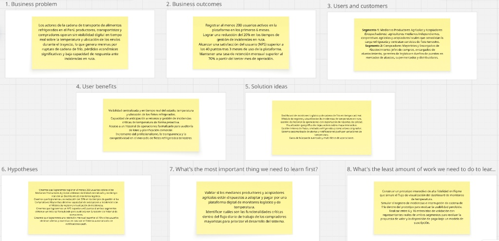<br>
  <i>Nota. Elaboración propia.</i>
</p>

<p align="center"> Enlace público del Lean UX Canvas: https://miro.com/app/board/uXjVHIgbY-o=/?share_link_id=988098140826 </p>

## 1.3. Segmentos objetivo

La delimitación de los segmentos objetivo de FríoTrack responde al diagnóstico sobre las falencias en el transporte terrestre de productos perecibles descritas por la FAO (2026) y el Banco Mundial (2023), la factibilidad de contacto directo para las fases de validación operativa, y el mapa de corredores logísticos identificado por el MTC (2023). A partir de este análisis, se han estructurado dos grupos clave de usuarios cuyos roles interactúan de forma directa y complementaria a lo largo de la cadena de suministro agroalimentaria:

---

### Segmento 1: Empresas de Transporte Refrigerado

**Descripción general**
Este grupo se encuentra integrado por empresas de transporte y operadores logísticos independientes encargados de brindar servicios de traslado terrestre bajo régimen de temperatura controlada para insumos perecibles y productos congelados. Su responsabilidad principal abarca la operación continua y el mantenimiento técnico de las unidades de frío durante todo el itinerario, asegurando que la carga ingrese a su destino respetando estrictamente los parámetros térmicos fijados por el cliente. La dificultad central que atraviesa este sector radica en la falta de visibilidad en tiempo real sobre las condiciones del compartimento de carga mientras las unidades permanecen en carretera, lo que anula la capacidad de reacción inmediata ante averías imprevistas del sistema de refrigeración.

**Características demográficas y estadísticas de contexto**
Las decisiones de gestión en este segmento son tomadas por coordinadores de flota y gerentes de operaciones cuyas edades oscilan mayoritariamente entre los 28 y 55 años. La infraestructura operativa de estas compañías se concentra en Lima Metropolitana y en los principales nodos agroexportadores del país —La Libertad, Ica, Piura y Lambayeque—, coincidentes con los corredores logísticos identificados por el MTC (2023). En lo relativo al nivel educativo, predomina la formación técnica o universitaria en logística, administración y disciplinas afines. Dado el nivel de desempeño logístico general del país (puesto 61/139 en el LPI del Banco Mundial, 2023), es razonable estimar una baja penetración de herramientas tecnológicas de control de flotas y monitoreo térmico remoto entre operadores de pequeña y mediana escala.

**Características psicográficas y conductuales**
Los responsables operativos conviven con un alto nivel de estrés derivado del riesgo constante de que una avería no detectada en el equipo frigorífico derive en la pérdida total de despachos de alto valor comercial. Ante la falta de sistemas integrados, la supervisión de la ruta se efectúa de manera informal mediante llamadas telefónicas periódicas con el conductor y revisiones manuales en puntos de control estratégicos. Si bien estos profesionales emplean cotidianamente computadoras para tareas administrativas y teléfonos inteligentes de gama media, se observa una adopción incipiente de soluciones orientadas al Internet de las Cosas (IoT) o plataformas de gestión remota. No obstante, muestran una elevada receptividad hacia la incorporación de herramientas tecnológicas accesibles que hayan demostrado eficacia en la disminución de pérdidas de productos y en el fortalecimiento de la confianza con sus clientes.

**Puntos de dolor (Pain Points)**
* Incertidumbre permanente respecto al estado térmico real de la mercadería a lo largo de la ruta.
* Ausencia de mecanismos automatizados para la emisión de alertas tempranas ante fallas en los sistemas de refrigeración.
* Dificultad para fundamentar de manera objetiva ante los clientes el cumplimiento continuo del rango de temperatura solicitado durante el traslado.
* Pérdida sostenida de oportunidades de negocio frente a firmas exportadoras que exigen trazabilidad térmica rigurosa como condición imprescindible en sus contratos.

---

### Segmento 2: Productores/Exportadores y Compradores de Alimentos Perecibles

**Descripción general**
Este segmento reúne a los actores de la cadena comercial que despachan o recepcionan insumos y productos perecibles cuya calidad depende de una cadena de frío ininterrumpida. Entre ellos se encuentran los productores agrícolas, las agroexportadoras, las plantas de procesamiento industrial y los compradores finales, tales como cadenas de supermercados, distribuidoras y clientes internacionales. La exigencia fundamental de este grupo reside en disponer de evidencias auditables y confiables que certifiquen que la carga se mantuvo dentro del rango térmico estipulado a lo largo de todo el trayecto, garantizando con ello la inocuidad y los estándares de calidad requeridos para su procesamiento o comercialización.

**Características demográficas y estadísticas de contexto**
El perfil de los profesionales que conforman este segmento abarca un rango etario que va de los 28 a los 60 años. Geográficamente, la actividad se concentra en Lima Metropolitana y en los valles agrícolas de alta productividad dedicados a la exportación —La Libertad, Ica, Piura y Lambayeque—, en línea con el crecimiento de las exportaciones agropecuarias no tradicionales reportado por el INEI (2023). La composición académica y la tipología de negocio son heterogéneas, abarcando desde supervisores de campo con formación técnica hasta gerentes de calidad y logística con estudios universitarios de grado y posgrado. Se trata de organizaciones que mueven volúmenes constantes de carga refrigerada y cuyo nivel de operación está condicionado por la observancia de normas y certificaciones internacionales de inocuidad alimentaria.

**Características psicográficas y conductuales**
Existe una marcada sensibilidad hacia la variable del tiempo y el control de la temperatura, dado que cualquier alteración en la refrigeración compromete de forma directa la vida útil, el valor comercial y la inocuidad del producto. Esta situación genera una constante frustración operativa ante la falta de comunicación proactiva por parte de las empresas de transporte respecto a las condiciones de la carga en tránsito. En comparación con el sector transportista, este segmento exhibe una mayor familiaridad con herramientas digitales de gestión de datos e implementación de sistemas de calidad. Asimismo, demuestran un claro interés por adoptar tecnologías que reduzcan la incertidumbre dentro de sus cadenas de suministro, en un contexto donde la FAO (2026) señala la trazabilidad térmica como un factor crítico para reducir pérdidas de alimentos.

**Puntos de dolor (Pain Points)**
* Incertidumbre sobre el mantenimiento del rango térmico adecuado en los productos recibidos al concluir el traslado.
* Imposibilidad de anticipar el deterioro de la carga antes de su llegada a la planta de recepción para activar planes de contingencia.
* Carencia de un canal de comunicación formal e integrado con el transportista para la notificación inmediata de incidencias térmicas.
* Dificultad para evaluar con criterios objetivos el nivel de cumplimiento y desempeño de sus proveedores de transporte refrigerado debido a la falta de historiales documentados.
* Presión creciente por parte de auditorías de calidad y certificaciones internacionales para respaldar con datos verificables la trazabilidad térmica en toda la cadena de abastecimiento.

---
# Capítulo II: Requirements Elicitation & Analysis

## 2.1. Competidores

En esta sección se identifican y describen los principales competidores de **FrioTrack**, tanto directos como indirectos. Estos ofrecen soluciones digitales relacionadas con la gestión logística, el control de inventario y el monitoreo de productos sensibles a la temperatura dentro de la cadena de frío.

### 2.1.1. Análisis competitivo

#### Competitive Analysis Landscape

**¿Por qué realizar este análisis?**

El análisis permite identificar oportunidades de diferenciación y aspectos de mejora para la propuesta de valor de **FrioTrack**. Asimismo, permite comparar cómo otras soluciones atienden las necesidades de gestión de inventario, monitoreo y distribución, considerando factores como funcionalidades, precio y experiencia de usuario.

| Perfil | **FrioTrack** | **Óptima ERP (Perú)** | **Sinapsys WMS (Perú)** | **Tive (EE. UU.)** |
|---|---|---|---|---|
| **Descripción general** | Plataforma SaaS orientada al monitoreo de temperatura y gestión de productos perecibles, integrando información de la cadena de frío en una sola solución. | ERP peruano orientado a pymes, con módulos de inventario y facturación electrónica integrada con SUNAT. | Sistema WMS para la gestión de almacenes, incluyendo recepción, picking y despacho. | Plataforma IoT para monitoreo de temperatura y ubicación en la cadena de suministro. |
| **Ventaja competitiva** | Integra monitoreo de temperatura, control de productos perecibles, alertas y trazabilidad en una solución dirigida al mercado peruano. | Integración con SUNAT y experiencia en el mercado peruano de pymes. | Amplia cobertura de procesos de almacén y adaptación a diferentes sectores. | Alta precisión en el monitoreo de temperatura y geolocalización, con cobertura internacional. |

#### Perfil de marketing

| Aspecto | **FrioTrack** | **Óptima ERP** | **Sinapsys WMS** | **Tive** |
|---|---|---|---|---|
| **Mercado objetivo** | Empresas distribuidoras y negocios que comercializan alimentos perecibles y requieren controlar las condiciones de almacenamiento y transporte. | Pymes peruanas de comercio, manufactura y distribución que requieren gestionar inventario y facturación. | Empresas medianas y grandes de distribución y manufactura en Latinoamérica. | Empresas exportadoras, operadores logísticos y cadenas de suministro que manejan productos sensibles a la temperatura. |
| **Estrategias de marketing** | Marketing digital, posicionamiento en buscadores, redes sociales y ventas directas a empresas relacionadas con la cadena de frío. | Publicidad digital, participación en eventos empresariales y referencias de clientes. | Ventas B2B, participación en eventos del sector logístico y alianzas con integradores. | Presencia en medios digitales especializados y eventos internacionales de supply chain, con enfoque en clientes empresariales. |

#### Productos y servicios

| **FrioTrack** | **Óptima ERP** | **Sinapsys WMS** | **Tive** |
|---|---|---|---|
| Monitoreo de temperatura en tiempo real, alertas ante variaciones, trazabilidad de productos y visualización de información mediante un dashboard. | Contabilidad, facturación electrónica, inventario, cuentas por cobrar y pagar y generación de reportes. | Recepción de mercadería, gestión de ubicaciones, picking, embalaje, despacho y control de lotes. | Sensores de temperatura y GPS, plataforma SaaS de monitoreo, alertas, reportes y API de integración. |

#### Precios y costos

| **FrioTrack** | **Óptima ERP** | **Sinapsys WMS** | **Tive** |
|---|---|---|---|
| Modelo de suscripción según las funcionalidades y necesidades del cliente. | Planes desde aproximadamente S/ 89 mensuales, con módulos adicionales. | Solución con costos asociados a implementación y configuración. | Suscripción por sensor más el costo del hardware, principalmente orientada a clientes empresariales. |

#### Canales de distribución

| **FrioTrack** | **Óptima ERP** | **Sinapsys WMS** | **Tive** |
|---|---|---|---|
| Plataforma web accesible desde dispositivos con conexión a internet. | Plataforma web y aplicación de escritorio. | Plataforma web y aplicaciones orientadas a la gestión empresarial. | Plataforma web, API y aplicaciones móviles, complementadas con sensores físicos. |

#### Análisis SWOT

**Fortalezas**

- **FrioTrack:** Plataforma enfocada en la cadena de frío, con monitoreo de temperatura y acceso a la información desde una interfaz web.
- **Óptima ERP:** Experiencia en el mercado peruano e integración con SUNAT.
- **Sinapsys WMS:** Amplia cobertura de procesos relacionados con la gestión de almacenes.
- **Tive:** Alta precisión en sensores y experiencia internacional en monitoreo de temperatura.

**Debilidades**

- **FrioTrack:** Al ser una solución en desarrollo, requiere validación y adopción inicial por parte de los usuarios.
- **Óptima ERP:** No cuenta con un módulo especializado para el monitoreo de temperatura.
- **Sinapsys WMS:** Su implementación puede representar una mayor complejidad y costo para pequeñas empresas.
- **Tive:** Su enfoque empresarial y dependencia de hardware especializado pueden incrementar el costo de implementación.

**Oportunidades**

- **FrioTrack:** Crecimiento de la necesidad de monitorear productos perecibles y reducir pérdidas asociadas a variaciones de temperatura.
- **Óptima ERP:** Incorporar funcionalidades de monitoreo de temperatura para ampliar su propuesta de valor.
- **Sinapsys WMS:** Integrar tecnologías IoT para complementar la gestión de almacenes.
- **Tive:** Establecer alianzas con proveedores locales para ampliar su presencia en nuevos mercados.

**Amenazas**

- **FrioTrack:** Resistencia al cambio tecnológico, competencia de soluciones consolidadas y problemas de conectividad en determinadas zonas.
- **Óptima ERP:** Aparición de soluciones especializadas que integren inventario y monitoreo de temperatura.
- **Sinapsys WMS:** Competencia de plataformas empresariales con funcionalidades similares y mayor reconocimiento.
- **Tive:** Aparición de sensores de menor costo y nuevas plataformas IoT orientadas a pequeñas y medianas empresas.

### 2.1.2. Estrategias y tácticas frente a competidores

A partir del análisis competitivo, **FrioTrack** define las siguientes estrategias y tácticas preliminares para responder a las fortalezas de sus competidores y aprovechar las oportunidades identificadas en el mercado peruano.

**Frente a Óptima ERP**

*Estrategia:* Diferenciación mediante especialización y atención de necesidades específicas.

Óptima ERP cuenta con presencia en el segmento pyme peruano, pero no está especializado en el monitoreo de temperatura ni en la gestión de productos perecibles. **FrioTrack** puede aprovechar esta diferencia mediante el monitoreo térmico en tiempo real, las alertas y la trazabilidad de productos.

*Tácticas:*

- Desarrollar materiales de comunicación que destaquen los beneficios del monitoreo de temperatura y el control de productos perecibles.
- Implementar la importación de datos desde Excel para facilitar la migración de empresas que utilizan hojas de cálculo u otras soluciones.
- Ofrecer un periodo de prueba gratuito para facilitar la adopción de la plataforma.

**Frente a Sinapsys WMS**

*Estrategia:* Competir mediante accesibilidad y facilidad de adopción para el segmento PYME.

Sinapsys WMS ofrece una cobertura amplia para la gestión de almacenes, pero su implementación puede resultar compleja para pequeñas y medianas empresas. **FrioTrack** busca diferenciarse mediante una solución especializada, sencilla y enfocada en las necesidades de la cadena de frío.

*Tácticas:*

- Ofrecer un proceso de incorporación sencillo, acompañado de tutoriales y soporte en español.
- Orientar las campañas de adquisición hacia empresas que busquen una alternativa especializada y de menor complejidad.
- Desarrollar casos de uso para sectores como alimentos, bebidas y otros productos sensibles a la temperatura.

**Frente a Tive**

*Estrategia:* Aprovechar la orientación hacia pymes locales y la accesibilidad de la solución frente a plataformas empresariales internacionales.

Tive ofrece una solución especializada para el monitoreo de temperatura y ubicación. Sin embargo, su orientación hacia clientes empresariales permite que **FrioTrack** se diferencie mediante una propuesta enfocada en las necesidades de pequeñas y medianas empresas del mercado peruano.

*Tácticas:*

- Destacar la compatibilidad de **FrioTrack** con sensores IoT disponibles en el mercado, reduciendo la dependencia de hardware propietario.
- Desarrollar alianzas con proveedores locales de sensores IoT para facilitar la adquisición e implementación de los dispositivos.
- Orientar la comunicación de la marca hacia las necesidades particulares de las empresas peruanas que trabajan con productos perecibles.

**Frente a Sinapsys WMS**

*Estrategia:* Competir mediante accesibilidad económica y facilidad de adopción para el segmento PYME.

Sinapsys WMS ofrece funciones amplias para la gestión de almacenes, pero su implementación puede representar una barrera para pequeñas y medianas empresas. Además, su mayor complejidad puede dificultar la adopción. **FrioTrack** puede aprovechar esta diferencia mediante una solución especializada en cadena de frío, sencilla de utilizar y enfocada en las necesidades del segmento objetivo.

*Tácticas:*

- Posicionar a **FrioTrack** como una solución de fácil adopción, con un proceso de incorporación sencillo, tutoriales en español y soporte al usuario.
- Orientar las campañas hacia empresas que hayan descartado soluciones WMS por su costo o complejidad, destacando funcionalidades específicas como el monitoreo de temperatura y la trazabilidad.
- Publicar casos de uso en sectores como lácteos, cárnicos y frutas y verduras para demostrar la especialización de **FrioTrack**.

**Frente a Tive**

*Estrategia:* Aprovechar la orientación hacia PYMES locales y la accesibilidad de la solución frente a plataformas empresariales internacionales.

Tive ofrece una solución especializada para el monitoreo de temperatura y ubicación. Sin embargo, **FrioTrack** puede diferenciarse mediante una propuesta orientada a las necesidades de pequeñas y medianas empresas, integrando el monitoreo de temperatura con la gestión de productos perecibles.

*Tácticas:*

- Comunicar la compatibilidad de **FrioTrack** con sensores IoT disponibles en el mercado, reduciendo la dependencia de hardware propietario.
- Desarrollar alianzas con proveedores locales de sensores IoT para facilitar la adquisición e implementación de los dispositivos.
- Orientar la comunicación de marca hacia las necesidades del mercado peruano, destacando una solución desarrollada para empresas que trabajan con productos perecibles y requieren controlar sus condiciones de almacenamiento y transporte.

## 2.2. Entrevistas

Se diseñó una investigación mediante entrevistas semiestructuradas dirigidas a representantes de ambos segmentos. En el material recopilado se registran tres entrevistas por segmento y se desarrollaron tres resúmenes en total.

### 2.2.1. Diseño de entrevistas

El diseño de las guías de entrevista siguió buenas prácticas de *needfinding* aplicadas al diseño de experiencia de usuario (Portigal, 2013; Goodman et al., 2012). Las preguntas fueron formuladas de manera abierta para evitar sesgar las respuestas de los entrevistados, priorizando la descripción de comportamientos y experiencias reales sobre opiniones o intenciones.

### Segmento 1: Empresas distribuidoras de productos perecibles

#### Datos del entrevistado

1. ¿Cuál es su nombre y edad?
2. ¿En qué distrito opera su empresa actualmente?
3. ¿Cuál es su cargo o rol dentro de la empresa?
4. ¿En qué sector específico trabaja su empresa? (alimenticio, farmacéutico, agroindustrial, otro)
5. ¿Cuántos años lleva trabajando en el rubro logístico o de distribución?
6. ¿Cuántas personas conforman su equipo operativo actualmente?

#### Gestión de inventario

7. ¿Qué método utilizan actualmente para registrar y controlar el inventario de sus productos perecibles?
8. ¿Con qué frecuencia detectan pérdidas por productos vencidos o en mal estado?
9. ¿Qué tan actualizado se mantiene el stock en sus registros durante las operaciones diarias?
10. ¿Han tenido inconvenientes graves por errores en el registro del inventario? ¿Cómo los manejaron?

#### Control de temperatura y cadena de frío

11. ¿Cómo monitorean la temperatura durante el almacenamiento y el transporte de sus productos?
12. ¿Qué sucede operativamente cuando detectan un fallo en la cadena de frío?
13. ¿Qué tan difícil les resulta identificar mermas o pérdidas en tiempo real dentro del proceso?

#### Logística y distribución

14. ¿Qué herramientas o sistemas utilizan actualmente para planificar y ejecutar su distribución?
15. ¿Cómo realizan el seguimiento de los productos desde el almacén hasta el punto de entrega final?
16. ¿Qué tan eficiente consideran su proceso de distribución actual y en qué basan esa valoración?

#### Impacto económico y operativo

17. ¿Cuánto estiman que pierden mensualmente por fallas en almacenamiento, transporte o control de inventario?
18. ¿Cuál de estos factores afecta más su rentabilidad: gestión de inventario, transporte o control de calidad?
19. ¿Cómo repercuten estos problemas en la satisfacción de sus clientes?

#### Disposición hacia una solución digital

20. ¿Qué tan valioso sería para ustedes contar con visibilidad del stock en tiempo real?
21. ¿Qué importancia le darían a una herramienta que monitoree la temperatura de forma automática y continua?
22. ¿Estarían dispuestos a invertir en una solución que automatice su inventario y distribución? ¿Bajo qué condiciones?
23. ¿Qué funcionalidades serían indispensables en una plataforma de gestión logística como FrioTrack?

### Segmento 2: Tiendas y bodegas con productos perecibles

#### Datos del entrevistado

1. ¿Cuál es su nombre y edad?
2. ¿En qué distrito se ubica su tienda o bodega?
3. ¿Cuántos años lleva gestionando su negocio?
4. ¿Qué tipo de productos perecibles comercializa principalmente?
5. ¿Cuántas personas trabajan en su negocio actualmente?
6. ¿Maneja un solo local o tiene más puntos de venta?

#### Control de inventario

7. ¿Cómo controlan actualmente el stock de sus productos perecibles?
8. ¿Registran las entradas y salidas de forma manual o cuentan con algún sistema digital?
9. ¿Qué tan actualizado suele estar su inventario durante un día normal de operación?
10. ¿Con qué frecuencia se quedan sin stock de productos de alta rotación?

#### Fechas de vencimiento y pérdidas

11. ¿Cómo controlan las fechas de vencimiento de sus productos actualmente?
12. ¿Con qué frecuencia tienen pérdidas por productos vencidos o deteriorados?
13. ¿Qué tipo de productos les generan mayor cantidad de pérdidas y a qué lo atribuyen?

#### Organización y errores frecuentes

14. ¿Qué dificultades enfrentan para mantener ordenado su almacén o área de stock?
15. ¿Qué errores ocurren con mayor frecuencia en el registro o control de su inventario?
16. ¿Qué consecuencias les trae no encontrar un producto rápidamente cuando un cliente lo solicita?

#### Impacto en ventas y clientes

17. ¿Han perdido ventas o clientes por problemas relacionados con una mala gestión del inventario?
18. ¿Cómo deciden actualmente cuándo y cuánto reponer de cada producto?

#### Disposición hacia una solución digital

19. ¿Les resultaría útil recibir alertas automáticas cuando un producto esté próximo a vencerse?
20. ¿Utilizarían una aplicación sencilla para gestionar su inventario desde el celular o computadora?
21. ¿Qué funciones priorizarían: alertas de vencimiento, reportes de ventas o control automático de stock?
22. ¿Cuánto estarían dispuestos a pagar mensualmente por una solución como FrioTrack?

### 2.2.2. Registro de entrevistas

A continuación, se presenta el registro de las entrevistas realizadas a los representantes de cada segmento objetivo.

#### Entrevistas segmento 1:

#### Entrevista 1: Jari Hassan
| Campo                                  | Detalle                                                                                                                                                                                                                                                                                                                                                          |
|:---------------------------------------|:-----------------------------------------------------------------------------------------------------------------------------------------------------------------------------------------------------------------------------------------------------------------------------------------------------------------------------------------------------------------|
| **Titulo**                             | Entrevista 1: Jari Hassan                                                                                                                                                                                                                                                                                                                                        |
| **Segmento**                           | Empresas distribuidoras de productos perecibles                                                                                                                                                                                                                                                                                                                  |
| **Nombres y Apellidos**                | Jari Hassan                                                                                                                                                                                                                                                                                                                                                      |
| **Edad**                               | 25 años                                                                                                                                                                                                                                                                                                                                                          |
| **Distrito**                           | San Borja                                                                                                                                                                                                                                                                                                                                                        |
| **Enlace al video (Microsoft Stream)** |[Entrevistas-Consolidado](https://upcedupe-my.sharepoint.com/:v:/g/personal/u202219829_upc_edu_pe/IQAIrCLq6pSFSJvrtihV4MBEAclabwb3TRiATBksgwlaG60?nav=eyJyZWZlcnJhbEluZm8iOnsicmVmZXJyYWxBcHAiOiJPbmVEcml2ZUZvckJ1c2luZXNzIiwicmVmZXJyYWxBcHBQbGF0Zm9ybSI6IldlYiIsInJlZmVycmFsTW9kZSI6InZpZXciLCJyZWZlcnJhbFZpZXciOiJNeUZpbGVzTGlua0NvcHkifX0&e=ZMsYWh)|
| **Timing de inicio y duración**        | Inicio: 00:40 - Fin: 10:42                                                                                                                                                                                                                                                                                                                       |
| **Evidencia fotográfica**              | *<p> </p>*                                                                                                                                                                                                                                                                     |

**Resumen de la entrevista:**

Jari Hassan es un profesional de 25 años que se desempeña como Jefe de Operaciones y Logística en una empresa del sector alimenticio con base en San Luis. Trabaja directamente con la distribución de productos perecibles, como lácteos, embutidos y carnes envasadas, por lo que conoce de cerca las exigencias que implica mantener la cadena de frío y el control del inventario en este tipo de operación.

A partir de su experiencia, señala que uno de los principales problemas en su empresa es la **falta de visibilidad en tiempo real**, tanto del stock como de las condiciones de temperatura durante el transporte. Actualmente combinan un ERP tradicional con registros manuales en Excel, lo que genera desfases en la información, errores de inventario y pérdidas por productos vencidos o en mal estado. También menciona que, cuando ocurre una falla en ruta, muchas veces se enteran demasiado tarde y la mercadería termina en cuarentena o merma.

Jari considera que una solución digital sí podría aportar valor real a su operación, siempre que sea práctica, intuitiva y rápida de implementar. Para él, las funciones más importantes serían:

- Control de lotes con alertas de vencimiento
- Trazabilidad de vehículos por GPS
- Monitoreo térmico en vivo con notificaciones inmediatas

Estas funcionalidades ayudarían a prevenir pérdidas, mejorar la distribución y tomar decisiones con mayor rapidez.


#### Entrevista 2: Farit

| Campo | Detalle |
|:------|:--------|
| **Título** | Entrevista 2: Farit |
| **Segmento** | Empresas distribuidoras de productos perecibles |
| **Nombres y Apellidos** | Farit (apellidos pendientes) |
| **Edad** | 28 años |
| **Distrito** | San Luis |
| **Enlace al video (Microsoft Stream)** |[Entrevistas-Consolidado](https://upcedupe-my.sharepoint.com/:v:/g/personal/u202219829_upc_edu_pe/IQAIrCLq6pSFSJvrtihV4MBEAclabwb3TRiATBksgwlaG60?nav=eyJyZWZlcnJhbEluZm8iOnsicmVmZXJyYWxBcHAiOiJPbmVEcml2ZUZvckJ1c2luZXNzIiwicmVmZXJyYWxBcHBQbGF0Zm9ybSI6IldlYiIsInJlZmVycmFsTW9kZSI6InZpZXciLCJyZWZlcnJhbFZpZXciOiJNeUZpbGVzTGlua0NvcHkifX0&e=ZMsYWh)|
| **Timing de inicio y duración** | Inicio: 10:42 - Fin: 17:02|
| **Evidencia fotográfica** |  <p></p> |

**Resumen de la entrevista:**

Farit es un profesional de 28 años que trabaja en el área de operaciones y logística de una empresa alimenticia ubicada en San Luis. Su labor está relacionada con la distribución y conservación de productos perecibles, por lo que conoce las dificultades asociadas al control del inventario y al mantenimiento de la cadena de frío.

Actualmente, la empresa utiliza un **sistema ERP complementado con Excel** para gestionar el stock, los lotes y las fechas de vencimiento. Sin embargo, uno de sus principales problemas es la **falta de actualización de la información en tiempo real**, lo que genera diferencias entre el inventario registrado y el físico, además de pérdidas ocasionales por productos vencidos o deteriorados.

Asimismo, Farit identificó la **falta de monitoreo automatizado de temperatura durante el transporte** como una dificultad importante. En algunas ocasiones, las fallas en la cadena de frío se detectan cuando los vehículos llegan a su destino, dificultando una respuesta oportuna. También señaló que la información logística se encuentra distribuida entre diferentes herramientas y comunicaciones con los conductores, lo que puede ocasionar retrasos, pérdidas económicas e insatisfacción de los clientes.

El entrevistado considera que **FrioTrack podría mejorar la eficiencia operativa mediante la centralización de información y la automatización del monitoreo**. Para él, las funcionalidades más importantes serían:

- Monitoreo de temperatura en tiempo real durante el transporte.
- Alertas automáticas ante variaciones de temperatura.
- Control de lotes y fechas de vencimiento.
- Seguimiento de vehículos mediante GPS.
- Panel centralizado para consultar información logística e inventarios.

Respecto a la implementación, Farit manifestó disposición a utilizar una solución digital, siempre que sea **fácil de utilizar, tenga un costo razonable y permita demostrar una reducción de pérdidas**.

En conclusión, la entrevista evidencia la necesidad de una **plataforma que integre el control de inventarios, el monitoreo de la cadena de frío y la trazabilidad logística en tiempo real**. Estos hallazgos respaldan la propuesta de FrioTrack para prevenir pérdidas, mejorar la capacidad de respuesta ante incidentes y optimizar la distribución de productos perecibles.

#### Entrevistas segmento 2:

#### Entrevista 1: Irma Barreto

| Campo | Detalle |
|:------|:--------|
| **Título** | Entrevista 1: Irma Barreto |
| **Segmento** | Tiendas y bodegas con productos perecibles |
| **Nombres y Apellidos** | Irma Barreto |
| **Edad** | 40 años |
| **Distrito** | San Juan de Lurigancho |
| **Enlace al video (Microsoft Stream)** |[Entrevistas-Consolidado](https://upcedupe-my.sharepoint.com/:v:/g/personal/u202219829_upc_edu_pe/IQAIrCLq6pSFSJvrtihV4MBEAclabwb3TRiATBksgwlaG60?nav=eyJyZWZlcnJhbEluZm8iOnsicmVmZXJyYWxBcHAiOiJPbmVEcml2ZUZvckJ1c2luZXNzIiwicmVmZXJyYWxBcHBQbGF0Zm9ybSI6IldlYiIsInJlZmVycmFsTW9kZSI6InZpZXciLCJyZWZlcnJhbFZpZXciOiJNeUZpbGVzTGlua0NvcHkifX0&e=ZMsYWh)|
| **Timing de inicio y duración** | Inicio: 17:05 - Fin: 23:53|
| **Evidencia fotográfica** | <p></p> |

**Resumen de la entrevista:**

Irma Barreto es una comerciante de 40 años que administra un restaurante familiar ubicado en San Juan de Lurigancho. Cuenta con 6 años de experiencia en el negocio y trabaja junto a otras tres personas. Su establecimiento utiliza principalmente productos perecibles como frutas, verduras y carnes, con un volumen aproximado de compra de 30 a 40 kg semanales.

Actualmente, realiza el **control de inventario de manera manual**, revisando las cantidades disponibles y registrando algunas compras en un cuaderno. Entre sus principales dificultades identifica la **falta de actualización del stock en tiempo real**, los errores en los registros y el riesgo de quedarse sin ingredientes durante las horas de mayor atención. Asimismo, menciona que algunos productos llegan demasiado maduros, deteriorados o en cantidades inferiores a las solicitadas, lo que ocasiona pérdidas y dificultades en la preparación de los platos.

Irma considera que una solución digital sencilla, accesible desde su celular Android, podría mejorar la administración de su negocio. Las funcionalidades que considera más importantes son:

- Control automático del inventario y actualización del stock.
- Alertas de productos próximos a vencer.
- Consulta de existencias y seguimiento del estado de los pedidos.
- Organización de compras y abastecimiento.

Respecto a la inversión, manifestó estar dispuesta a pagar **entre S/ 30 y S/ 50 mensuales**, siempre que la herramienta sea accesible y facilite sus operaciones diarias.

En conclusión, la entrevista evidencia la necesidad de una **solución digital práctica y económica** que permita reducir las pérdidas por deterioro, mejorar el control de productos perecibles y garantizar una mayor disponibilidad de ingredientes para el funcionamiento del restaurante.


#### Entrevista 2: Santiago Silva Jara

| Campo | Detalle |
|:------|:--------|
| **Título** | Entrevista 2: Santiago Silva Jara |
| **Segmento** | Tiendas y bodegas con productos perecibles |
| **Nombres y Apellidos** | Santiago Silva Jara |
| **Edad** | 22 años |
| **Distrito** | Víctor Larco Herrera (Trujillo) |
| **Enlace al video (Microsoft Stream)** |[Entrevistas-Consolidado](https://upcedupe-my.sharepoint.com/:v:/g/personal/u202219829_upc_edu_pe/IQAIrCLq6pSFSJvrtihV4MBEAclabwb3TRiATBksgwlaG60?nav=eyJyZWZlcnJhbEluZm8iOnsicmVmZXJyYWxBcHAiOiJPbmVEcml2ZUZvckJ1c2luZXNzIiwicmVmZXJyYWxBcHBQbGF0Zm9ybSI6IldlYiIsInJlZmVycmFsTW9kZSI6InZpZXciLCJyZWZlcnJhbFZpZXciOiJNeUZpbGVzTGlua0NvcHkifX0&e=ZMsYWh)|
| **Timing de inicio y duración** | Inicio: 23:54 - Fin: 28:02 |
| **Evidencia fotográfica** | <p></p> |

**Resumen de la entrevista:**

Santiago Silva Jara es un comerciante de 22 años del distrito de Víctor Larco Herrera, en Trujillo. Es propietario de una bodega donde comercializa diversos productos, incluidos alimentos perecibles que requieren un control adecuado de sus fechas de vencimiento.

Actualmente, realiza el **registro manual de las fechas de caducidad** de sus productos para identificar cuándo deben cambiarse y evitar inconvenientes con sus clientes. Este procedimiento requiere una revisión constante, ya que depende de las anotaciones realizadas por el propio comerciante.

Durante la entrevista, Santiago manifestó interés en contar con una **aplicación que le permita recibir avisos sobre los próximos vencimientos** y facilite la identificación de los productos que necesitan ser cambiados.

La funcionalidad principal identificada es:

- Alertas automáticas sobre fechas de vencimiento y productos que requieren cambio.

En conclusión, la entrevista evidencia la necesidad de una **herramienta digital sencilla para el control de vencimientos**, que facilite el seguimiento de productos perecibles y contribuya a prevenir inconvenientes con los clientes.


#### Entrevista 3: Carlos Astudillo

| Campo | Detalle |
|:------|:--------|
| **Título** | Entrevista 3: Carlos Astudillo |
| **Segmento** | Tiendas y bodegas con productos perecibles |
| **Nombres y Apellidos** | Carlos Astudillo |
| **Edad** | 22 años |
| **Distrito** | San Juan de Lurigancho |
| **Enlace al video (Microsoft Stream)** |[Entrevistas-Consolidado](https://upcedupe-my.sharepoint.com/:v:/g/personal/u202219829_upc_edu_pe/IQAIrCLq6pSFSJvrtihV4MBEAclabwb3TRiATBksgwlaG60?nav=eyJyZWZlcnJhbEluZm8iOnsicmVmZXJyYWxBcHAiOiJPbmVEcml2ZUZvckJ1c2luZXNzIiwicmVmZXJyYWxBcHBQbGF0Zm9ybSI6IldlYiIsInJlZmVycmFsTW9kZSI6InZpZXciLCJyZWZlcnJhbFZpZXciOiJNeUZpbGVzTGlua0NvcHkifX0&e=ZMsYWh)|
| **Timing de inicio y duración** | Inicio: 28:06 - Fin 41:19 |
| **Evidencia fotográfica** |<p></p> |

**Resumen de la entrevista:**

Carlos Astudillo es un joven de 22 años encargado de una bodega familiar ubicada en San Juan de Lurigancho. Durante la entrevista, identificó diversas dificultades relacionadas con el **control de inventarios, las fechas de vencimiento y la organización de productos**. Actualmente, utilizan cuadernos para registrar las ventas y Excel para administrar el inventario, consolidando la información al finalizar cada mes.

Uno de los principales problemas es la **falta de actualización del stock en tiempo real**, debido a que los recuentos se realizan generalmente cada 30 días o cada 15 días cuando algún producto presenta mayor rotación. Para evitar el desabastecimiento, aplican una estrategia de reposición cuando las existencias alcanzan aproximadamente el 20 % del stock. Sin embargo, todavía dependen de revisiones manuales, lo que incrementa el riesgo de errores y pérdidas.

Asimismo, Carlos señaló que han experimentado **pérdidas ocasionales por productos vencidos o deteriorados**, especialmente con productos como los huevos. También mencionó que la desorganización del almacén puede generar retrasos en la atención al cliente y dificultades con los proveedores, afectando la eficiencia de las operaciones.

El entrevistado considera que **FrioTrack podría facilitar la gestión del negocio mediante la automatización del inventario y el control de vencimientos**. Destacó la importancia de contar con una aplicación sencilla y accesible desde dispositivos móviles, especialmente porque algunos integrantes de su familia presentan dificultades para utilizar Excel.

Las funcionalidades que considera más importantes son:

- Control automático del inventario y actualización del stock.
- Alertas anticipadas sobre productos próximos a vencer.
- Notificaciones accesibles desde dispositivos móviles.
- Avisos directos, como llamadas de alerta, ante vencimientos próximos.
- Interfaz sencilla e intuitiva para usuarios con poca experiencia tecnológica.

Respecto a la inversión, Carlos manifestó interés en adoptar la plataforma, aunque **no estableció un monto mensual específico**, indicando que el costo debería evaluarse según las necesidades y el tamaño del negocio.

En conclusión, la entrevista evidencia la necesidad de una **solución digital accesible que reduzca la dependencia de registros manuales, prevenga pérdidas por vencimiento y mejore la organización del inventario**. Estos hallazgos respaldan la propuesta de FrioTrack como una herramienta para optimizar la gestión de productos perecibles en pequeñas bodegas.

### 2.2.3. Análisis de entrevistas

El presente análisis sintetiza la información recopilada a partir de las entrevistas en profundidad realizadas a los representantes de los dos segmentos objetivo.

**Análisis Primer Segmento: Empresas Distribuidoras de Productos Perecibles (Jari Hassan)**

En primer lugar, se evidencia una limitación operativa significativa derivada de la falta de visibilidad en tiempo real sobre el stock y las condiciones térmicas durante el transporte. El 100% (1 de 1) de los entrevistados de este segmento gestiona la distribución de productos altamente sensibles a la temperatura —lácteos, embutidos y carnes envasadas— desde una empresa del sector alimenticio con base en San Luis, combinando un ERP tradicional con registros manuales en hojas de cálculo, lo que genera desfases entre la información registrada y el estado real del inventario.

En segundo lugar, se identifica un impacto financiero directo generado por la detección tardía de fallas en la cadena de frío. El entrevistado señaló que, cuando ocurre una interrupción térmica durante el traslado, la empresa suele enterarse cuando ya es demasiado tarde, lo que deriva en mercadería puesta en cuarentena o convertida directamente en merma, además de errores de inventario que afectan la rentabilidad de la operación.

En tercer lugar, se identifica una demanda concreta por funcionalidades de monitoreo automatizado y trazabilidad. El entrevistado, de 25 años y con el cargo de Jefe de Operaciones y Logística, prioriza contar con control de lotes mediante alertas de vencimiento, trazabilidad de vehículos por GPS y monitoreo térmico en vivo con notificaciones inmediatas ante cualquier desviación fuera de rango.

En cuarto lugar, respecto a la viabilidad y adopción de la plataforma, la disposición a migrar hacia una solución digital está condicionada a que esta sea práctica, intuitiva y rápida de implementar dentro de la operación diaria. En síntesis, este segmento requiere una solución que centralice la telemetría térmica y la ubicación de la flota en un único panel, reduciendo la brecha entre el momento en que ocurre una falla y el momento en que el equipo logístico puede reaccionar.

**Análisis Segundo Segmento: Tiendas y Bodegas con Productos Perecibles (Irma Barreto y Santiago Silva Jara)**

En primer lugar, se evidencia una dependencia generalizada de métodos manuales para el control de inventario y de fechas de vencimiento. De acuerdo con los testimonios recopilados, el 100% (2 de 2) de los comerciantes registra sus productos a mano —ya sea en un cuaderno o directamente sobre el empaque—, sin apoyo de ningún sistema digital, lo que abarca desde un restaurante familiar en San Juan de Lurigancho con un volumen de 30 a 40 kg de productos perecibles por semana, hasta una bodega en Trujillo que comercializa productos perecibles junto con otros rubros.

En segundo lugar, existe un impacto directo en las pérdidas y en la operación diaria derivado de la falta de actualización del stock en tiempo real. El 100% de los entrevistados reportó dificultades vinculadas a productos que llegan en mal estado, maltratados o en cantidades menores a las solicitadas, así como el riesgo constante de quedarse sin ingredientes o productos de alta rotación durante las horas de mayor atención al público.

En tercer lugar, se identifica una alta disposición hacia la adopción de alertas automáticas de vencimiento y aplicaciones móviles sencillas. Ambos comerciantes, con edades de 22 y 40 años, coincidieron en el interés por una aplicación accesible desde su celular Android que les permita recibir avisos sobre productos próximos a vencer y revisar sus existencias sin depender del registro manual.

En cuarto lugar, respecto a la viabilidad comercial, la disposición a pagar está condicionada a que la solución sea económicamente accesible para negocios de pequeña escala: la entrevistada de San Juan de Lurigancho indicó estar dispuesta a pagar entre 30 y 50 soles mensuales por una herramienta que facilite la gestión de su inventario. En síntesis, este segmento requiere una aplicación simple y de bajo costo que automatice el control de vencimientos y reduzca las pérdidas por deterioro, sin exigir conocimientos técnicos avanzados para su uso diario.

## 2.3. Needfinding

Las entrevistas de esta sección exploran conservación, distribución e inventario. Sus personas y mapas se conservan como resultados de esa investigación. El producto implementado se concentra en transporte refrigerado y utiliza los perfiles de Coordinador Logístico y Cliente de Carga del Capítulo I; la validación específica de estos perfiles se debe ampliar antes de trasladar hallazgos de inventario al alcance de transporte.

Para realizar el proceso de *needfinding* en **FrioTrack**, se llevaron a cabo entrevistas en profundidad con actores clave de los segmentos objetivo. Estas incluyeron representantes de empresas distribuidoras de productos perecibles, así como propietarios y administradores de tiendas y bodegas. Las entrevistas permitieron conocer sus actividades diarias, métodos de control de inventario y principales dificultades relacionadas con la conservación de productos, el control de temperatura, el vencimiento y las pérdidas de productos perecibles.

A partir de esta exploración, se identificaron oportunidades de mejora relacionadas con el uso de controles manuales, la falta de supervisión continua, las dificultades para realizar un seguimiento adecuado del inventario y el acceso limitado a herramientas tecnológicas sencillas. También se evidenció una diferencia entre el registro de información y la capacidad de tomar decisiones preventivas de manera oportuna.

Durante las entrevistas se identificaron necesidades recurrentes, principalmente la posibilidad de recibir alertas ante variaciones de temperatura, contar con mayor visibilidad del inventario y facilitar el control de las fechas de vencimiento. Asimismo, se identificó la necesidad de contar con herramientas que permitan gestionar estos procesos de manera sencilla.

De esta manera, se identificó una oportunidad para desarrollar **FrioTrack**, una plataforma digital orientada al monitoreo de la cadena de frío y la gestión de productos perecibles, buscando reducir las pérdidas y facilitar el control de las operaciones.

### 2.3.1. User Personas

**Segmento objetivo: Jefes de almacén y supervisores logísticos de distribuidoras medianas**

<div align="center">
  
</div>

<div align="center">
  
</div>

**Segmento Objetivo: Propietarios y administradores de bodegas y puestos en mercados de abastos:**

<div align="center">
  
</div>

<div align="center">
  
</div>

### 2.3.2. User Task Matrix

| **Task** | **Javier Mendoza (Jefe de Almacén y Logística)** |  | **Rosa Huamán (Propietaria de Bodega)** |  |
|---|---|---|---|---|
|  | **Frequency** | **Importance** | **Frequency** | **Importance** |
| Monitorear temperatura de cámaras/vitrinas | High | High | High | High |
| Registrar fecha de vencimiento y lote de productos | High | High | Medium | High |
| Verificar rotación de inventario bajo criterio FEFO | High | High | Medium | High |
| Detectar desviaciones térmicas fuera de horario laboral | High | High | Low | High |
| Revisar manualmente el estado físico de los equipos de frío | Medium | High | High | High |
| Lanzar promociones o remates por caducidad cercana | Low | Medium | High | High |
| Preparar pedidos o despachos para clientes/rutas | High | High | High | High |
| Generar reportes de mermas y pérdidas económicas | Medium | High | Low | Medium |
| Justificar trazabilidad térmica ante clientes o auditorías | Medium | High | Low | Low |
| Coordinar mantenimiento de equipos de refrigeración | Low | High | Low | High |
| Separar y desechar mercadería deteriorada/vencida | Medium | High | Medium | High |

### 2.3.3. User Journey Mapping

**Segmento objetivo: Jefes de almacén y supervisores logísticos de distribuidoras medianas**

<div align="center">
  
</div>

**Segmento objetivo: Propietarios y administradores de bodegas y puestos en mercados de abastos**

<div align="center">
  
</div>

### 2.3.4. Empathy Mapping

**Segmento objetivo: Jefes de almacén y supervisores logísticos de distribuidoras medianas**

<div align="center">
  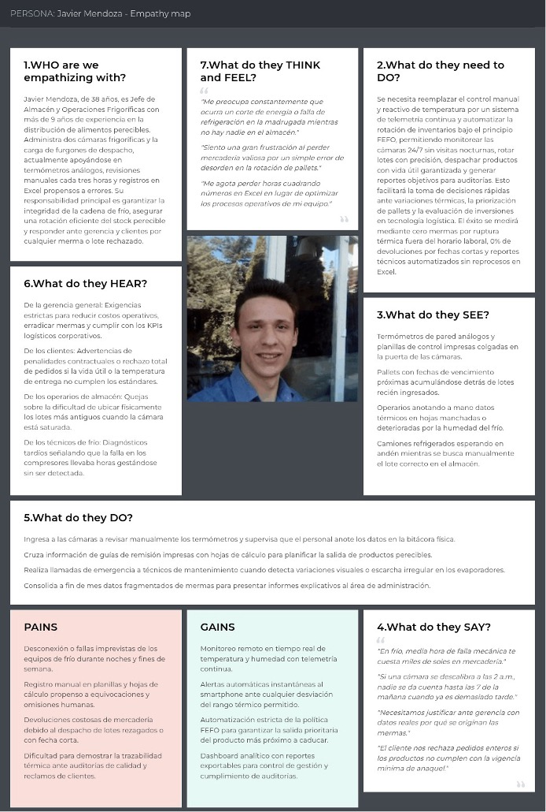
</div>

**Segmento objetivo: Propietarios y administradores de bodegas y puestos en mercados de abastos**

<div align="center">
  
</div>

## 2.4. Big Picture EventStorming

En la sesión de **Big Picture EventStorming**, el equipo exploró de forma visual el panorama general del dominio de **FrioTrack**, enfocado en la telemetría IoT para la cadena de frío y la gestión de inventarios de productos perecibles. Se identificaron los principales eventos del ciclo de vida de los productos, desde la recepción e ingreso de la mercadería hasta su despacho, considerando el monitoreo de las condiciones de almacenamiento y transporte.

Asimismo, se identificaron los sistemas externos que interactúan con la plataforma, como los sensores IoT y los servicios utilizados para generar alertas. Esta primera aproximación permitió alinear el entendimiento del equipo sobre el dominio y establecer las bases para el diseño detallado de la solución.

**Primera fase: Eventos**

<div align="center">
  
  <p><i>Figura 2.1. Big Picture EventStorming exploratorio de FríoTrack.</i></p>
</div>

## 2.5. Ubiquitous Language

El **Ubiquitous Language** de **FrioTrack** establece un lenguaje común entre los integrantes del equipo y los usuarios del sistema. Los siguientes términos representan los conceptos principales del dominio de monitoreo de la cadena de frío y gestión de productos perecibles.

- **Cold Chain (Cadena de Frío):** conjunto de procesos de almacenamiento y transporte que mantienen condiciones de temperatura adecuadas para conservar productos perecibles.

- **Perishable Batch (Lote Perecible):** agrupación de productos perecibles que comparten características de identificación y control, como procedencia, fecha de producción o fecha de vencimiento.

- **FEFO Policy (Primero en Vencer, Primero en Salir):** estrategia de gestión de inventario que prioriza la salida de los productos cuya fecha de vencimiento está más próxima.

- **Thermal Telemetry (Telemetría Térmica):** registro y transmisión periódica de datos de temperatura obtenidos mediante sensores.

- **Thermal Threshold (Umbral Térmico):** límite mínimo y máximo de temperatura permitido para mantener un producto en condiciones adecuadas.

- **Cold Breach (Ruptura de Cadena de Frío):** situación en la que la temperatura de almacenamiento o transporte se encuentra fuera del rango permitido durante un periodo determinado.

- **IoT Sensor Node (Nodo Sensor IoT):** dispositivo equipado con sensores que recopila información ambiental y la transmite a la plataforma.

- **Storage Unit (Unidad de Almacenamiento):** espacio destinado al almacenamiento de productos perecibles bajo condiciones controladas de temperatura.

- **Shrinkage / Merma:** pérdida de productos perecibles debido a vencimiento, deterioro o condiciones inadecuadas de almacenamiento.

- **Critical Expiration Window (Ventana Crítica de Caducidad):** periodo previo al vencimiento de un producto durante el cual se requiere tomar acciones para evitar que se convierta en merma.

- **Telemetry Ingestion (Ingesta de Telemetría):** proceso mediante el cual la plataforma recibe, valida y almacena los datos enviados por los sensores.

- **Telemetry Loss (Pérdida de Comunicación Telemétrica):** condición en la que el sensor deja de transmitir información hacia la plataforma.

- **Thermal Deviation Event (Evento de Desviación Térmica):** evento generado cuando una medición de temperatura supera los límites establecidos.

- **Dispatch Order (Orden de Despacho):** instrucción utilizada para preparar los productos que serán transportados o entregados al cliente.

- **Picking List (Lista de Picking):** listado que indica los productos y lotes que deben ser retirados del inventario para preparar un pedido.

- **Emergency Alert (Alerta de Emergencia):** notificación generada ante una condición crítica que requiere atención inmediata.

- **Clearance Discount (Descuento de Liquidación):** reducción de precio aplicada a productos próximos a vencer con el objetivo de acelerar su venta y reducir pérdidas.

- **Warehouse Supervisor (Supervisor de Almacén):** usuario encargado de supervisar las operaciones relacionadas con el almacenamiento, inventario y condiciones de conservación de los productos.

- **Retail Merchant (Comerciante Minorista):** usuario encargado de gestionar productos perecibles en tiendas, bodegas o puestos de mercados de abastos.

- **MQTT Broker (Broker MQTT):** intermediario utilizado para gestionar la comunicación de mensajes entre los sensores IoT y los componentes de la plataforma.

- **Thermal Recovery Time (Tiempo de Recuperación Térmica):** tiempo que necesita una unidad de almacenamiento para volver a su rango de temperatura adecuado después de una alteración térmica.

- **Shelf Life (Vida Útil):** periodo durante el cual un producto perecible puede mantenerse en condiciones adecuadas para su comercialización y consumo.

---

# Capítulo III: Requirements Specification

### Epics

| Epic ID | Título | Descripción |
| :--- | :--- | :--- |
| **EP01** | Panel de Monitoreo en Tiempo Real (Dashboard) | Épica que agrupa las funcionalidades clave para la supervisión telemática en tiempo real de temperatura, humedad y ubicación de la flota agroexportadora. |
| **EP02** | Sistema de Alertas Automatizadas | Épica encargada de la detección temprana, emisión y notificación de alertas ante excursiones térmicas o anomalías críticas en ruta. |
| **EP03** | Historial, Auditoría e Informes de Envíos | Épica enfocada en el almacenamiento, consulta, exportación y análisis de registros térmicos históricos para auditorías de calidad y cumplimiento normativo. |
| **EP04** | Gestión de Flota, Conductores y Dispositivos IoT | Épica dedicada al registro, administración, asignación de unidades frigoríficas, personal de transporte y asociación de dispositivos sensores IoT. |
| **EP05** | Autenticación y Gestión de Usuarios | Épica orientada al control de accesos, inicio de sesión seguro, recuperación de credenciales y administración de perfiles. |
| **EP06** | Gestión de la Landing Page y Captación | Épica que agrupa los requerimientos asociados al sitio web estático institucional de presentación, propuesta de valor y captación de clientes de FríoTrack. |
| **EP07** | RESTful API Backend & Servicios Transversales | Épica técnica dedicada al desarrollo de la API de servicios bajo arquitectura REST (C# / ASP.NET Core), seguridad, gestión de reportes ejecutivos en PDF, multi-idioma (i18n) y analítica avanzada. |

## 3.1. User Stories

| Epic/ Story ID | Título | Descripción | Criterios de Aceptación | Relacionado con (Epic ID) |
| :--- | :--- | :--- | :--- | :--- |
| **US01** | Telemetría en vivo en el panel | Como **coordinador logístico**, quiero visualizar un panel con lecturas actualizadas de temperatura para supervisar envíos. | - **Escenario 1:** Dado que accede al panel y selecciona un envío activo, cuando llegan nuevas lecturas, entonces la interfaz refleja los valores actualizados sin recargar la página. <br>- **Escenario 2:** Dado que el servicio pierde conexión con el servidor, cuando intenta actualizar la telemetría, entonces muestra un aviso de pérdida de señal y retiene la última lectura válida. | EP01 |
| **US02** | Mapa interactivo de rutas | Como **coordinador logístico**, quiero visualizar la ubicación geográfica de las unidades sobre un mapa para rastrear el trayecto. | - **Escenario 1:** Dado que ingresa a mapas, cuando el servicio procesa coordenadas válidas, entonces dibuja la ruta activa y posición del vehículo fluidamente. <br>- **Escenario 2:** Dado que el servicio de mapas no responde o falla al cargar coordenadas, entonces muestra un mensaje de error y un botón de reintento. | EP01 |
| **US03** | Búsqueda y filtros de envíos | Como **coordinador logístico**, quiero buscar y filtrar envíos activos por código o unidad para localizar operaciones rápidamente. | - **Escenario 1:** Dado que utiliza la barra de búsqueda con un código existente, cuando introduce el criterio, entonces filtra la lista mostrando las coincidencias exactas. <br>- **Escenario 2:** Dado que introduce un código o término inexistente, cuando ejecuta la búsqueda, entonces muestra un mensaje indicando que no se encontraron registros. | EP01 |
| **US04** | Indicadores visuales de severidad | Como **coordinador logístico**, quiero observar indicadores visuales de color según el estado térmico para priorizar incidencias. | - **Escenario 1:** Dado que lista envíos activos, cuando la temperatura se mantiene en rango seguro, entonces muestra el indicador en verde. <br>- **Escenario 2:** Dado que la temperatura excede los límites permitidos, cuando el sistema detecta la anomalía, entonces cambia inmediatamente el indicador visual a color rojo de alerta crítica. | EP01 |
| **US05** | Detalle de telemetría por unidad | Como **coordinador logístico**, quiero consultar el detalle técnico de una unidad en ruta para verificar variables de humedad y vibración. | - **Escenario 1:** Dado que selecciona una unidad activa, cuando hace clic en detalles, entonces muestra gráficos avanzados de sensores de humedad y vibración. <br>- **Escenario 2:** Dado que la unidad seleccionada no posee registros históricos recientes, cuando abre el detalle, entonces muestra un aviso de ausencia de datos para el periodo. | EP01 |
| **TS01** | Endpoint de consulta de envíos activos | Como **developer**, quiero desarrollar un endpoint GET en la API para listar los envíos activos con filtros de búsqueda. | - **Escenario 1:** Dado que realiza petición GET con token válido, cuando la BD procesa los filtros, entonces retorna un arreglo JSON con los registros y HTTP 200 OK. <br>- **Escenario 2:** Dado que el token de autorización está ausente o malformado, cuando realiza la petición GET, entonces responde HTTP 401 Unauthorized. | EP07 |
| **US06** | Detección de excursiones térmicas | Como **comprador de alimentos**, quiero recibir notificaciones automáticas cuando la temperatura supere el rango seguro. | - **Escenario 1:** Dado que un sensor registra una lectura fuera del umbral permitido, cuando el motor de reglas procesa el evento, entonces genera una alerta prioritaria en la interfaz. <br>- **Escenario 2:** Dado que el sistema experimenta un retraso masivo en la recepción de tramas IoT, cuando se evalúan las lecturas atrasadas, entonces registra la alerta marcándola con etiqueta de recepción tardía. | EP02 |
| **US07** | Notificaciones push en plataforma | Como **coordinador logístico**, quiero visualizar avisos emergentes dentro de la aplicación para enterarme de incidencias. | - **Escenario 1:** Dado que ocurre una incidencia crítica, cuando el servidor emite el aviso, entonces aparece una notificación flotante con el resumen del evento. <br>- **Escenario 2:** Dado que el navegador tiene bloqueadas las notificaciones emergentes, cuando el sistema intenta alertar, entonces muestra un banner interno de advertencia en la cabecera. | EP02 |
| **US08** | Configuración de umbrales térmicos | Como **gestor de calidad**, quiero configurar los rangos máximos y mínimos permitidos por tipo de alimento transportado. | - **Escenario 1:** Dado que accede a configuración, cuando define límites térmicos válidos por tipo de alimento y guarda, entonces actualiza los parámetros del motor. <br>- **Escenario 2:** Dado que ingresa un umbral mínimo mayor al máximo permitido, cuando intenta guardar, entonces bloquea la acción y muestra un mensaje de validación. | EP02 |
| **US09** | Historial de alertas emitidas | Como **coordinador logístico**, quiero consultar el registro histórico de todas las alertas generadas para auditar incidencias. | - **Escenario 1:** Dado que ingresa al módulo de alertas y selecciona un rango de fechas válido, entonces despliega el listado cronológico registrado. <br>- **Escenario 2:** Dado que selecciona un rango de fechas invertido (desde mayor que hasta), cuando consulta, entonces muestra un error de validación de fechas. | EP02 |
| **TS02** | Endpoint de consulta de alertas | Como **developer**, quiero desarrollar un endpoint GET en la API para consultar el listado de alertas térmicas registradas. | - **Escenario 1:** Dado que solicita el recurso de alertas con filtros de fecha correctos, cuando el servidor procesa, entonces retorna JSON con las incidencias y HTTP 200 OK. <br>- **Escenario 2:** Dado que envía parámetros de filtro con tipos de datos incorrectos, cuando valida el esquema, entonces retorna HTTP 400 Bad Request. | EP07 |
| **US10** | Consulta de historial térmico | Como **gestor de calidad**, quiero consultar los registros históricos de temperatura de envíos finalizados para auditorías. | - **Escenario 1:** Dado que accede al historial y selecciona un envío finalizado, entonces despliega el registro tabular y gráfico completo de telemetría. <br>- **Escenario 2:** Dado que el envío seleccionado no contiene registros guardados por fallo del sensor, cuando consulta, entonces muestra una pantalla de aviso de datos incompletos. | EP03 |
| **US11** | Exportación de informes de trazabilidad | Como **agroexportador**, quiero exportar informes térmicos en formato estructurado para resolver reclamaciones comerciales. | - **Escenario 1:** Dado que visualiza el historial de un envío, cuando hace clic en exportar informe, entonces genera y descarga exitosamente el archivo estructurado. <br>- **Escenario 2:** Dado que ocurre una falla en el servidor durante la compilación del reporte, cuando intenta exportar, entonces cancela el proceso y notifica al usuario con opción de reintentar. | EP03 |
| **US12** | Gráficos estadísticos comparativos | Como **gestor de calidad**, quiero visualizar gráficos de comportamiento térmico por ruta para identificar variaciones. | - **Escenario 1:** Dado que selecciona un conjunto de envíos históricos de una misma ruta, cuando solicita el gráfico, entonces muestra la curva térmica consolidada. <br>- **Escenario 2:** Dado que selecciona un conjunto de datos sin coincidencia de rutas, cuando solicita la comparativa, entonces muestra una advertencia de incompatibilidad de datos. | EP03 |
| **US13** | Registro de bitácora de auditoría | Como **auditor de calidad**, quiero consultar el registro de acciones de los usuarios en la plataforma para trazabilidad interna. | - **Escenario 1:** Dado que accede al módulo de auditoría y filtra por usuario y fecha válida, entonces muestra el historial detallado de operaciones. <br>- **Escenario 2:** Dado que el usuario introducido en el filtro no existe en el sistema, cuando busca, entonces retorna una lista vacía con mensaje informativo. | EP03 |
| **US14** | Registro de nueva unidad refrigerada | Como **coordinador logístico**, quiero registrar nuevas unidades frigoríficas en el sistema para asociarlas a los despachos. | - **Escenario 1:** Dado que ingresa una placa válida y capacidad correcta, cuando confirma, entonces almacena la unidad exitosamente en la base de datos. <br>- **Escenario 2:** Dado que introduce una placa que ya se encuentra registrada en el sistema, cuando intenta guardar, entonces rechaza el registro indicando que la placa está duplicada. | EP04 |
| **US15** | Edición de datos de unidad | Como **coordinador logístico**, quiero actualizar la información de una unidad frigorífica para mantener la base de datos al día. | - **Escenario 1:** Dado que selecciona una unidad existente, cuando modifica sus datos correctamente y guarda, entonces persiste los cambios en el sistema. <br>- **Escenario 2:** Dado que deja campos obligatorios vacíos durante la edición, cuando intenta guardar, entonces despliega errores de validación en pantalla. | EP04 |
| **US16** | Registro de conductores | Como **coordinador logístico**, quiero registrar los datos de los conductores en el sistema para asignarlos a los viajes. | - **Escenario 1:** Dado que ingresa nombre completo y licencia de conducir vigente, cuando confirma, entonces almacena el perfil en el directorio. <br>- **Escenario 2:** Dado que ingresa un número de licencia con formato inválido o vencido, cuando intenta registrar, entonces bloquea el guardado y muestra alerta. | EP04 |
| **US17** | Asignación de conductor a vehículo | Como **coordinador logístico**, quiero asignar un conductor disponible a una unidad de transporte para organizar despachos. | - **Escenario 1:** Dado que selecciona una unidad libre y un conductor activo, cuando confirma la asignación, entonces vincula ambos elementos al viaje. <br>- **Escenario 2:** Dado que el conductor seleccionado ya se encuentra asignado a otra ruta en curso, cuando intenta vincularlo, entonces muestra un mensaje de conflicto de disponibilidad. | EP04 |
| **US18** | Configuración de dispositivos IoT | Como **administrador técnico**, quiero asociar tokens y dispositivos sensores IoT a las unidades de transporte desde el panel. | - **Escenario 1:** Dado que ingresa un código de dispositivo IoT válido, cuando lo vincula a una unidad, entonces habilita la recepción de telemetría. <br>- **Escenario 2:** Dado que el código del dispositivo IoT no existe en el inventario o ya está asignado, cuando intenta vincularlo, entonces muestra un error de serial inválido. | EP04 |
| **TS03** | Endpoint de gestión de flotas | Como **developer**, quiero crear endpoints CRUD en la API para la administración de unidades frigoríficas y vehículos. | - **Escenario 1:** Dado que envía petición HTTP POST/PUT a flotas con datos correctos, cuando procesa, entonces persiste la unidad y retorna HTTP 201 Created o 200 OK. <br>- **Escenario 2:** Dado que intenta registrar una unidad con campos incompletos o violando restricciones únicas, cuando procesa, entonces responde HTTP 422 Unprocessable Entity. | EP07 |
| **TS04** | Endpoint de recepción de telemetría IoT | Como **developer**, quiero implementar un endpoint POST en la API para recibir y almacenar lecturas masivas de sensores. | - **Escenario 1:** Dado que el sensor IoT envía un JSON con telemetría válida, cuando el validador corrobora los campos, entonces persiste en la base de datos y responde HTTP 201 Created. <br>- **Escenario 2:** Dado que el JSON recibido está corrupto o carece de campos obligatorios como el ID de sensor, cuando procesa, entonces descarta la trama y responde HTTP 400 Bad Request. | EP07 |
| **US19** | Inicio de sesión en el sistema | Como **coordinador logístico**, quiero autenticar mis credenciales en el sistema para acceder al panel operativo. | - **Escenario 1:** Dado que está en la pantalla de login, cuando ingresa credenciales válidas, entonces genera la sesión y redirige al panel principal. <br>- **Escenario 2:** Dado que ingresa una contraseña incorrecta o correo no registrado, cuando intenta acceder, entonces rechaza el acceso mostrando un mensaje genérico de error. | EP05 |
| **US20** | Cierre de sesión seguro | Como **usuario del sistema**, quiero cerrar mi sesión activa de forma segura para evitar accesos no autorizados. | - **Escenario 1:** Dado que tiene una sesión activa, cuando hace clic en cerrar sesión, entonces invalida el token de acceso y redirige al login. <br>- **Escenario 2:** Dado que la sesión ha expirado previamente por inactividad, cuando el usuario intenta hacer clic en cerrar sesión, entonces limpia el almacenamiento local y redirige directamente al login. | EP05 |
| **US21** | Recuperación de contraseña | Como **usuario del sistema**, quiero solicitar un enlace de recuperación de contraseña para restablecer mi acceso. | - **Escenario 1:** Dado que ingresa su correo en la opción de recuperación, cuando el servidor valida el registro, entonces envía un enlace temporal al correo. <br>- **Escenario 2:** Dado que ingresa un correo electrónico con formato erróneo o no registrado en la base de datos, cuando intenta enviar, entonces muestra un mensaje de error o aviso de seguridad. | EP05 |
| **US22** | Gestión de perfiles de usuario | Como **administrador**, quiero administrar los roles y permisos de los usuarios para controlar el acceso a módulos. | - **Escenario 1:** Dado que el administrador accede al módulo y modifica un rol guardando cambios, entonces actualiza los privilegios en la plataforma. <br>- **Escenario 2:** Dado que el administrador intenta quitarle el rol al último usuario administrador activo, cuando intenta guardar, entonces bloquea la acción indicando que debe existir al menos un administrador. | EP05 |
| **TS05** | Endpoint de autenticación JWT | Como **developer**, quiero construir un endpoint POST en la API para autenticar usuarios y emitir tokens JWT seguros. | - **Escenario 1:** Dado que el cliente envía credenciales válidas por POST, cuando el servidor procesa, entonces responde HTTP 200 OK con el token JWT firmado. <br>- **Escenario 2:** Dado que envía un payload con credenciales inválidas o expiradas, cuando procesa la petición, entonces responde HTTP 401 Unauthorized. | EP07 |
| **US23** | Propuesta de valor en Landing | Como **visitante transportista**, quiero visualizar la propuesta de valor principal en la página de inicio para comprender los beneficios del monitoreo térmico. | - **Escenario 1:** Dado que el usuario accede a la web, cuando se renderiza la sección principal, entonces muestra la propuesta enfocada en la cadena de frío de forma responsiva. <br>- **Escenario 2:** Dado que se accede desde un dispositivo con ancho de pantalla extremadamente reducido, cuando carga el componente principal, entonces adapta el diseño en modo colapsado sin desbordar la interfaz. | EP06 |
| **US24** | Corredores logísticos en Landing | Como **visitante agroexportador**, quiero consultar los corredores logísticos cubiertos para verificar la cobertura de mis rutas. | - **Escenario 1:** Dado que navega a la sección de corredores, cuando carga la página, entonces lista las rutas de La Libertad, Ica, Piura y Lambayeque con sus detalles. <br>- **Escenario 2:** Dado que falla la carga de datos estáticos desde el servidor, cuando entra a la sección, entonces muestra un mensaje alternativo de rutas principales disponibles en caché. | EP06 |
| **US25** | Formulario de contacto comercial | Como **visitante interesado**, quiero registrar mis datos en un formulario para solicitar una demostración comercial. | - **Escenario 1:** Dado que visualiza el formulario, cuando ingresa datos válidos de contacto y envía, entonces almacena la solicitud y muestra mensaje de éxito. <br>- **Escenario 2:** Dado que introduce un formato de correo electrónico incorrecto o deja campos vacíos, cuando intenta enviar, entonces bloquea el envío y muestra alertas de campo requerido. | EP06 |
| **US26** | Casos de éxito y testimonios | Como **visitante del sitio**, quiero leer casos de éxito de otros transportistas para validar la efectividad de la plataforma. | - **Escenario 1:** Dado que accede a testimonios, cuando desplaza la vista, entonces muestra experiencias reales de adopción en logística. <br>- **Escenario 2:** Dado que las imágenes multimedia de los testimonios fallan al cargar, cuando el usuario navega por la sección, entonces muestra textos de respaldo con diseño adaptado. | EP06 |
| **US27** | Preguntas frecuentes (FAQ) | Como **visitante interesado**, quiero consultar preguntas frecuentes para resolver dudas sobre la implementación del sistema. | - **Escenario 1:** Dado que hace clic en FAQ, cuando selecciona una pregunta, entonces despliega la respuesta técnica y comercial correspondiente de manera fluida. <br>- **Escenario 2:** Dado que el contenido de las preguntas frecuentes no se puede sincronizar con el CMS, cuando accede, entonces muestra la versión estática almacenada localmente. | EP06 |
| **US28** | Generación de reportes PDF ejecutivos | Como **gerente logístico**, quiero generar un reporte ejecutivo en PDF con el resumen mensual de operaciones y cadena de frío. | - **Escenario 1:** Dado que selecciona un periodo mensual válido, cuando presiona generar PDF, entonces el sistema compila el documento ejecutivo y descarga el archivo. <br>- **Escenario 2:** Dado que no existen registros de operaciones para el periodo mensual seleccionado, cuando solicita generar el PDF, entonces interrumpe el proceso y muestra un aviso de datos insuficientes. | EP07 |
| **US29** | Panel de analítica de incidencias | Como **gestor de calidad**, quiero visualizar métricas agregadas de fallas térmicas para identificar proveedores o rutas críticas. | - **Escenario 1:** Dado que accede al módulo de analítica y selecciona el trimestre, entonces muestra gráficos consolidados de incidencias por zona. <br>- **Escenario 2:** Dado que el motor analítico experimenta un tiempo de espera agotado (timeout) por exceso de datos, cuando consulta, entonces muestra un aviso de consulta pesada. | EP07 |
| **US30** | Gestión de multi-idioma (i18n) | Como **usuario del sistema**, quiero alternar entre español e inglés en la interfaz para facilitar la operación a socios extranjeros. | - **Escenario 1:** Dado que selecciona el selector de idioma, cuando cambia a inglés, entonces traduce todos los textos estáticos y dinámicos de la interfaz. <br>- **Escenario 2:** Dado que falta la clave de traducción para un componente específico, cuando renderiza, entonces muestra la cadena por defecto en español como fallback. | EP07 |
| **TS06** | Endpoint de exportación de reportes | Como **developer**, quiero implementar un endpoint en la API que compile y exporte datos históricos en archivos estructurados. | - **Escenario 1:** Dado que el cliente solicita la exportación de un envío concluido, cuando genera el archivo, entonces retorna el flujo de bytes para descarga con HTTP 200 OK. <br>- **Escenario 2:** Dado que el ID del envío solicitado no existe o no ha finalizado, cuando procesa la solicitud, entonces responde HTTP 404 Not Found. | EP07 |
| **TS07** | Documentación Swagger OpenAPI | Como **developer**, quiero configurar la especificación OpenAPI mediante Swagger para documentar los endpoints. | - **Escenario 1:** Dado que la aplicación arranca en desarrollo, cuando inicializa el middleware Swagger, entonces la interfaz gráfica se muestra accesible en la ruta `/swagger`. <br>- **Escenario 2:** Dado que la aplicación arranca en entorno de producción, cuando intenta invocar la ruta de documentación, entonces el sistema bloquea el acceso respondiendo HTTP 403 Forbidden. | EP07 |

| **US31** | Planes y acceso desde la Landing | Como **visitante**, quiero consultar los planes y acceder a la aplicación con el idioma seleccionado. | - **Escenario 1:** Dado que el visitante elige su segmento e idioma, cuando abre el acceso, entonces llega al login público con role y lang conservados. <br>- **Escenario 2:** Dado que el servicio de acceso no responde, cuando intenta ingresar, entonces conserva la landing y muestra un enlace recuperable. | EP06 |
| **US32** | Registro de Cliente de Carga | Como **cliente de carga**, quiero crear mi cuenta para consultar los envíos que me asignen. | - **Escenario 1:** Dado que los datos son válidos y acepta términos, cuando envía el registro, entonces la API crea una cuenta cargo-client e inicia sesión. <br>- **Escenario 2:** Dado que se solicita un rol de coordinador, cuando procesa el registro público, entonces rechaza la elevación con HTTP 403. | EP05 |
| **US33** | Programación de envío refrigerado | Como **coordinador logístico**, quiero programar carga, ruta, fechas, cliente y recursos con rangos ambientales. | - **Escenario 1:** Dado que todos los datos son válidos y los recursos están disponibles, cuando confirma, entonces guarda el envío y reserva los recursos. <br>- **Escenario 2:** Dado que la capacidad es insuficiente o hay solapamiento, cuando confirma, entonces rechaza el envío sin reservar parcialmente. | EP04 |
| **US34** | Gestión de estados del envío | Como **coordinador logístico**, quiero iniciar, entregar o cancelar un envío con historial. | - **Escenario 1:** Dado que un envío programado cumple las condiciones de inicio, cuando inicia el viaje, entonces pasa a in-transit y registra el evento. <br>- **Escenario 2:** Dado que un envío está en tránsito o entregado, cuando solicita cancelarlo, entonces rechaza la cancelación. | EP04 |
| **US35** | Registro de acción correctiva | Como **coordinador logístico**, quiero registrar una acción ante una alerta y conservar su trazabilidad. | - **Escenario 1:** Dado que la alerta existe y el comentario es válido, cuando guarda la acción, entonces registra autor y fecha y reconoce la alerta sin cerrarla. <br>- **Escenario 2:** Dado que el comentario está vacío, cuando intenta guardar, entonces rechaza la acción y solicita completar el campo. | EP02 |
| **US36** | Consulta de envíos del Cliente de Carga | Como **cliente de carga**, quiero consultar únicamente mis envíos, lecturas, alertas e historial. | - **Escenario 1:** Dado que la sesión cliente es válida, cuando consulta el workspace, entonces recibe solo sus envíos y recursos relacionados. <br>- **Escenario 2:** Dado que el cliente solicita una operación de coordinación, cuando el servidor verifica el rol, entonces responde HTTP 403. | EP03 |

## 3.2. Impact Mapping


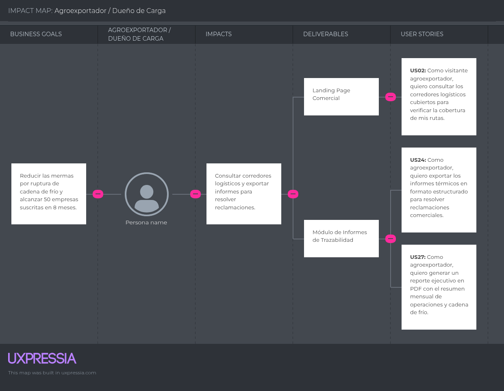


## 3.3. Product Backlog

| # Orden | User Story Id | Título | Descripción | Story Points <br>(1 / 2 / 3 / 5 / 8) |
| :---: | :---: | :--- | :--- | :---: |
| **1** | US01 | Telemetría en vivo en el panel | Como **coordinador logístico**, quiero visualizar un panel con lecturas actualizadas de temperatura para supervisar envíos. | 5 |
| **2** | US02 | Mapa interactivo de rutas | Como **coordinador logístico**, quiero visualizar la ubicación geográfica de las unidades sobre un mapa para rastrear el trayecto. | 8 |
| **3** | US03 | Búsqueda y filtros de envíos | Como **coordinador logístico**, quiero buscar y filtrar envíos activos por código o unidad para localizar operaciones rápidamente. | 3 |
| **4** | US04 | Indicadores visuales de severidad | Como **coordinador logístico**, quiero observar indicadores visuales de color según el estado térmico para priorizar incidencias. | 2 |
| **5** | US05 | Detalle de telemetría por unidad | Como **coordinador logístico**, quiero consultar el detalle técnico de una unidad en ruta para verificar variables de humedad y vibración. | 5 |
| **6** | TS01 | Endpoint de consulta de envíos activos | Como **developer**, quiero desarrollar un endpoint GET en la API para listar los envíos activos con filtros de búsqueda. | 3 |
| **7** | US06 | Detección de excursiones térmicas | Como **comprador de alimentos**, quiero recibir notificaciones automáticas cuando la temperatura supere el rango seguro. | 5 |
| **8** | US07 | Notificaciones push en plataforma | Como **coordinador logístico**, quiero visualizar avisos emergentes dentro de la aplicación para enterarme de incidencias. | 3 |
| **9** | US08 | Configuración de umbrales térmicos | Como **gestor de calidad**, quiero configurar los rangos máximos y mínimos permitidos por tipo de alimento transportado. | 3 |
| **10** | US09 | Historial de alertas emitidas | Como **coordinador logístico**, quiero consultar el registro histórico de todas las alertas generadas para auditar incidencias. | 3 |
| **11** | TS02 | Endpoint de consulta de alertas | Como **developer**, quiero desarrollar un endpoint GET en la API para consultar el listado de alertas térmicas registradas. | 3 |
| **12** | US10 | Consulta de historial térmico | Como **gestor de calidad**, quiero consultar los registros históricos de temperatura de envíos finalizados para auditorías. | 5 |
| **13** | US11 | Exportación de informes de trazabilidad | Como **agroexportador**, quiero exportar informes térmicos en formato estructurado para resolver reclamaciones comerciales. | 5 |
| **14** | US12 | Gráficos estadísticos comparativos | Como **gestor de calidad**, quiero visualizar gráficos de comportamiento térmico por ruta para identificar variaciones. | 5 |
| **15** | US13 | Registro de bitácora de auditoría | Como **auditor de calidad**, quiero consultar el registro de acciones de los usuarios en la plataforma para trazabilidad interna. | 3 |
| **16** | US14 | Registro de nueva unidad refrigerada | Como **coordinador logístico**, quiero registrar nuevas unidades frigoríficas en el sistema para asociarlas a los despachos. | 3 |
| **17** | US15 | Edición de datos de unidad | Como **coordinador logístico**, quiero actualizar la información de una unidad frigorífica para mantener la base de datos al día. | 2 |
| **18** | US16 | Registro de conductores | Como **coordinador logístico**, quiero registrar los datos de los conductores en el sistema para asignarlos a los viajes. | 3 |
| **19** | US17 | Asignación de conductor a vehículo | Como **coordinador logístico**, quiero asignar un conductor disponible a una unidad de transporte para organizar despachos. | 3 |
| **20** | US18 | Configuración de dispositivos IoT | Como **administrador técnico**, quiero asociar tokens y dispositivos sensores IoT a las unidades de transporte desde el panel. | 5 |
| **21** | TS03 | Endpoint de gestión de flotas | Como **developer**, quiero crear endpoints CRUD en la API para la administración de unidades frigoríficas y vehículos. | 5 |
| **22** | TS04 | Endpoint de recepción de telemetría IoT | Como **developer**, quiero implementar un endpoint POST en la API para recibir y almacenar lecturas masivas de sensores. | 8 |
| **23** | US19 | Inicio de sesión en el sistema | Como **coordinador logístico**, quiero autenticar mis credenciales en el sistema para acceder al panel operativo. | 3 |
| **24** | US20 | Cierre de sesión seguro | Como **usuario del sistema**, quiero cerrar mi sesión activa de forma segura para evitar accesos no autorizados. | 2 |
| **25** | US21 | Recuperación de contraseña | Como **usuario del sistema**, quiero solicitar un enlace de recuperación de contraseña para restablecer mi acceso. | 3 |
| **26** | US22 | Gestión de perfiles de usuario | Como **administrador**, quiero administrar los roles y permisos de los usuarios para controlar el acceso a módulos. | 5 |
| **27** | TS05 | Endpoint de autenticación JWT | Como **developer**, quiero construir un endpoint POST en la API para autenticar usuarios y emitir tokens JWT seguros. | 5 |
| **28** | US23 | Propuesta de valor en Landing | Como **visitante transportista**, quiero visualizar la propuesta de valor principal en la página de inicio para comprender los beneficios del monitoreo térmico. | 2 |
| **29** | US24 | Corredores logísticos en Landing | Como **visitante agroexportador**, quiero consultar los corredores logísticos cubiertos para verificar la cobertura de mis rutas. | 2 |
| **30** | US25 | Formulario de contacto comercial | Como **visitante interesado**, quiero registrar mis datos en un formulario para solicitar una demostración comercial. | 3 |
| **31** | US26 | Casos de éxito y testimonios | Como **visitante del sitio**, quiero leer casos de éxito de otros transportistas para validar la efectividad de la plataforma. | 2 |
| **32** | US27 | Preguntas frecuentes (FAQ) | Como **visitante interesado**, quiero consultar preguntas frecuentes para resolver dudas sobre la implementación del sistema. | 2 |
| **33** | US28 | Generación de reportes PDF ejecutivos | Como **gerente logístico**, quiero generar un reporte ejecutivo en PDF con el resumen mensual de operaciones y cadena de frío. | 5 |
| **34** | US29 | Panel de analítica de incidencias | Como **gestor de calidad**, quiero visualizar métricas agregadas de fallas térmicas para identificar proveedores o rutas críticas. | 5 |
| **35** | US30 | Gestión de multi-idioma (i18n) | Como **usuario del sistema**, quiero alternar entre español e inglés en la interfaz para facilitar la operación a socios extranjeros. | 3 |
| **36** | TS06 | Endpoint de exportación de reportes | Como **developer**, quiero implementar un endpoint en la API que compile y exporte datos históricos en archivos estructurados. | 5 |
| **37** | TS07 | Documentación Swagger OpenAPI | Como **developer**, quiero configurar la especificación OpenAPI mediante Swagger para documentar los endpoints. | 2 |

| **38** | US31 | Planes y acceso desde la Landing | Como **visitante**, quiero consultar los planes y acceder a la aplicación con el idioma seleccionado. | 2 |
| **39** | US32 | Registro de Cliente de Carga | Como **cliente de carga**, quiero crear mi cuenta para consultar los envíos que me asignen. | 3 |
| **40** | US33 | Programación de envío refrigerado | Como **coordinador logístico**, quiero programar carga, ruta, fechas, cliente y recursos con rangos ambientales. | 5 |
| **41** | US34 | Gestión de estados del envío | Como **coordinador logístico**, quiero iniciar, entregar o cancelar un envío con historial. | 3 |
| **42** | US35 | Registro de acción correctiva | Como **coordinador logístico**, quiero registrar una acción ante una alerta y conservar su trazabilidad. | 3 |
| **43** | US36 | Consulta de envíos del Cliente de Carga | Como **cliente de carga**, quiero consultar únicamente mis envíos, lecturas, alertas e historial. | 5 |

## Referencia y Enlace Público
- **Herramienta de gestión:** Trello
- **URL Pública del Product Backlog:** https://trello.com/b/6qrvOukt/blackstartup-fr%C3%ADotrack

## Captura de pantalla
<div align="center">
  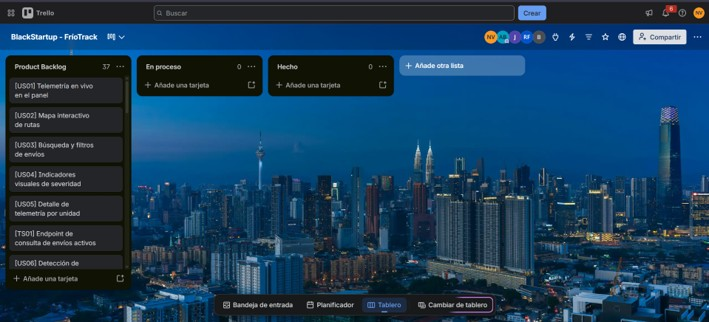
</div>

---
# Capítulo IV: Product Design

El presente capítulo documenta las decisiones de diseño de FríoTrack, la plataforma web de BlackStartup para el monitoreo en tiempo casi real de la temperatura, la humedad y la posición de cargas refrigeradas durante el transporte terrestre, el diseño se desarrolla en dos planos complementarios. El primero corresponde al diseño de la experiencia y de la interfaz (secciones 4.1 a 4.5), que traduce a pantallas navegables el problema y los perfiles de usuario definidos en el Capítulo I. El segundo corresponde al diseño de la solución de software (secciones 4.6 a 4.8), donde se modela el dominio, se describe la arquitectura y se especifican las clases y la base de datos que sustentan esas pantallas.

Ambos planos se trabajaron de manera conjunta. Cada pantalla de la aplicación se diseñó a partir de una tarea concreta de los dos perfiles de usuario de la plataforma, el **Coordinador Logístico** (empresa de transporte refrigerado) y el **Cliente de Carga** (productor, exportador o comprador de alimentos perecibles), y cada comando o evento del modelo de dominio se relaciona con una acción visible en esas pantallas. De este modo, el enfoque de diseño centrado en las personas propuesto por la norma ISO 9241-210 (International Organization for Standardization [ISO], 2019) se mantiene desde la primera guía de estilo hasta el diagrama de la base de datos.

Los datos de ejemplo que aparecen en las imágenes (códigos de envío, placas, conductores, clientes y empresas) son ficticios y se emplean solamente para ilustrar el diseño. Los precios de los planes de la Landing Page son referenciales y están sujetos a validación con usuarios reales.

## 4.1. Style Guidelines

### 4.1.1. General Style Guidelines

La guía de estilo de FríoTrack establece los elementos visuales y de lenguaje que se aplican de manera uniforme en la Landing Page y en la Web Application. Su propósito es que la interfaz transmita seriedad y precisión, que es lo que los usuarios esperan de una herramienta que respalda la conservación de alimentos perecibles, y que la información crítica (por ejemplo, una lectura fuera de rango) pueda reconocerse sin esfuerzo. Los principios que la orientan son cuatro: consistencia entre pantallas, jerarquía visual clara, uso del color siempre acompañado de texto e ícono, y lenguaje orientado a la acción. Estos principios se apoyan en las heurísticas de usabilidad de Nielsen (1994), en particular la visibilidad del estado del sistema, la consistencia y los estándares, y la prevención de errores.

#### Logotipo

El logotipo de FríoTrack combina un isotipo y un nombre dividido cromáticamente en «Frío» y «Track». El isotipo es el mismo archivo `logo.svg` de la Landing Page y está formado por tres elementos con significado propio: un copo de nieve de seis brazos que comunica la cadena de frío, puntas de flecha en los extremos que aluden al recorrido de la unidad y un nodo central que representa el sensor que reporta las lecturas. Todo ello se inscribe en un cuadrado de esquinas redondeadas del color principal de la marca. Se definen tres versiones: la principal sobre fondo claro, una versión sobre fondo oscuro para el pie de página y una versión sobre el color de marca, además del isotipo aislado que se usa como ícono de la pestaña del navegador y de la aplicación.

**Figura 4.1**

*Logotipo de FríoTrack y sus variantes*

<p align="center">
  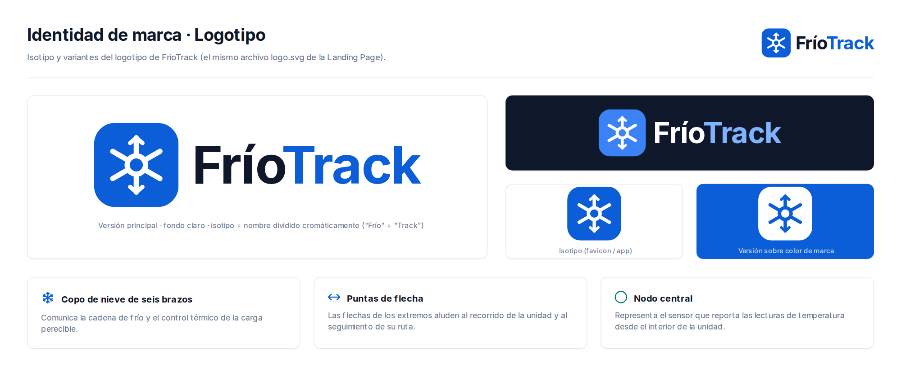<br>
  <i>Nota.</i> Elaboración propia.
</p>

#### Tipografía

Se adopta la familia **Inter** (Andersson, s. f.) como tipografía única de la plataforma. Inter es una tipografía sans-serif de licencia SIL Open Font License 1.1, diseñada para la lectura en pantalla, que incluye los caracteres del español (tildes, «ñ», signos de apertura) y cifras tabulares. Esta última característica es relevante para FríoTrack porque las lecturas de temperatura se muestran en columnas y deben alinearse verticalmente para poder compararse de un vistazo. La escala tipográfica define nueve roles, desde el texto de encabezado de la Landing Page hasta las etiquetas de 12 px, y mantiene un interlineado mínimo de 1,5 en párrafos y de 1,3 en interfaces densas.

**Figura 4.2**

*Sistema tipográfico de FríoTrack*

<p align="center">
  <br>
  <i>Nota.</i> Elaboración propia.
</p>

#### Paleta de colores

La paleta parte de un azul frío como color principal, asociado con confianza y con la temática de refrigeración, y de un turquesa de acento para elementos decorativos. Sobre esta base se definen cuatro colores semánticos para el estado térmico de un envío: dentro del rango, advertencia, crítico y sin señal. Cada color de estado tiene tres variantes (relleno, texto seguro y tinte de fondo), de modo que el texto siempre se pinta con la variante que cumple el contraste requerido. Además, el color nunca es el único portador de información: cada estado se acompaña de un ícono y de una etiqueta de texto, lo que responde al criterio de éxito 1.4.1 (Uso del color) de las Pautas de Accesibilidad para el Contenido Web (World Wide Web Consortium [W3C], 2024).

**Tabla 4.1**

*Colores de marca, superficies y estados de FríoTrack*


| Nombre | Código | Función en la interfaz |
| :--- | :---: | :--- |
| **Primary Blue** | `#0B5ED7` | Acciones principales, enlaces y navegación activa. |
| **Blue Dark** | `#084BAE` | Estados *hover* y *pressed*; texto sobre el tinte azul. |
| **Cold Teal** | `#00B4A6` | Acento decorativo y datos secundarios (no se usa como color de texto sobre blanco). |
| **Ink** | `#0F172A` | Texto principal y encabezados. |
| **Slate** | `#64748B` | Texto secundario y etiquetas. |
| **Background** | `#F8FAFC` | Fondo general de la aplicación. |
| **Blue Tint** | `#EAF2FE` | Selección, fila activa y avisos informativos. |
| **Dentro del rango** | `#146C36` (texto) · `#E7F6EC` (tinte) | Lectura dentro del rango térmico configurado. |
| **Advertencia** | `#92400E` (texto) · `#FEF3C7` (tinte) · `#F5A524` (relleno) | Lectura cercana al límite o desvío breve. |
| **Crítico** | `#B42318` (texto) · `#FDECEE` (tinte) · `#E63946` (relleno) | Desvío que supera la tolerancia configurada. |
| **Sin señal** | `#475569` (texto) · `#EEF2F6` (tinte) · `#64748B` (relleno) | El sensor no reporta; se muestra la última lectura conocida. |

*Nota.* Elaboración propia.

Los valores de contraste se calcularon con la fórmula de luminancia relativa definida por el criterio 1.4.3 (Contraste mínimo) de las Pautas de Accesibilidad para el Contenido Web 2.2 (W3C, 2024), que exige una razón de al menos 4,5 : 1 para texto normal y de 3 : 1 para texto grande. La Tabla 4.2 resume los resultados de las combinaciones que se emplean en la interfaz.

**Tabla 4.2**

*Razón de contraste de las combinaciones de color utilizadas*


| Combinación (texto sobre fondo) | Razón | Resultado | Uso |
| :--- | :---: | :---: | :--- |
| Blanco sobre Primary Blue | 5,84 : 1 | Cumple AA | Texto de botones primarios |
| Primary Blue sobre blanco | 5,84 : 1 | Cumple AA | Enlaces y texto de acción |
| Blanco sobre Blue Dark | 7,99 : 1 | Cumple AA | Botones en estado *hover* |
| Ink sobre Background | 17,06 : 1 | Cumple AA | Texto principal |
| Slate sobre blanco | 4,76 : 1 | Cumple AA | Texto secundario |
| Slate sobre Background | 4,55 : 1 | Cumple AA | Texto secundario sobre el fondo de página |
| Blue Dark sobre Blue Tint | 7,09 : 1 | Cumple AA | Navegación activa |
| Texto de «Dentro del rango» sobre su tinte | 5,82 : 1 | Cumple AA | Chips de estado |
| Texto de «Advertencia» sobre su tinte | 6,37 : 1 | Cumple AA | Chips de estado |
| Texto de «Crítico» sobre su tinte | 5,76 : 1 | Cumple AA | Chips de estado y alertas |
| Texto de «Sin señal» sobre su tinte | 6,74 : 1 | Cumple AA | Chips de estado |
| Ink sobre Cold Teal | 6,87 : 1 | Cumple AA | Etiquetas sobre el acento |
| Blanco sobre Cold Teal | 2,60 : 1 | No cumple | Combinación prohibida para texto |

*Nota.* Razones calculadas por el equipo con la fórmula de luminancia relativa de WCAG. Elaboración propia.

**Figura 4.3**

*Paleta de colores y estados térmicos de FríoTrack*

<p align="center">
  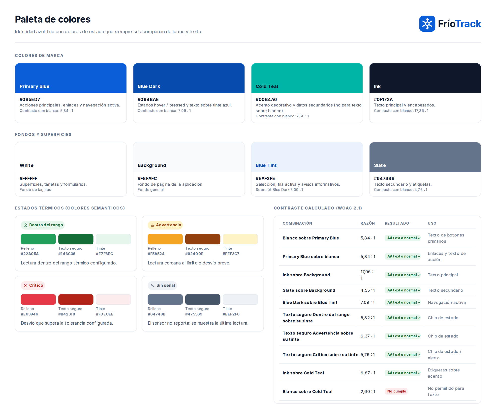<br>
  <i>Nota.</i> Elaboración propia.
</p>

#### Espaciado y cuadrícula

El espaciado se basa en una cuadrícula de 8 px con un medio paso de 4 px, escala que se aplica a los componentes de la Web Application y, con valores fluidos que se ajustan al ancho de la pantalla, a la Landing Page. Los radios de borde (8 px en botones y campos, 12 px en tarjetas, 20 px en paneles grandes y circular en los chips) y tres niveles de elevación (tarjetas, controles flotantes y ventanas modales) completan el sistema. Para la maquetación se definen cuatro puntos de quiebre: móvil (360 a 767 px, cuatro columnas), tableta (768 a 1023 px, ocho columnas), laptop (1024 a 1439 px, doce columnas) y escritorio (desde 1440 px, doce columnas con un ancho máximo de 1180 px en la Landing Page). La Landing Page implementada aplica además cortes propios según su contenido: 1240 px, por debajo del cual la navegación pasa a un menú desplegable; 1000 px, donde las secciones se apilan en una columna y las tarjetas de funciones pasan a dos por fila; 720 px, donde las tarjetas ocupan todo el ancho; y 560 px, donde se compactan los bloques de equipo y de metas. Este enfoque adaptable a distintos tamaños de pantalla sigue los tres ingredientes del diseño web adaptable descritos por Marcotte (2010): cuadrículas fluidas, imágenes flexibles y consultas de medios.

**Figura 4.4**

*Sistema de espaciado, radios, elevación y puntos de quiebre*

<p align="center">
  <br>
  <i>Nota.</i> Elaboración propia.
</p>

#### Iconografía

La interfaz utiliza PrimeIcons, la biblioteca de íconos de PrimeVue (PrimeTek, s. f.), para la navegación y las acciones frecuentes, y la complementa con cinco íconos propios que PrimeIcons no ofrece y que son propios de la cadena de frío: temperatura, humedad, puerta abierta, copo de nieve y sin señal. Los íconos se usan en tres tamaños (16, 20 y 24 px) y se acompañan de una etiqueta de texto cuando la acción pueda resultar ambigua, como en «Descargar reporte».

**Figura 4.5**

*Sistema de iconografía de FríoTrack*

<p align="center">
  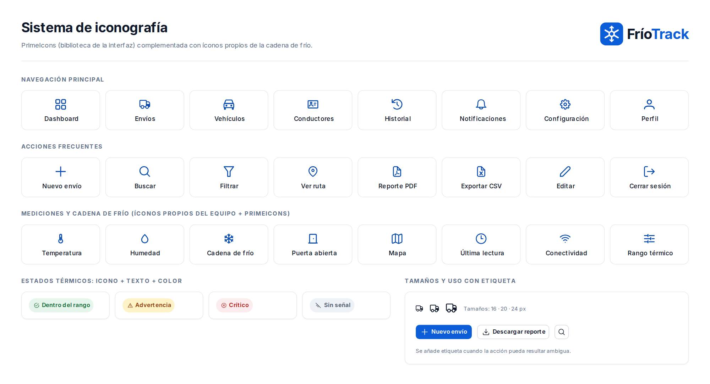<br>
  <i>Nota.</i> Elaboración propia.
</p>

#### Tono de comunicación y lenguaje aplicado

El tono de FríoTrack es serio pero cercano. La interfaz informa con precisión y orienta la siguiente acción, sin culpar al usuario cuando ocurre un error. Se establecen tres principios: comunicar de manera clara y profesional; ser preciso y no absoluto (se distingue entre lectura reportada, ruta planificada y llegada estimada, y no se afirma «en tiempo real» cuando el dato llegó con retraso); y orientar a la acción, mostrando primero el problema y luego qué hacer. Los textos de la interfaz se redactan en español latinoamericano (`es_419`) y en inglés (`en_US`).

**Tabla 4.3**

*Vocabulario preferido y vocabulario a evitar en la interfaz*


| Preferir | Evitar | Motivo |
| :--- | :--- | :--- |
| Lectura reportada 09:30 | Temperatura actual (cuando el dato está retrasado) | Si la lectura llegó con retraso, «actual» resulta engañoso. |
| Fuera de rango | Peligro / Emergencia | Describe el hecho sin dramatizar. |
| Sin señal del sensor | Error de conexión | Nombra la causa que el usuario puede revisar. |
| Llegada estimada | Hora de llegada exacta | La hora depende del tránsito y no es una certeza. |
| Registrar acción correctiva | Solucionar problema | Nombra la acción concreta que realiza el usuario. |
| Envío en tránsito | Camión activo | Se refiere al envío, que es la unidad del negocio. |

*Nota.* Elaboración propia.

**Figura 4.6**

*Tono de comunicación y mensajes del sistema*

<p align="center">
  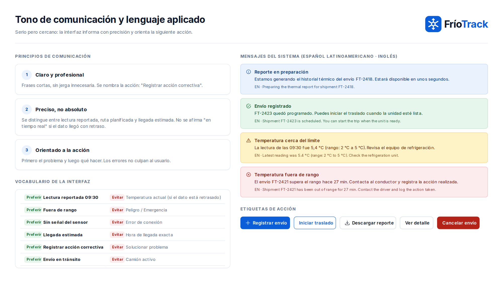<br>
  <i>Nota.</i> Elaboración propia.
</p>

### 4.1.2. Web Style Guidelines

Las guías de estilo web definen cómo se aplican los elementos anteriores en los componentes de interfaz de la Web Application y de la Landing Page. La Web Application se construye con Vue 3 y PrimeVue (PrimeTek, s. f.), una biblioteca de componentes que se personaliza con el tema de FríoTrack, mientras que la Landing Page, por ser un sitio estático, usa HTML, CSS y JavaScript sin bibliotecas y replica los mismos tokens mediante variables CSS, y toma como referencia Material Design 3 (Google, s. f.) para los estados de interacción, el foco y la elevación. Todos los componentes comparten los mismos tokens de color, tipografía y espaciado descritos en la sección 4.1.1, de manera que un cambio de tema se propaga a toda la plataforma.

**Tabla 4.4**

*Componentes de la interfaz web y reglas de uso*


| Componente | Variantes y estados | Regla de uso |
| :--- | :--- | :--- |
| **Botón** | Primario, contorno, neutro, texto y peligro; tamaños pequeño (32 px), estándar (40 px) y grande (48 px); estados normal, *hover*, foco, deshabilitado. | Cada vista tiene una sola acción primaria. Las acciones destructivas usan el botón de peligro y piden confirmación. |
| **Campo de formulario** | Normal, con foco (anillo azul de 3 px), con error y con texto de ayuda. | Toda etiqueta es visible y los errores se muestran junto al campo, con texto que explica cómo corregirlos. |
| **Chip de estado** | Dentro del rango, advertencia, crítico, sin señal, en tránsito, programado. | Siempre incluye ícono y texto además del color. |
| **Tarjeta de indicador (KPI)** | Ícono de color, valor numérico y etiqueta. | Se usa en el Dashboard para envíos en tránsito, alertas activas, unidades disponibles y entregas del día. |
| **Aviso (*banner*)** | Informativo, correcto, advertencia y crítico. | Comunican el estado de un envío o de una operación, por ejemplo «Sin señal desde 09:12». |
| **Tabla** | Encabezado fijo, filas seleccionables, paginación. | Los códigos y las lecturas usan cifras tabulares; toda fila navega al detalle del registro. |
| **Pestañas** | Activa, inactiva, con contador. | Organizan el detalle del envío (Resumen, Lecturas, Ruta y posiciones, Alertas, Historial de estados). |
| **Indicador de pasos** | Paso completado, actual y pendiente. | Guía el registro de un envío en cuatro pasos. |
| **Ventana modal** | Cabecera, cuerpo, pie con acciones. | Se reserva para acciones que requieren decisión, como registrar una acción correctiva. |
| **Interruptor y selector** | Activado, desactivado; opciones excluyentes. | Preferencias como las alertas por correo y el idioma (ES / EN). |

*Nota.* Elaboración propia, con base en los componentes de PrimeVue y las pautas de Material Design 3.

**Figura 4.7**

*Componentes de la interfaz web de FríoTrack*

<p align="center">
  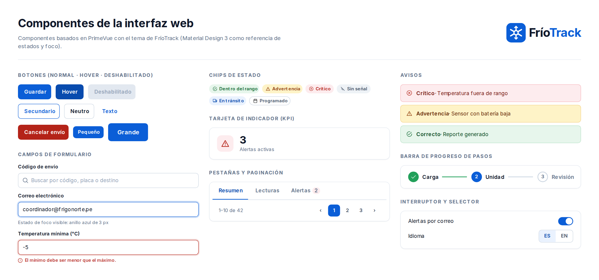<br>
  <i>Nota.</i> Elaboración propia.
</p>

**Accesibilidad.** Las siguientes son decisiones y objetivos de diseño; no acreditan una auditoría completa de la implementación ni una certificación. La verificación local realizada se presenta en Sprint 2. La interfaz se diseña para cumplir el nivel AA de las Pautas de Accesibilidad para el Contenido Web 2.2 (W3C, 2024). Las decisiones concretas son las siguientes: los contrastes de la Tabla 4.2 satisfacen el criterio 1.4.3; el borde y el anillo de foco de los campos superan la razón de 3 : 1 exigida por el criterio 1.4.11 (Contraste de elementos no textuales), con 5,84 : 1 en el estado de foco y 5,76 : 1 en el estado de error; el foco del teclado es siempre visible (criterio 2.4.7); los controles táctiles miden al menos 32 px por lado, más que el mínimo de 24 px del criterio 2.5.8 (Tamaño del objetivo); y los mensajes de error identifican el campo y sugieren la corrección (criterios 3.3.1 y 3.3.3). Los componentes interactivos personalizados, como las pestañas y las ventanas modales, incorporan roles y atributos de las especificaciones WAI-ARIA 1.2 (W3C, 2023) para que los lectores de pantalla anuncien correctamente su estado.

**Punto de mejora identificado.** El borde de reposo de los campos y de los botones neutros (`#CBD5E1`) tiene una razón de contraste de solo 1,48 : 1 frente al blanco, por lo que no alcanza el 3 : 1 del criterio 1.4.11. La Landing Page implementada ya resuelve este punto: sus campos y botones de conmutación usan Slate (`#64748B`, 4,76 : 1) como borde. Los mock-ups de la Web Application conservan el tono tenue por coherencia visual con el diseño original, pero cada campo mantiene una etiqueta visible; para la implementación de la Web Application se recomienda aplicar el mismo cambio antes de la validación con usuarios.

**Internacionalización.** Todos los textos se gestionan mediante archivos de traducción para el español latinoamericano (`es_419`), idioma base del producto según el Capítulo I, y el inglés (`en_US`). El idioma inicial sigue al del navegador del usuario y puede cambiarse desde el selector ES / EN del encabezado o, en la Web Application, desde la sección Configuración; la elección se conserva para la siguiente visita.

**Diseño adaptable.** La Landing Page prioriza el contenido esencial en pantallas pequeñas, según la recomendación de Wroblewski (2011): en su versión móvil las secciones se reorganizan en una sola columna y la navegación se reduce a un menú desplegable. La Web Application ofrece dos disposiciones: en escritorio, una barra lateral de navegación con un área de trabajo de varias columnas; en móvil, una barra inferior con cuatro destinos (Panel, Envíos, Alertas y Perfil) y un panel deslizable con la lista de envíos sobre el mapa.

**Retroalimentación e interacción.** Siguiendo el principio de retroalimentación descrito por Norman (2013), toda acción del usuario recibe una respuesta visible: los botones cambian de estado al pasar el cursor, las operaciones largas (como la generación del reporte térmico) muestran un aviso de progreso y los resultados se confirman con un mensaje. Las acciones irreversibles, como cancelar un envío, solicitan confirmación previa.

## 4.2. Information Architecture

La arquitectura de información de FríoTrack define cómo se organiza, se nombra, se busca y se recorre el contenido de la plataforma. Se elaboró con base en los cuatro sistemas que proponen Rosenfeld et al. (2015) (organización, rotulado, navegación y búsqueda) y en el modelo de capas de Garrett (2011), que distingue la estructura del sitio de la interacción y de la superficie visual. La plataforma tiene dos superficies con audiencias distintas: la Landing Page, pública, cuyo objetivo es explicar la propuesta de valor y llevar al visitante al registro; y la Web Application, privada, cuyo contenido depende del perfil del usuario autenticado.

### 4.2.1. Organization Systems

FríoTrack combina una **estructura jerárquica** con **flujos secuenciales**. La jerarquía agrupa el contenido en pocas categorías principales, siete para el Coordinador Logístico y cuatro para el Cliente de Carga, cada una con subniveles propios. Los flujos secuenciales se reservan para tareas que deben completarse en orden y con validación en cada paso, como el registro de un envío en cuatro pasos (carga y rango térmico, ruta y horario, unidad y conductor, revisión). Esta decisión responde a que la jerarquía facilita ubicar la información, mientras que la secuencia reduce errores en tareas de alto costo, como programar un traslado con una unidad equivocada.

El contenido se organiza mediante cuatro esquemas de organización, cada uno aplicado en las pantallas donde resulta más natural para el usuario:

**Tabla 4.5**

*Esquemas de organización aplicados en FríoTrack*


| Esquema | Criterio de agrupación | Dónde se aplica |
| :--- | :--- | :--- |
| **Por audiencia** | Perfil del usuario | Landing Page («Para quién») y menú lateral de la aplicación, que muestra siete opciones al Coordinador Logístico y cuatro al Cliente de Carga. |
| **Por tarea** | Lo que el usuario necesita hacer | Menú del Coordinador Logístico: Envíos (programar y seguir), Vehículos y Conductores (administrar la flota), Historial (auditar). |
| **Cronológico** | Fecha y hora del evento | Historial de envíos, historial de estados de un envío, lista de notificaciones agrupada por día y gráfico de lecturas de las últimas 12 horas. |
| **Por estado** | Situación del envío o de la alerta | Chips de estado (programado, en tránsito, entregado, cancelado) y de estado térmico (dentro del rango, advertencia, crítico, sin señal); filtros de las listas. |

*Nota.* Elaboración propia, con base en los esquemas de organización de Rosenfeld et al. (2015).

Los dos mapas del sitio que se muestran a continuación resumen la estructura resultante. El primero corresponde a la Landing Page, que se organiza en una página principal de doce secciones, una página de términos y condiciones y una ventana modal con dos puntos de entrada a la aplicación (Iniciar sesión y Registrarse). El segundo muestra la Web Application, con una zona pública de acceso y cuenta, y dos ramas privadas, una por perfil.

**Figura 4.8**

*Mapa del sitio de la Landing Page*

<p align="center">
  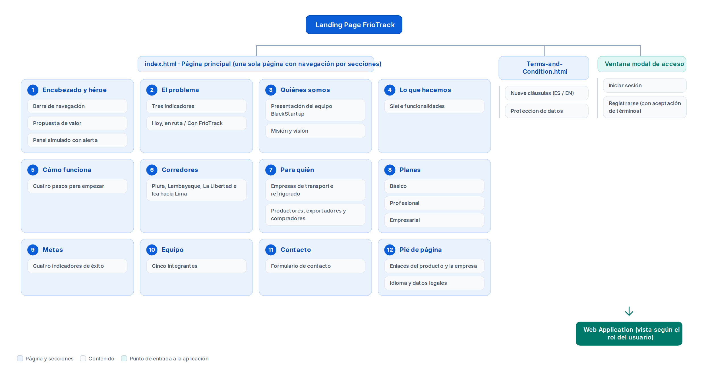<br>
  <i>Nota.</i> Elaboración propia.
</p>

**Figura 4.9**

*Mapa del sitio de la Web Application por perfil de usuario*

<p align="center">
  <br>
  <i>Nota.</i> Elaboración propia.
</p>

Con esta estructura se aplican los principios de claridad, navegación enfocada y facilidad de uso: el Cliente de Carga nunca ve opciones de administración de flota que no puede usar, y el Coordinador Logístico accede a cada función operativa con una sola selección del menú lateral, sin menús anidados.

> **Enlace al diagrama de arquitectura de información (Miro):** pendiente de completar por el equipo.

### 4.2.2. Labeling Systems

El sistema de rotulado de FríoTrack usa una sola palabra o una frase corta y estable para nombrar cada función, y emplea la misma etiqueta en el menú, en el título de la pantalla y en el encabezado de la ruta de navegación (*breadcrumb*). Las etiquetas de acción usan verbos en infinitivo o imperativo que nombran el resultado («Registrar acción correctiva», «Descargar reporte térmico»). La plataforma soporta español latinoamericano (`es_419`), idioma base del producto, e inglés (`en_US`), de modo que la terminología se mantiene uniforme en ambos idiomas.

**Tabla 4.6**

*Etiquetas de navegación y su descripción*


| Inglés (`en_US`) | Español latinoamericano (`es_419`) | Descripción |
| :--- | :--- | :--- |
| **Home** | Inicio | Presenta la propuesta de valor de FríoTrack y el panel simulado de una unidad refrigerada. |
| **About us** | Quiénes somos | Presenta al equipo BlackStartup, su misión y su visión. |
| **What we do** | Lo que hacemos | Explica las capacidades de la plataforma: panel en tiempo casi real, alertas, historial, mapa, flota, búsqueda y avisos. |
| **How it works** | Cómo funciona | Resume en cuatro pasos cómo empezar a usar la plataforma. |
| **Who it's for** | Para quién | Describe los dos segmentos de usuarios y lo que cada uno obtiene de la plataforma. |
| **Pricing** | Planes | Muestra los tres planes referenciales según el tamaño de la flota. |
| **Team** | Equipo | Presenta a los cinco integrantes del equipo y su rol. |
| **Contact** | Contacto | Ofrece un formulario para comunicarse con el equipo. |
| **Terms and conditions** | Términos y condiciones | Presenta las condiciones generales del servicio. |
| **Log in** | Iniciar sesión | Permite a un usuario registrado ingresar a su cuenta. |
| **Sign up** | Registrarse | Inicia la creación de una cuenta. |
| **Dashboard** | Dashboard | Muestra el mapa de unidades activas, los indicadores y los envíos que requieren atención. |
| **Shipments** | Envíos | Lista, busca y registra envíos; da acceso al detalle de cada uno. |
| **Vehicles** | Vehículos | Administra las unidades refrigeradas y su sensor asignado. |
| **Drivers** | Conductores | Administra los conductores y su disponibilidad. |
| **History** | Historial | Consulta envíos anteriores y descarga sus reportes térmicos. |
| **Notifications** | Notificaciones | Reúne los avisos de alertas, incidencias y entregas. |
| **Settings** | Configuración | Gestiona el perfil, la contraseña y el idioma. |
| **Incoming shipments** | Envíos por recibir | Lista los envíos asociados al Cliente de Carga que están programados o en tránsito. |

*Nota.* Elaboración propia.

Además de las etiquetas de navegación, la plataforma define un vocabulario controlado para los estados, que se usa de forma idéntica en chips, filtros, notificaciones y reportes.

**Tabla 4.7**

*Vocabulario controlado de estados*


| Dominio | Inglés (`en_US`) | Español latinoamericano (`es_419`) |
| :--- | :--- | :--- |
| **Estado del envío** | Draft · Scheduled · In transit · Delivered · Cancelled | Borrador · Programado · En tránsito · Entregado · Cancelado |
| **Estado térmico** | Within range · Warning · Critical · No signal | Dentro del rango · Advertencia · Crítico · Sin señal |
| **Estado de la alerta** | Active · Acknowledged · Resolved | Activa · Reconocida · Resuelta |
| **Estado de la unidad** | Available · In transit · In maintenance | Disponible · En tránsito · En mantenimiento |

*Nota.* Elaboración propia.

### 4.2.3. SEO Tags and Meta Tags

Los SEO Tags y Meta Tags de FríoTrack describen el contenido de cada página al navegador y a los motores de búsqueda. Se distinguen dos casos. La Landing Page y las páginas de acceso son públicas y se optimizan para el posicionamiento, con términos como cadena de frío, transporte refrigerado, monitoreo de temperatura y trazabilidad. Las vistas de la Web Application requieren autenticación, por lo que sus metadatos solo sirven para identificar la pestaña del navegador y **no deben indexarse**: se marcan con la directiva `noindex` de la etiqueta *robots* (Google Search Central, s. f.). Los metadatos no reemplazan los mecanismos de autenticación y autorización de la plataforma.

**Tabla 4.8**

*Etiquetas title, description, keywords, author y robots por página*


| Página | Title | Description | Keywords | Author | Robots |
| :--- | :--- | :--- | :--- | :--- | :---: |
| **Landing Page** | FríoTrack \| Monitoreo de la cadena de frío en transporte | Monitorea en tiempo casi real la temperatura, la humedad y la ubicación de tus unidades refrigeradas. Recibe alertas y consulta el historial del viaje. | cadena de frío, transporte refrigerado, monitoreo de temperatura, trazabilidad, alertas, Perú | BlackStartup | `index, follow` |
| **Iniciar sesión / Registro** | Accede a FríoTrack \| Iniciar sesión o registrarse | Inicia sesión o crea tu cuenta de Coordinador Logístico o de Cliente de Carga en FríoTrack. | FríoTrack, iniciar sesión, registro, coordinador logístico, cliente de carga | BlackStartup | `index, follow` |
| **Recuperar contraseña** | Recuperar contraseña \| FríoTrack | Solicita un enlace para restablecer la contraseña de tu cuenta de FríoTrack. | recuperar contraseña, FríoTrack | BlackStartup | `noindex, nofollow` |
| **Dashboard** | Dashboard \| FríoTrack | Consulta las unidades activas, los envíos en tránsito y las alertas que requieren atención. | dashboard, envíos, alertas, unidades activas | BlackStartup | `noindex, nofollow` |
| **Envíos** | Envíos \| FríoTrack | Busca, programa y da seguimiento a los envíos refrigerados de tu empresa. | envíos, transporte refrigerado, seguimiento | BlackStartup | `noindex, nofollow` |
| **Detalle del envío** | Envío FT-2418 \| FríoTrack | Revisa las lecturas de temperatura y humedad, la ruta y las alertas del envío. | detalle del envío, lecturas, ruta, alertas | BlackStartup | `noindex, nofollow` |
| **Historial** | Historial de envíos \| FríoTrack | Consulta envíos anteriores y descarga sus reportes térmicos. | historial, reporte térmico, envíos entregados | BlackStartup | `noindex, nofollow` |
| **Configuración** | Configuración \| FríoTrack | Administra tu perfil, tu contraseña y el idioma de la plataforma. | perfil, configuración, idioma | BlackStartup | `noindex, nofollow` |

*Nota.* El *title* de la vista de detalle incluye el código del envío que se está consultando. Elaboración propia.

Los títulos se limitan a un máximo aproximado de 60 caracteres y las descripciones a unos 160 caracteres, longitudes que evitan que los resultados de búsqueda se trunquen. Todas las páginas declaran la codificación de caracteres, el atributo `lang` de la etiqueta `html` según el idioma elegido (`es-419` o `en`) y la etiqueta *viewport*, indispensable para que la interfaz se adapte a pantallas móviles. La Landing Page incorpora además las etiquetas *Open Graph* (`og:title`, `og:description`, `og:image` y `og:type`) para que el enlace se muestre con una vista previa al compartirse en redes y mensajería; la imagen de vista previa usa la dirección absoluta que exige ese mecanismo. Al cambiar de idioma con el selector, la Landing Page actualiza también el título, la descripción y las etiquetas Open Graph. A modo de ejemplo, el encabezado de la Landing Page se define así:

```html
<html lang="es-419">
<head>
  <meta charset="UTF-8">
  <meta name="viewport" content="width=device-width, initial-scale=1.0">
  <title>FríoTrack | Monitoreo de la cadena de frío en transporte</title>
  <meta name="description" content="Monitorea en tiempo casi real la temperatura, la humedad y la ubicación de tus unidades refrigeradas. Recibe alertas y consulta el historial del viaje.">
  <meta name="keywords" content="cadena de frío, transporte refrigerado, monitoreo de temperatura, trazabilidad, alertas, Perú">
  <meta name="author" content="BlackStartup">
  <meta name="robots" content="index, follow">
  <meta name="theme-color" content="#0F172A">
  <meta property="og:type" content="website">
  <meta property="og:site_name" content="FríoTrack">
  <meta property="og:title" content="FríoTrack | Monitoreo de la cadena de frío en transporte">
  <meta property="og:description" content="Sabe en todo momento si tu carga refrigerada sigue en rango.">
  <meta property="og:image" content="https://friotracktb1bce6db1b.z22.web.core.windows.net/landing/assets/images/og-friotrack.png">
  <meta name="twitter:card" content="summary_large_image">
</head>
```

### 4.2.4. Searching Systems

Los mecanismos de búsqueda y filtrado de FríoTrack permiten localizar un envío, una unidad o un conductor sin recorrer manualmente listas extensas. Todas las búsquedas se ejecutan únicamente sobre los registros que el usuario tiene autorizados: el Coordinador Logístico consulta los envíos, unidades y conductores de su empresa, y el Cliente de Carga solo los envíos en los que figura como destinatario. La barra de búsqueda global del encabezado y las barras propias de cada lista comparten el mismo comportamiento.

#### Searching System para envíos

La lista de envíos incluye una barra de búsqueda de texto libre. Se busca de manera parcial y sin distinguir mayúsculas de minúsculas.

**Tabla 4.9**

*Criterios de búsqueda de la lista de envíos*


| Criterio | Descripción |
| :--- | :--- |
| **Código de envío** | Localiza un envío por su identificador, por ejemplo «FT-2418». |
| **Placa del vehículo** | Localiza los envíos que usan una unidad determinada. |
| **Destino** | Localiza los envíos cuyo destino coincide con el texto ingresado. |
| **Cliente de Carga** | Localiza los envíos asignados a un cliente (solo para el Coordinador Logístico). |

*Nota.* Elaboración propia.

Los resultados muestran el código, la carga y su rango térmico, la ruta, la unidad y el conductor, la última lectura, el estado térmico, el estado del envío y la llegada estimada. Cuando no existen coincidencias, la lista presenta un mensaje que indica que no se encontraron envíos para el criterio ingresado y ofrece la acción «Limpiar búsqueda».

#### Searching System mediante filtros

Los filtros complementan la búsqueda de texto y reducen la lista según atributos concretos. Pueden combinarse y, cuando se usa más de uno, la lista muestra solo los registros que cumplen todas las condiciones.

**Tabla 4.10**

*Filtros disponibles por lista*


| Filtro | Descripción | Lista donde se ofrece |
| :--- | :--- | :--- |
| **Estado** | Programado, En tránsito, Entregado o Cancelado. | Envíos, Historial |
| **Estado térmico** | Dentro del rango, Advertencia, Crítico o Sin señal. | Envíos, Envíos por recibir |
| **Producto o tipo de carga** | Limita la lista a una carga determinada, por ejemplo arándanos o palta Hass. | Envíos, Historial |
| **Destino** | Limita la lista a los envíos que llegan a una ubicación. | Envíos, Historial |
| **Rango de fechas** | Fecha inicial y final de salida o de entrega. | Historial |
| **Estado de la unidad** | Disponible, En tránsito o En mantenimiento. | Vehículos |

*Nota.* Elaboración propia.

La interfaz muestra los filtros activos como chips que pueden quitarse de a uno y ofrece la acción «Limpiar filtros» para volver a la lista completa. Al regresar desde el detalle de un envío a la lista, los filtros y la búsqueda se conservan, para evitar que el usuario tenga que repetirlos.

#### Searching System para el Coordinador Logístico y para el Cliente de Carga

El Coordinador Logístico dispone de búsqueda y filtros en Envíos, Vehículos (por placa o marca), Conductores (por nombre o licencia) e Historial, y además de la barra global del encabezado, que lleva directamente al detalle de un envío. Esto responde a la hipótesis de uso del Capítulo I sobre la localización de envíos, unidades o rutas en segundos.

El Cliente de Carga dispone de los mismos mecanismos básicos, pero solo en Envíos por recibir e Historial y limitados a los envíos que le fueron asignados. No puede buscar unidades ni conductores, ya que esa información pertenece a la empresa de transporte.

### 4.2.5. Navigation Systems

El sistema de navegación permite recorrer la plataforma de forma clara, predecible y coherente con el perfil del usuario. Se compone de tres tipos de navegación (global, local y contextual) que siguen la clasificación de Rosenfeld et al. (2015), y de elementos de apoyo, como la ruta de navegación, la barra de búsqueda, el selector de idioma y el ícono de notificaciones con contador de avisos sin leer.

#### Navigation System de la Landing Page

La Landing Page usa una barra horizontal en escritorio y un menú desplegable en móviles. El enlace «Iniciar sesión» y el botón «Registrarse» se mantienen visibles en todo momento, ya que son las dos acciones que persiguen los visitantes.

**Tabla 4.11**

*Opciones de navegación de la Landing Page*


| Nombre | Descripción |
| :--- | :--- |
| **Inicio / Home** | Lleva a la sección principal con la propuesta de valor y los llamados a la acción. |
| **Quiénes somos / About us** | Desplaza a la presentación del equipo con su misión y su visión. |
| **Lo que hacemos / What we do** | Desplaza a la sección con las siete funcionalidades de la plataforma. |
| **Planes / Pricing** | Desplaza a los tres planes referenciales. |
| **Equipo / Team** | Desplaza a la sección con los cinco integrantes del equipo. |
| **Contacto / Contact** | Desplaza al formulario de contacto. |
| **Ver cómo funciona** | Botón del héroe: desplaza a la sección de los cuatro pasos. |
| **Términos y condiciones** | Abre la página con las condiciones generales del servicio (pie de página). |
| **ES \| EN** | Cambia el idioma de la Landing Page. |
| **Iniciar sesión / Log in** | Abre la ventana modal de inicio de sesión. |
| **Registrarse / Sign up** | Abre la ventana modal de creación de cuenta. |

*Nota.* Elaboración propia.

Las secciones «Cómo funciona», «Para quién», «Corredores» y «Metas» no figuran en la barra superior para no sobrecargarla con más de seis enlaces. Se alcanzan con el desplazamiento y, en el caso de las dos primeras, con el botón «Ver cómo funciona» del héroe y con los enlaces del pie de página. La ventana modal de acceso es provisional: en la versión final, «Iniciar sesión» y «Registrarse» conducirán a las pantallas de acceso de la Web Application (sección 4.4), donde el usuario elige su perfil (Coordinador Logístico o Cliente de Carga). Esa elección solo orienta el registro; no otorga privilegios ni reemplaza la autenticación.

#### Navigation System para el Coordinador Logístico

El Coordinador Logístico navega mediante una barra lateral fija en escritorio (que se reemplaza por una barra inferior de cuatro destinos en móvil) y un encabezado con búsqueda global, selector de idioma, notificaciones y menú de la cuenta.

**Tabla 4.12**

*Navegación principal del Coordinador Logístico*


| Nombre | Descripción |
| :--- | :--- |
| **Dashboard** | Resume las unidades activas en el mapa, los indicadores y los envíos que requieren atención. |
| **Envíos / Shipments** | Lista los envíos, permite programar uno nuevo y da acceso a su detalle. |
| **Vehículos / Vehicles** | Registra y actualiza las unidades refrigeradas y su sensor. |
| **Conductores / Drivers** | Registra conductores y muestra su disponibilidad. |
| **Historial / History** | Consulta envíos concluidos y sus reportes térmicos. |
| **Notificaciones / Notifications** | Muestra los avisos de alertas, incidencias y entregas, con contador de avisos sin leer. |
| **Configuración / Settings** | Gestiona el perfil, la contraseña y el idioma. |

*Nota.* Elaboración propia.

Las acciones que dependen del estado del envío no forman parte de la navegación principal, sino que aparecen dentro del detalle solo cuando corresponden: *Iniciar traslado* (envío programado), *Registrar acción correctiva* (alerta activa), *Registrar incidencia*, *Marcar como entregado* (envío en tránsito), *Cancelar envío* (envío programado) y *Descargar reporte térmico* (envío entregado).

#### Navigation System para el Cliente de Carga

La interfaz del Cliente de Carga se centra en consultar y verificar. Su menú tiene solo cuatro opciones, todas de lectura, y no incluye funciones de creación ni de administración.

**Tabla 4.13**

*Navegación principal del Cliente de Carga*


| Nombre | Descripción |
| :--- | :--- |
| **Envíos por recibir / Incoming shipments** | Muestra en el mapa y en una lista los envíos asignados al cliente. |
| **Historial / History** | Consulta envíos anteriores y descarga sus reportes térmicos. |
| **Notificaciones / Notifications** | Presenta los avisos de incidencias y de cambios de estado de sus envíos. |
| **Configuración / Settings** | Gestiona el perfil, la contraseña y el idioma. |

*Nota.* Elaboración propia.

La vista de detalle del Cliente de Carga incluye un aviso permanente de «Vista de solo lectura», que indica que las acciones operativas las gestiona la empresa de transporte.

#### Navigation System del detalle de un envío

Dentro del detalle de cada envío se usa navegación local mediante pestañas que organizan la información en cinco secciones. La pestaña Alertas muestra un contador cuando existen alertas activas.

**Tabla 4.14**

*Pestañas del detalle de un envío*


| Nombre | Descripción |
| :--- | :--- |
| **Resumen / Summary** | Presenta los indicadores principales (temperatura, humedad, última lectura y llegada estimada), el gráfico de lecturas y el mapa. |
| **Lecturas / Readings** | Muestra la serie completa de lecturas de temperatura y humedad con su hora. |
| **Ruta y posiciones / Route and positions** | Muestra la ruta planificada y las posiciones reportadas con su fecha y fuente. |
| **Alertas / Alerts** | Lista las alertas del envío y permite registrar la acción correctiva. |
| **Historial de estados / Status history** | Presenta cronológicamente los cambios de estado del envío. |

*Nota.* Elaboración propia.

La información geográfica indica de forma explícita si corresponde a una ruta planificada o a una posición reportada, con su hora y fuente, de modo que una posición estimada no se presente como seguimiento continuo. La ruta de navegación (por ejemplo, Envíos › FT-2421) permite retroceder un nivel en cualquier momento.

## 4.3. Landing Page UI Design

La Landing Page es la primera interacción de un potencial usuario con FríoTrack. Su diseño busca que el visitante comprenda en pocos segundos qué problema resuelve la plataforma, para quién está pensada y cómo comenzar. Para lograrlo se recurre a un recorrido vertical de doce secciones que se puede recorrer con la vista, en línea con la observación de Krug (2014) de que los usuarios de la web escanean las páginas en lugar de leerlas completas. Cada sección tiene un único propósito y un titular que se entiende por sí solo, y la barra de navegación permite saltar directamente a las secciones principales.

La Landing Page se implementó con HTML, CSS y JavaScript sin bibliotecas externas y se publica en el repositorio [`friotrack-landing`](https://github.com/upc-pre-202620-1asi0730-8088-FrioTrackk/friotrack-landing) del equipo, con el sitio disponible en [GitHub Pages](https://friotracktb1bce6db1b.z22.web.core.windows.net/landing/). Las capturas de este capítulo corresponden a esa implementación, de modo que el diseño que se documenta es el mismo que se entrega. La franja de cargas que se ubica bajo el héroe se documenta dentro de la sección 1, porque forma con él un solo bloque visual, y por eso el recorrido se mantiene en doce secciones.

**Tabla 4.15**

*Secciones de la Landing Page y su propósito*


| N.º | Sección | Propósito | Contenido principal |
| :---: | :--- | :--- | :--- |
| 1 | **Encabezado y héroe** | Explicar la propuesta de valor y dirigir a la acción. | Barra de navegación con logotipo, seis enlaces (Inicio, Quiénes somos, Lo que hacemos, Planes, Equipo, Contacto), «Iniciar sesión», «Registrarse» y selector ES | EN; titular «Tu carga perecible, vigilada en cada kilómetro», con la segunda línea en degradado turquesa y azul; botones «Probar FríoTrack» y «Ver cómo funciona»; tres beneficios con ícono; panel simulado de una unidad con lecturas de temperatura y humedad y un botón para simular una falla del equipo de frío. La barra de navegación es transparente sobre el fondo azul noche del héroe y pasa a fondo blanco al desplazarse. Al pie del bloque, una franja con las cargas que se cuidan en ruta (arándanos, espárragos, palta, uva, mango, banano orgánico, cítricos y productos hidrobiológicos). |
| 2 | **El problema** | Justificar la necesidad con datos verificables. | Tres indicadores: puesto 61 de 139 en el Índice de Desempeño Logístico (Banco Mundial, 2023), más de 12 millones de toneladas de alimentos perdidos o desperdiciados en Perú (estimación nacional, no atribuible solo al transporte) (Organización de las Naciones Unidas para la Alimentación y la Agricultura [FAO], 2026) y 41 corredores logísticos identificados (Ministerio de Transportes y Comunicaciones [MTC], 2023); comparación entre «Hoy, en ruta» (tarjeta de borde punteado) y «Con FríoTrack» (tarjeta azul noche). |
| 3 | **Quiénes somos** | Presentar al equipo y su propósito. | Descripción de BlackStartup como empresa de base tecnológica peruana, misión y visión definidas en el Capítulo I, cada una en una tarjeta con ícono. |
| 4 | **Lo que hacemos** | Detallar las capacidades. | Siete tarjetas en una cuadrícula tipo *bento* sobre fondo azul noche: panel en tiempo casi real, alertas automáticas, historial térmico, mapa de rutas, flota y conductores, búsqueda y filtros, y avisos dentro de la aplicación. Cada tarjeta incluye una mini-interfaz ilustrativa del producto. |
| 5 | **Cómo funciona** | Mostrar que el uso es simple. | Cuatro tarjetas numeradas: registrar la flota, definir los rangos seguros, seguir cada viaje, y actuar y demostrar. |
| 6 | **Corredores** | Delimitar la zona inicial de operación. | Cuatro corredores (Piura, Lambayeque, La Libertad e Ica) hacia Lima y el Callao, con la carga típica de cada uno y un esquema animado de la ruta seleccionada sobre un mapa de fondo oscuro. |
| 7 | **Para quién** | Segmentar a la audiencia. | Un selector segmentado con dos pestañas, una por segmento (empresas de transporte refrigerado; productores, exportadores y compradores), cada una con una tarjeta de lo que les preocupa y otra, azul noche, con lo que obtienen con FríoTrack. |
| 8 | **Planes** | Presentar la oferta comercial referencial. | Plan Básico (S/ 79 al mes, hasta 5 unidades), Plan Profesional (S/ 199 al mes, hasta 25 unidades, recomendado) y Plan Empresarial (a medida, más de 25 unidades); selector mensual o anual (dos meses gratis). |
| 9 | **Metas** | Comunicar los compromisos de medición. | Cuatro metas del Capítulo I, en una franja azul noche: 150 usuarios activos en ocho meses, retención mensual superior a 75 %, 30 % menos incidentes de ruptura de la cadena de frío y un Net Promoter Score mayor a 40. |
| 10 | **Equipo** | Dar a conocer a las personas detrás del producto. | Cinco integrantes, cada uno en una tarjeta con su rol, su descripción y su fotografía o, en su defecto, sus iniciales. |
| 11 | **Contacto** | Captar el interés del visitante. | Formulario sobre fondo azul noche con nombres y apellidos, empresa, correo, celular y perfil («Soy…»), y tres beneficios de la demostración. |
| 12 | **Pie de página** | Ofrecer navegación secundaria y datos legales. | Logotipo, descripción breve, enlaces de Producto, Empresa y Legal (Términos y condiciones, Protección de datos), derechos reservados y referencia al curso. |

*Nota.* Los precios son referenciales y están sujetos a validación con usuarios reales. Elaboración propia.

Los indicadores de la sección 2 provienen de las mismas fuentes utilizadas en el Capítulo I, de modo que el discurso de la Landing Page es coherente con el análisis del problema. La sección 7 refleja los dos segmentos objetivo definidos en ese capítulo, y la sección 9 repite los criterios de éxito de la visión de negocio. Además de la página principal existe una página de Términos y condiciones, con nueve cláusulas en español e inglés, a la que se llega desde el pie de página y desde el formulario de registro.

### 4.3.1. Landing Page Wireframe

Los wireframes de la Landing Page se elaboraron en escala de grises para concentrar la revisión en la estructura, la jerarquía y la ubicación de los elementos, sin la influencia del color ni de la identidad visual (Buxton, 2007). El logotipo y las fotografías aparecen como espacios reservados, los íconos como círculos y los gráficos como recuadros con su descripción. Se diseñaron una versión de escritorio, con un ancho de 1440 px, y una versión móvil de 390 px, en la que las columnas se apilan y la navegación se reduce a un menú desplegable.

#### Wireframes de escritorio

**Figura 4.10**

*Wireframe de escritorio · Sección 1: encabezado y héroe*

<p align="center">
  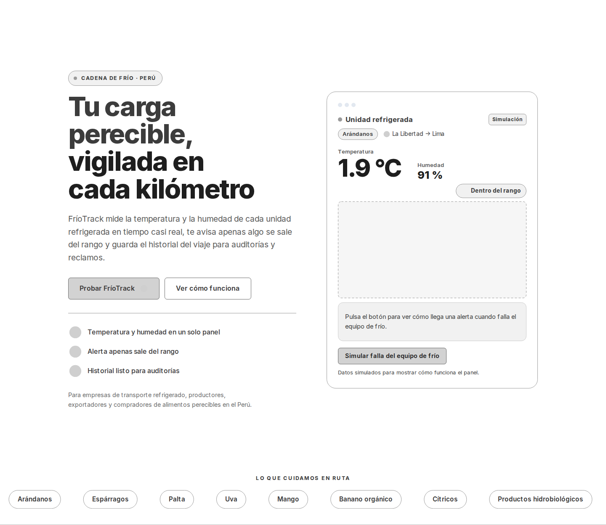<br>
  <i>Nota.</i> Elaboración propia.
</p>

**Figura 4.11**

*Wireframe de escritorio · Sección 2: el problema*

<p align="center">
  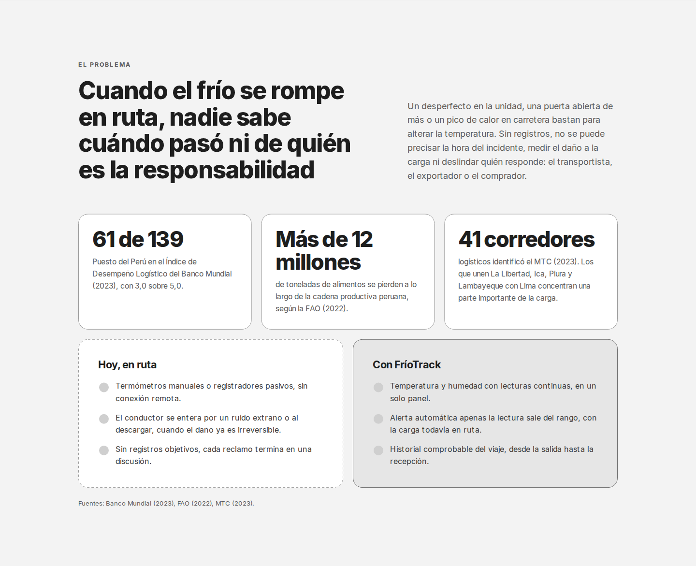<br>
  <i>Nota.</i> Elaboración propia.
</p>

**Figura 4.12**

*Wireframe de escritorio · Sección 3: quiénes somos*

<p align="center">
  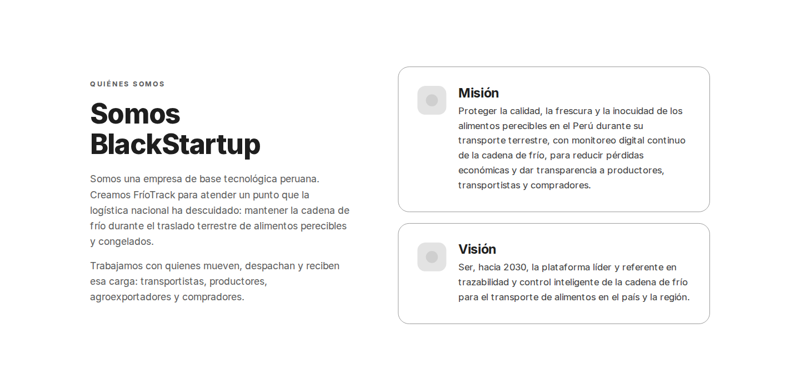<br>
  <i>Nota.</i> Elaboración propia.
</p>

**Figura 4.13**

*Wireframe de escritorio · Sección 4: lo que hacemos*

<p align="center">
  <br>
  <i>Nota.</i> Elaboración propia.
</p>

**Figura 4.14**

*Wireframe de escritorio · Sección 5: cómo funciona*

<p align="center">
  <br>
  <i>Nota.</i> Elaboración propia.
</p>

**Figura 4.15**

*Wireframe de escritorio · Sección 6: corredores*

<p align="center">
  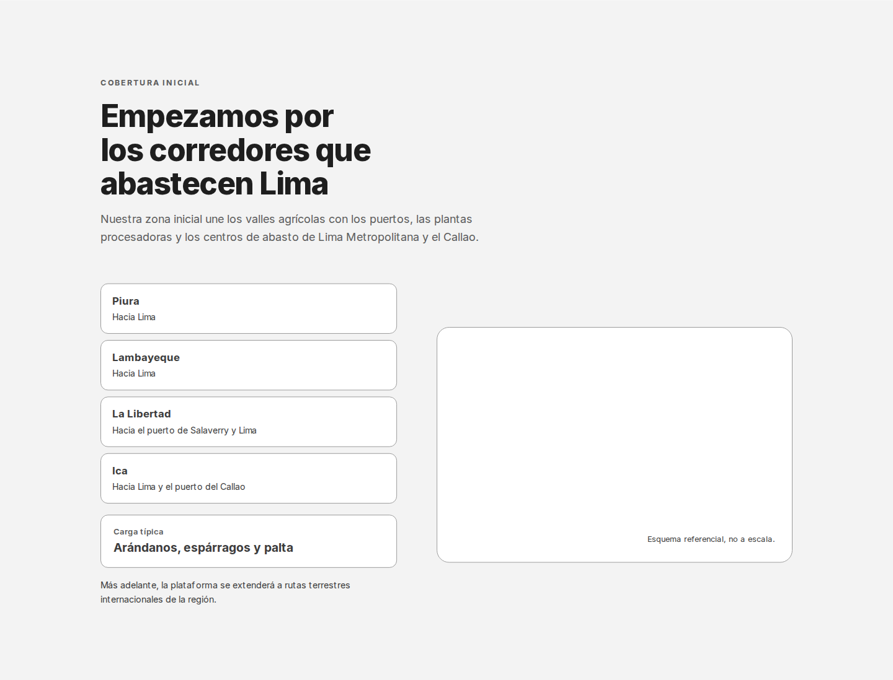<br>
  <i>Nota.</i> Elaboración propia.
</p>

**Figura 4.16**

*Wireframe de escritorio · Sección 7: para quién*

<p align="center">
  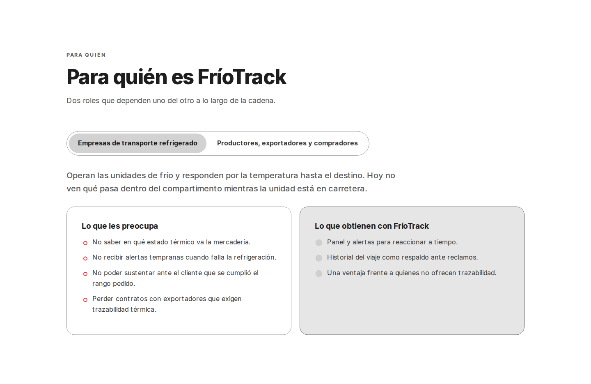<br>
  <i>Nota.</i> Elaboración propia.
</p>

**Figura 4.17**

*Wireframe de escritorio · Sección 8: planes*

<p align="center">
  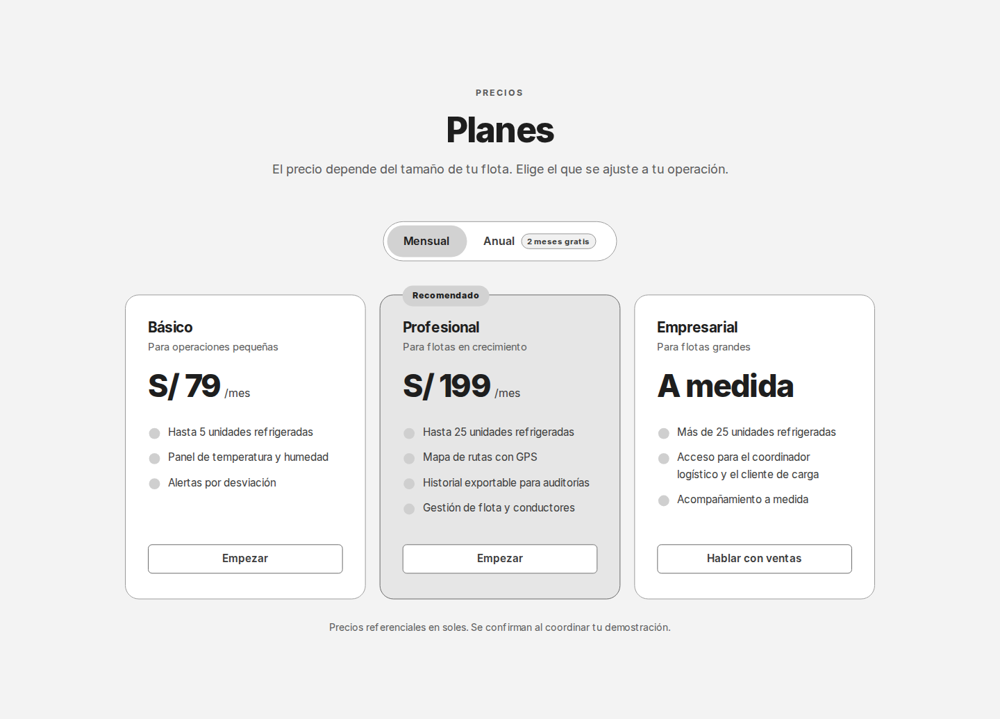<br>
  <i>Nota.</i> Elaboración propia.
</p>

**Figura 4.18**

*Wireframe de escritorio · Sección 9: metas*

<p align="center">
  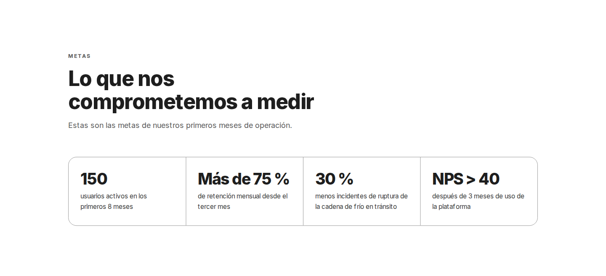<br>
  <i>Nota.</i> Elaboración propia.
</p>

**Figura 4.19**

*Wireframe de escritorio · Sección 10: equipo*

<p align="center">
  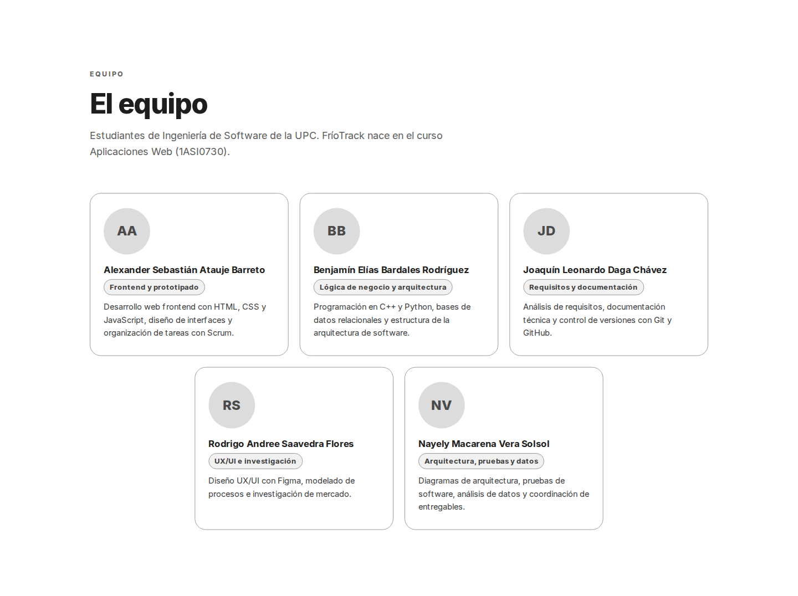<br>
  <i>Nota.</i> Elaboración propia.
</p>

**Figura 4.20**

*Wireframe de escritorio · Sección 11: contacto*

<p align="center">
  <br>
  <i>Nota.</i> Elaboración propia.
</p>

**Figura 4.21**

*Wireframe de escritorio · Sección 12: pie de página*

<p align="center">
  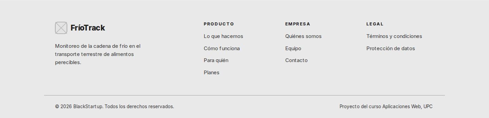<br>
  <i>Nota.</i> Elaboración propia.
</p>

#### Wireframes móviles

Las doce secciones se presentan a continuación en tres filas, en el mismo orden de la versión de escritorio (secciones 1 a 4, 5 a 8 y 9 a 12).

**Figura 4.22**

*Wireframes móviles · Secciones 1 a 4*

<p align="center">
  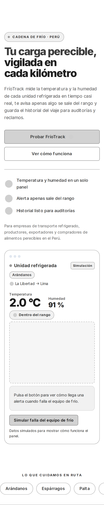
  
  
  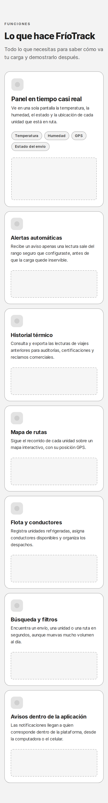<br>
  <i>Nota.</i> Elaboración propia.
</p>

**Figura 4.23**

*Wireframes móviles · Secciones 5 a 8*

<p align="center">
  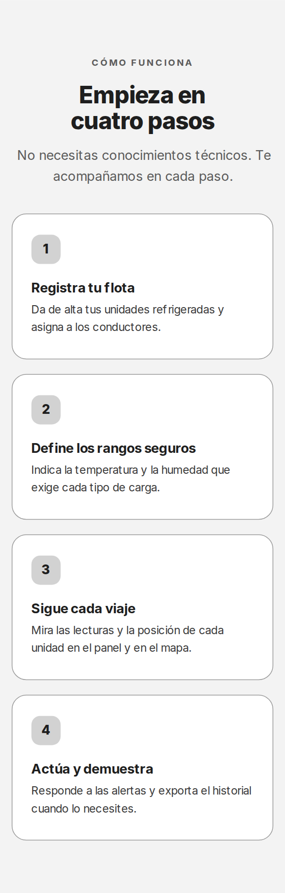
  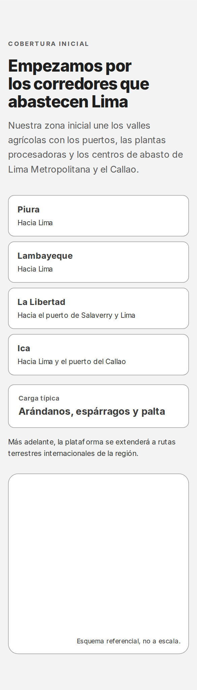
  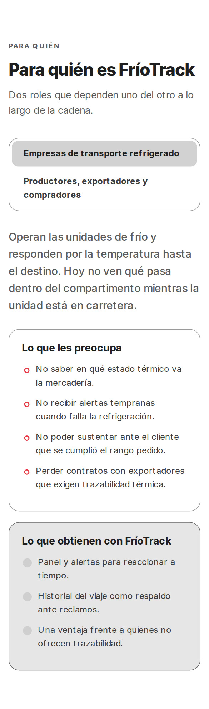
  <br>
  <i>Nota.</i> Elaboración propia.
</p>

**Figura 4.24**

*Wireframes móviles · Secciones 9 a 12*

<p align="center">
  
  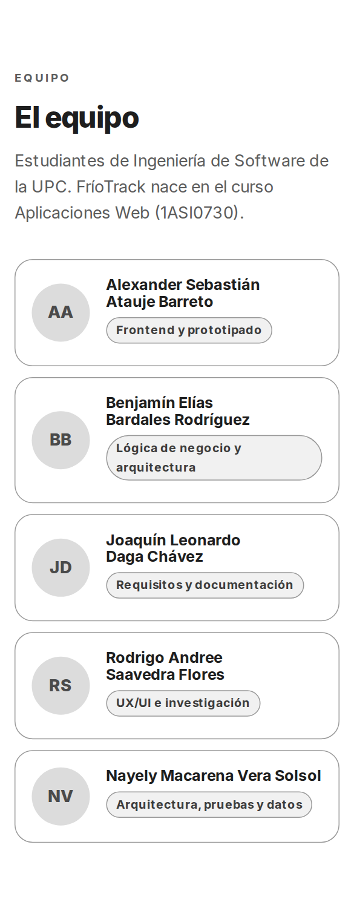
  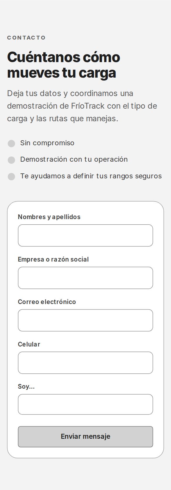
  <br>
  <i>Nota.</i> Elaboración propia.
</p>

### 4.3.2. Landing Page Mock-up

Los mock-ups aplican sobre los wireframes la identidad visual definida en la sección 4.1: la paleta azul y turquesa, la tipografía Inter y el logotipo. Se mantienen la estructura y las posiciones validadas en los wireframes, de manera que las diferencias entre ambas versiones son únicamente de superficie visual. Para dar una sensación de frío y de precisión, la Landing Page alterna secciones oscuras (héroe, funciones, metas y contacto) con secciones claras sobre blanco y sobre un fondo «hielo», y usa tarjetas de radio de 20 px, mini-interfaces del producto y una elevación suave. Las capturas se tomaron de la Landing Page implementada, con datos ficticios: el panel de la sección 1 es una simulación que muestra cómo se ve una lectura dentro del rango y cómo llega una alerta cuando la temperatura supera el máximo de 4 °C.

La Landing Page amplía la paleta de la sección 4.1.1 con cinco tonos derivados que no se usan en la Web Application: Night (`#06132B`) y Night 2 (`#0A2247`), para los fondos oscuros; Ice (`#EEF4FC`), para las secciones claras alternas; y Aqua (`#5EEAD4`) y Sky (`#7DB4FF`), versiones claras del turquesa y del azul que solo se emplean como texto o trazo sobre fondo oscuro. Sus razones de contraste sobre Night son de 12,5 : 1 (Aqua) y 8,7 : 1 (Sky), y el texto secundario claro (`#CBD5E1`) alcanza 12,5 : 1, por lo que superan el mínimo de 4,5 : 1 del criterio 1.4.3. El texto secundario de las secciones claras usa `#475569`, con 7,6 : 1 sobre blanco y 6,9 : 1 sobre Ice, y los rótulos en azul sobre Ice alcanzan 5,3 : 1.

#### Mock-ups de escritorio

**Figura 4.25**

*Mock-up de escritorio · Sección 1: encabezado y héroe*

<p align="center">
  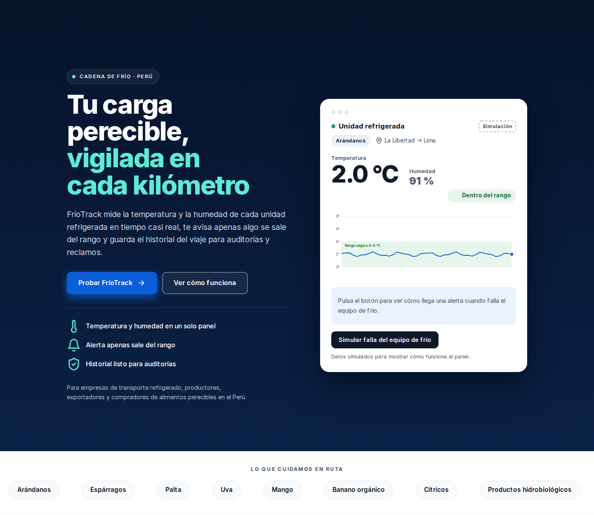<br>
  <i>Nota.</i> Elaboración propia.
</p>

**Figura 4.26**

*Mock-up de escritorio · Sección 2: el problema*

<p align="center">
  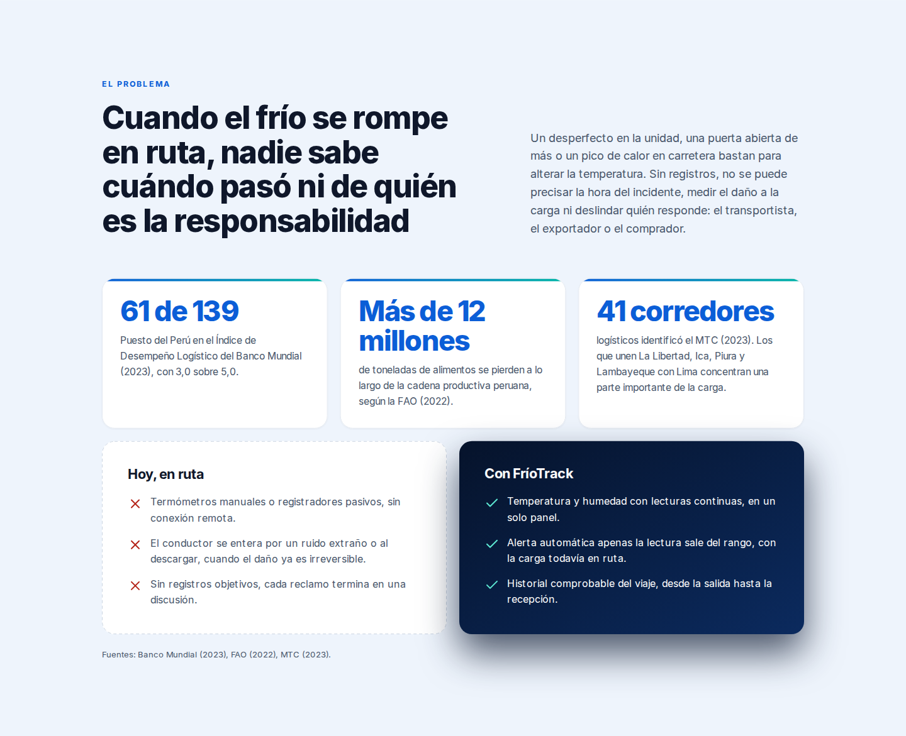<br>
  <i>Nota.</i> Elaboración propia.
</p>

**Figura 4.27**

*Mock-up de escritorio · Sección 3: quiénes somos*

<p align="center">
  <br>
  <i>Nota.</i> Elaboración propia.
</p>

**Figura 4.28**

*Mock-up de escritorio · Sección 4: lo que hacemos*

<p align="center">
  <br>
  <i>Nota.</i> Elaboración propia.
</p>

**Figura 4.29**

*Mock-up de escritorio · Sección 5: cómo funciona*

<p align="center">
  <br>
  <i>Nota.</i> Elaboración propia.
</p>

**Figura 4.30**

*Mock-up de escritorio · Sección 6: corredores*

<p align="center">
  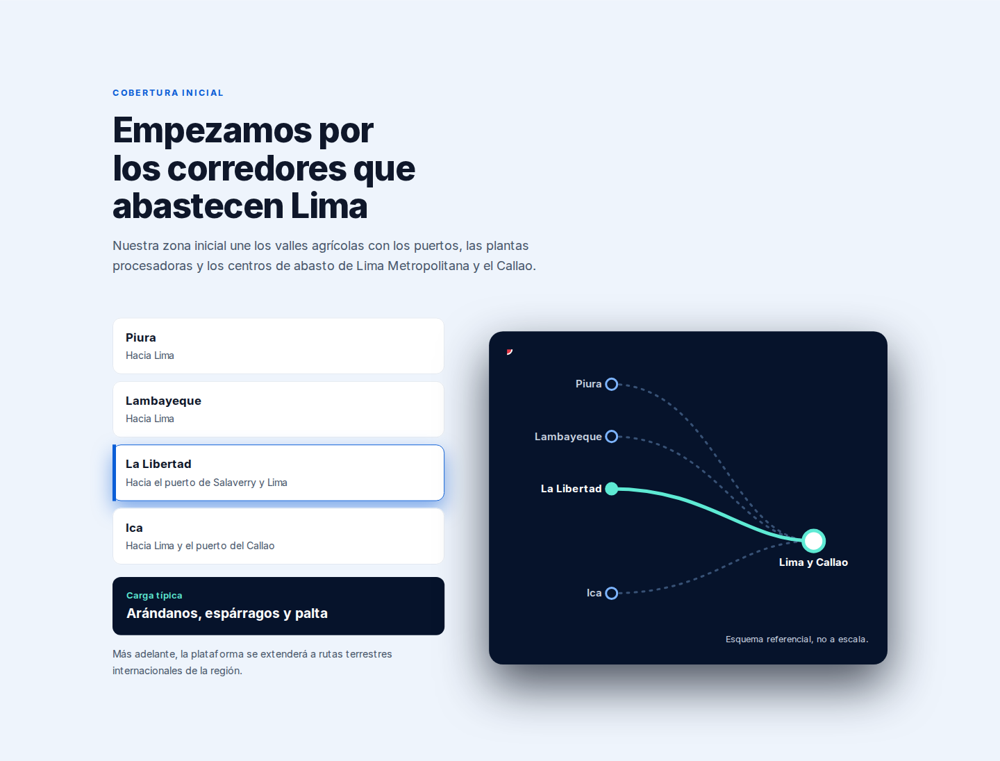<br>
  <i>Nota.</i> Elaboración propia.
</p>

**Figura 4.31**

*Mock-up de escritorio · Sección 7: para quién*

<p align="center">
  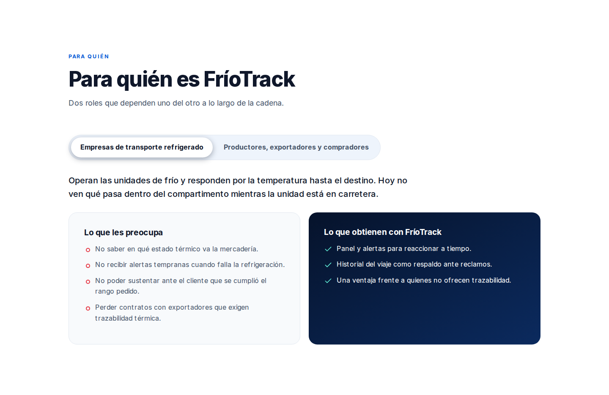<br>
  <i>Nota.</i> Elaboración propia.
</p>

**Figura 4.32**

*Mock-up de escritorio · Sección 8: planes*

<p align="center">
  <br>
  <i>Nota.</i> Elaboración propia.
</p>

**Figura 4.33**

*Mock-up de escritorio · Sección 9: metas*

<p align="center">
  <br>
  <i>Nota.</i> Elaboración propia.
</p>

**Figura 4.34**

*Mock-up de escritorio · Sección 10: equipo*

<p align="center">
  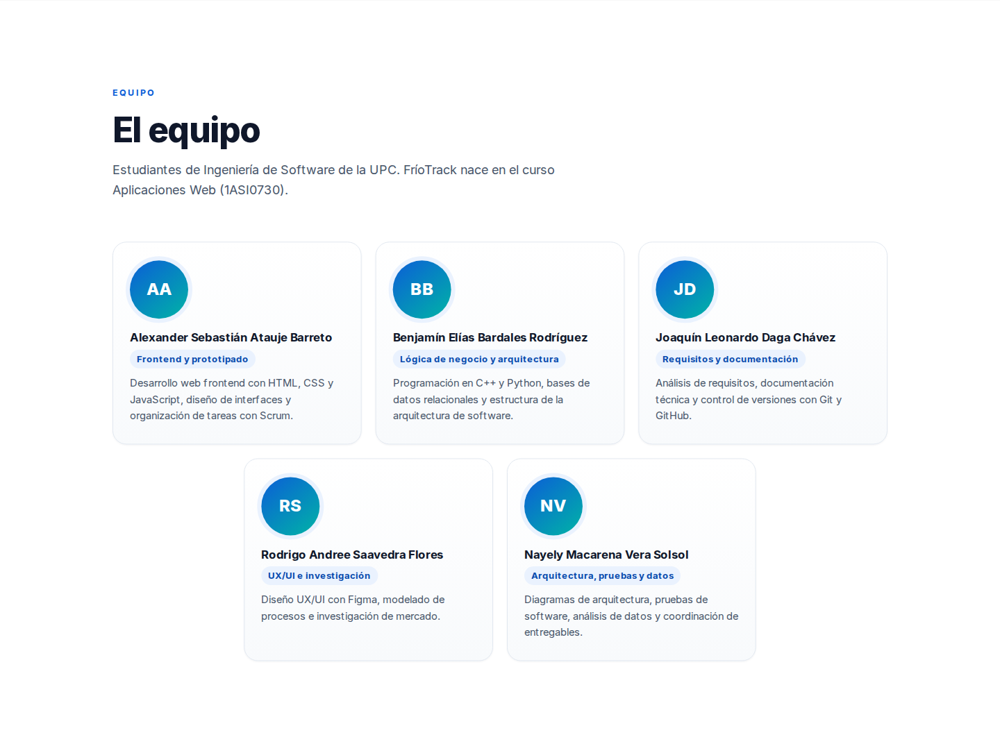<br>
  <i>Nota.</i> Elaboración propia.
</p>

**Figura 4.35**

*Mock-up de escritorio · Sección 11: contacto*

<p align="center">
  <br>
  <i>Nota.</i> Elaboración propia.
</p>

**Figura 4.36**

*Mock-up de escritorio · Sección 12: pie de página*

<p align="center">
  <br>
  <i>Nota.</i> Elaboración propia.
</p>

#### Mock-ups móviles

**Figura 4.37**

*Mock-ups móviles · Secciones 1 a 4*

<p align="center">
  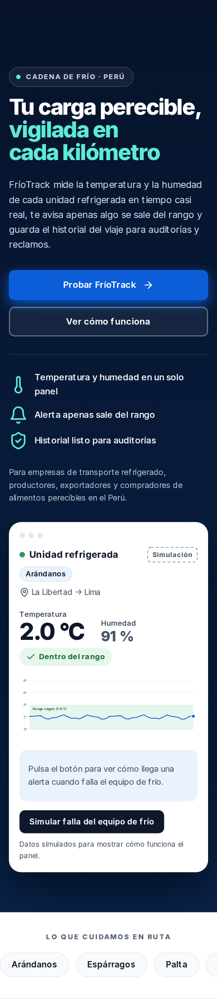
  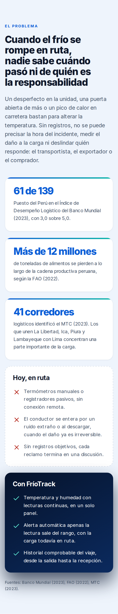
  
  <br>
  <i>Nota.</i> Elaboración propia.
</p>

**Figura 4.38**

*Mock-ups móviles · Secciones 5 a 8*

<p align="center">
  
  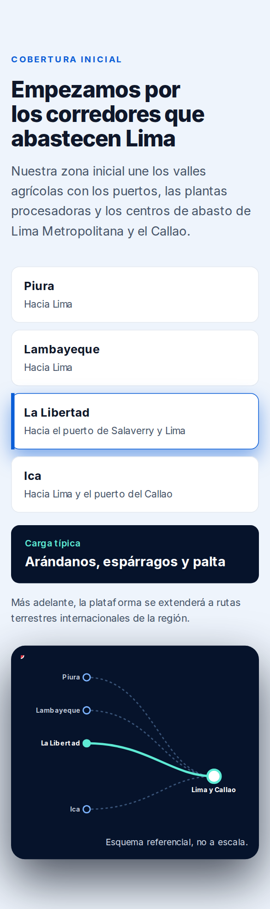
  
  <br>
  <i>Nota.</i> Elaboración propia.
</p>

**Figura 4.39**

*Mock-ups móviles · Secciones 9 a 12*

<p align="center">
  
  
  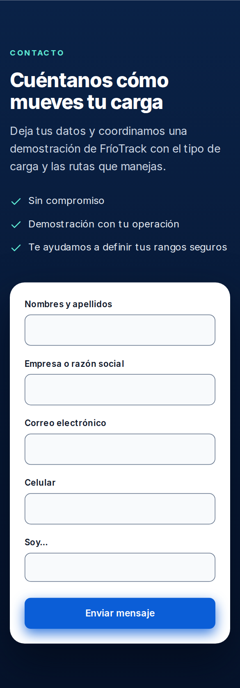
  <br>
  <i>Nota.</i> Elaboración propia.
</p>

#### Comportamiento interactivo

La Landing Page incluye interacciones que los mock-ups estáticos no muestran. La Tabla 4.16 las resume.

**Tabla 4.16**

*Interacciones de la Landing Page*


| Elemento | Comportamiento |
| :--- | :--- |
| **Selector ES \| EN** | Cambia todos los textos, los formatos numéricos y los metadatos de la página. El idioma inicial sigue al del navegador y se recuerda en el equipo del visitante. |
| **Panel simulado (sección 1)** | El botón «Simular falla del equipo de frío» eleva la temperatura por encima de 4 °C, muestra la alerta con la hora y el aviso al coordinador logístico y al cliente de carga, y al restablecer la refrigeración registra el incidente en el historial. Los datos son ficticios. |
| **Corredores (sección 6)** | Al elegir un corredor se resalta su ruta hacia Lima, se anima el recorrido del camión y se muestra la carga típica. |
| **Pestañas «Para quién» (sección 7)** | Alternan entre los dos segmentos con el ratón o con las teclas de flecha, Inicio y Fin. |
| **Planes (sección 8)** | El selector Mensual \| Anual actualiza los precios (el plan anual equivale a diez mensualidades). |
| **Formulario de contacto (sección 11)** | Valida los campos obligatorios y confirma en pantalla. Mientras no exista un servicio que reciba los datos, la confirmación aclara que es una versión demostrativa y que la información no se envía. |
| **Iniciar sesión y Registrarse** | Abren una ventana modal. El inicio de sesión no exige un formato de contraseña; el registro exige al menos ocho caracteres con mayúscula, minúscula y número, y muestra un enlace a los términos y condiciones. En esta versión no se autentica: los botones se conectarán con las pantallas de acceso de la Web Application (sección 4.4). |
| **Menú móvil** | En pantallas de hasta 1240 px la navegación se reemplaza por un menú desplegable que se cierra al elegir una sección o al pulsar Escape. |
| **Barra de navegación** | Es transparente sobre el héroe y pasa a fondo blanco con sombra ligera cuando el visitante se desplaza. El enlace de la sección visible se resalta en el menú. |
| **Franja de cargas (sección 1)** | Las cargas cuidadas en ruta se desplazan lentamente de derecha a izquierda; con la preferencia de reducción de movimiento del sistema, la franja queda estática. |
| **Aparición de bloques** | Las tarjetas y los titulares aparecen con un desvanecimiento suave al entrar en pantalla. Sin JavaScript o con reducción de movimiento, todo el contenido es visible desde el inicio. |

*Nota.* Elaboración propia.

**Verificación.** Las comprobaciones de la implementación están documentadas en el Capítulo V y en los registros de pruebas adjuntos. La evaluación con usuarios y la auditoría integral de accesibilidad requieren evidencias específicas.

## 4.4. Web Applications UX/UI Design

El diseño de la Web Application de FríoTrack organiza las experiencias de los dos perfiles de usuario: el Coordinador Logístico, que programa los envíos, administra la flota y atiende las alertas, y el Cliente de Carga, que verifica el estado térmico de los envíos que espera recibir y descarga los reportes. El diseño se desarrolla en cuatro artefactos encadenados: los wireframes definen la estructura de cada pantalla, los wireflows conectan las pantallas según las acciones del usuario, los mock-ups aplican la identidad visual y los diagramas de flujo de usuario (*user flows*) añaden las decisiones y las rutas alternas.

La aplicación se compone de 22 pantallas: 3 de acceso y cuenta, 12 del Coordinador Logístico, 3 del Cliente de Carga y 4 versiones móviles de las pantallas más críticas para quien opera en ruta. La Tabla 4.17 las lista con la tarea del usuario que cada una apoya. Los mock-ups históricos omiten los pasos 2 y 3. La aplicación TB1 incorpora los cuatro pasos; aún deben actualizarse los artefactos Figma para que su diseño y prototipo reflejen el recorrido completo.

**Tabla 4.17**

*Inventario de pantallas de la Web Application*


| N.º | Pantalla | Perfil | Tarea que apoya | Elementos destacados |
| :---: | :--- | :--- | :--- | :--- |
| 1 | **Iniciar sesión** | Ambos | Acceder a la cuenta. | Correo y contraseña, «Mantener sesión iniciada», enlaces a registro y a recuperación. |
| 2 | **Crear cuenta** | Ambos | Registrarse eligiendo el perfil. | Selector de perfil (Coordinador Logístico o Cliente de Carga), datos de contacto, validación por campo. |
| 3 | **Recuperar contraseña** | Ambos | Restablecer el acceso. | Envío de enlace con mensaje neutro que no revela si el correo existe. |
| 4 | **Dashboard** | Coordinador | Ver de un vistazo el estado de la operación. | Cuatro indicadores, mapa de unidades activas (70 % del ancho) y lista de envíos activos (30 %). |
| 5 | **Envíos** | Coordinador | Buscar, filtrar y acceder a un envío. | Búsqueda, filtros combinables, chips de filtros activos, tabla con estado térmico y paginación. |
| 6 | **Nuevo envío · paso 1** | Coordinador | Definir la carga y su rango térmico. | Indicador de cuatro pasos, datos de la carga, temperatura mínima y máxima, humedad y tolerancia. |
| 7 | **Nuevo envío · paso 4 (revisión)** | Coordinador | Confirmar y programar el envío. | Resumen de carga, ruta y recursos; aviso de que los recursos no se reservan hasta confirmar. |
| 8 | **Detalle del envío** | Coordinador | Seguir un envío en tránsito. | Aviso de alerta, indicadores, gráfico de lecturas con banda de rango seguro y mapa. |
| 9 | **Detalle del envío · Alertas** | Coordinador | Revisar las alertas de un envío. | Tabla de alertas con tipo, duración, lectura y estado; acción «Registrar acción». |
| 10 | **Registrar acción correctiva** | Coordinador | Documentar la respuesta a una alerta. | Ventana modal con acción, comentario y casilla «Notificar al Cliente de Carga». |
| 11 | **Vehículos** | Coordinador | Administrar las unidades y sus sensores. | Lista con placa, capacidad, sensor y estado; formulario de registro. |
| 12 | **Conductores** | Coordinador | Administrar los conductores. | Lista con licencia, contacto, unidad asignada y disponibilidad. |
| 13 | **Historial** | Coordinador | Auditar envíos concluidos. | Filtros por fecha y estado, resumen de desvíos y descarga del reporte en PDF. |
| 14 | **Notificaciones** | Ambos | Enterarse de alertas y cambios. | Pestañas (Todas, Sin leer, Alertas, Entregas), agrupación por día y acción «Marcar todas como leídas». |
| 15 | **Configuración** | Ambos | Gestionar perfil, contraseña e idioma. | Datos de perfil, cambio de contraseña, preferencias de idioma y de alertas. |
| 16 | **Envíos por recibir** | Cliente | Ubicar los envíos que espera. | Indicadores, lista de envíos asignados y mapa. |
| 17 | **Detalle del envío (Cliente)** | Cliente | Verificar el estado térmico y descargar el reporte. | Vista de solo lectura, lecturas, ruta y botón «Descargar reporte térmico». |
| 18 | **Historial (Cliente)** | Cliente | Consultar envíos anteriores. | Filtros y descarga de reportes. |
| 19 a 22 | **Versión móvil** | Coordinador | Operar en ruta desde el celular. | Inicio de sesión, panel con mapa y hoja deslizable, detalle del envío y registro de acción correctiva. |

*Nota.* Elaboración propia. La trazabilidad vigente usa el catálogo del capítulo III: acceso US06/07/08/32; perfil US39; dashboard y detalle US10–18; flota US19–22/29/38; programación US33; estados US34; acciones US35; cliente US36; incidencias US40; historial US23/24; idioma US30. Las pantallas históricas representan diseño; su presencia no demuestra implementación completa.

### 4.4.1. Web Applications Wireframes

Los wireframes de la aplicación se elaboraron en escala de grises, a un lienzo de 1440 × 900 px para escritorio y de 390 × 844 px para móvil. Su finalidad es acordar la distribución de los contenidos y de los controles antes de definir el aspecto visual. Las decisiones más relevantes son las siguientes: el Dashboard destina alrededor del 70 % del ancho al mapa y el 30 % a la lista de envíos, por ser la ubicación de las unidades el dato que más orienta al Coordinador; las listas usan tablas con filtros visibles y no menús ocultos; el registro de un envío se divide en cuatro pasos para no abrumar al usuario con un formulario extenso; y la acción primaria de cada pantalla ocupa siempre la misma posición, en la esquina superior derecha del área de trabajo.

#### Acceso y cuenta

**Figura 4.40**

*Wireframe · Iniciar sesión*

<p align="center">
  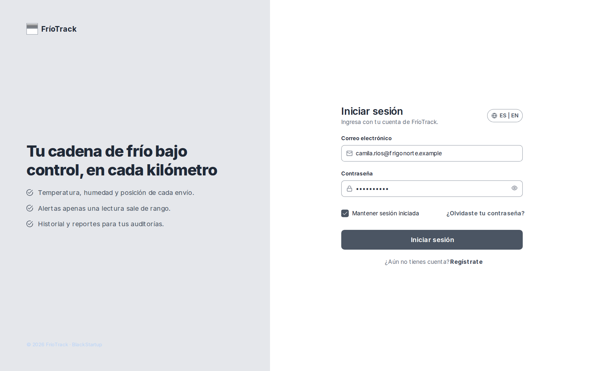<br>
  <i>Nota.</i> Elaboración propia.
</p>

**Figura 4.41**

*Wireframe · Crear cuenta*

<p align="center">
  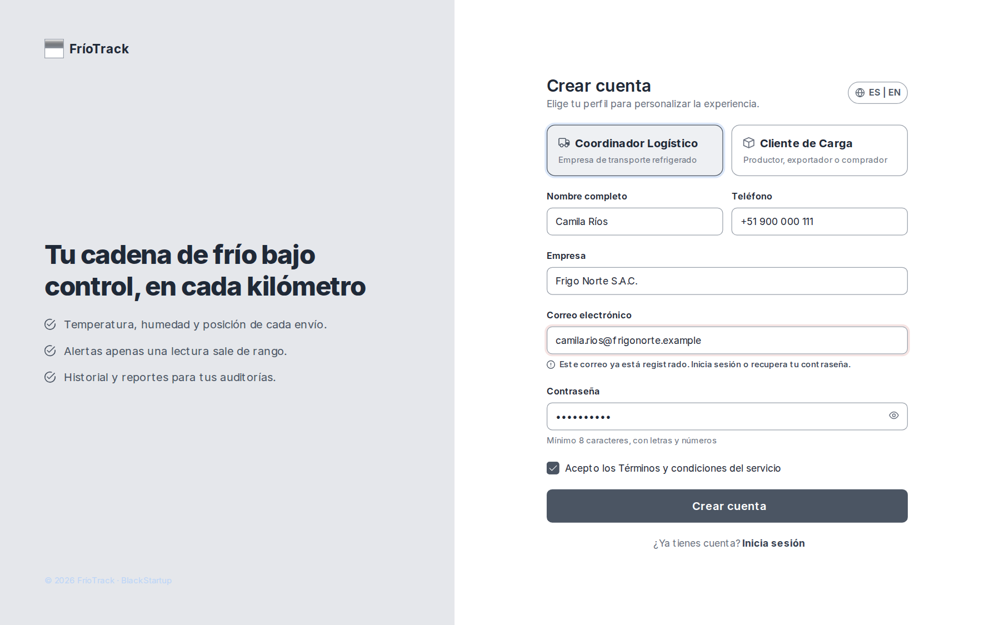<br>
  <i>Nota.</i> Elaboración propia.
</p>

**Figura 4.42**

*Wireframe · Recuperar contraseña*

<p align="center">
  <br>
  <i>Nota.</i> Elaboración propia.
</p>

#### Coordinador Logístico

**Figura 4.43**

*Wireframe · Dashboard del Coordinador Logístico*

<p align="center">
  <br>
  <i>Nota.</i> Elaboración propia.
</p>

**Figura 4.44**

*Wireframe · Lista de envíos*

<p align="center">
  <br>
  <i>Nota.</i> Elaboración propia.
</p>

**Figura 4.45**

*Wireframe · Nuevo envío, paso 1: carga y rango térmico*

<p align="center">
  <br>
  <i>Nota.</i> Elaboración propia.
</p>

**Figura 4.46**

*Wireframe · Nuevo envío, paso 4: revisión*

<p align="center">
  <br>
  <i>Nota.</i> Elaboración propia.
</p>

**Figura 4.47**

*Wireframe · Detalle de un envío en tránsito*

<p align="center">
  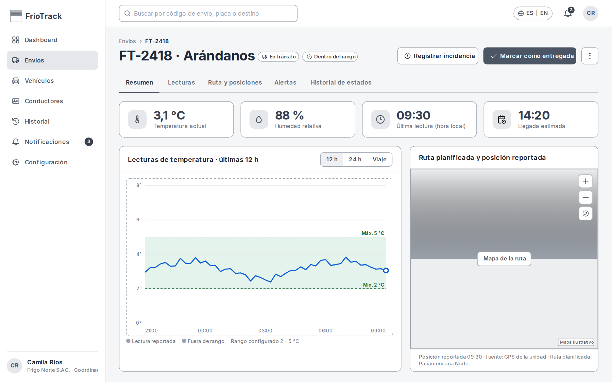<br>
  <i>Nota.</i> Elaboración propia.
</p>

**Figura 4.48**

*Wireframe · Detalle de un envío, pestaña Alertas*

<p align="center">
  <br>
  <i>Nota.</i> Elaboración propia.
</p>

**Figura 4.49**

*Wireframe · Ventana modal «Registrar acción correctiva»*

<p align="center">
  <br>
  <i>Nota.</i> Elaboración propia.
</p>

**Figura 4.50**

*Wireframe · Vehículos*

<p align="center">
  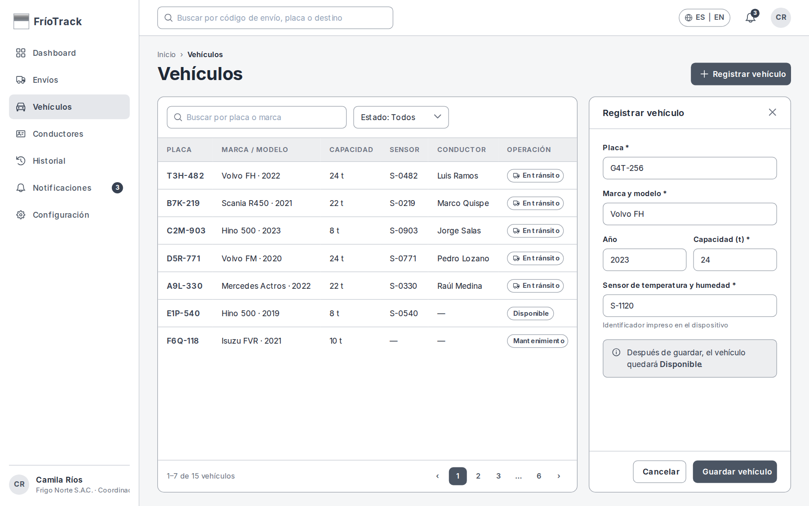<br>
  <i>Nota.</i> Elaboración propia.
</p>

**Figura 4.51**

*Wireframe · Conductores*

<p align="center">
  <br>
  <i>Nota.</i> Elaboración propia.
</p>

**Figura 4.52**

*Wireframe · Historial de envíos*

<p align="center">
  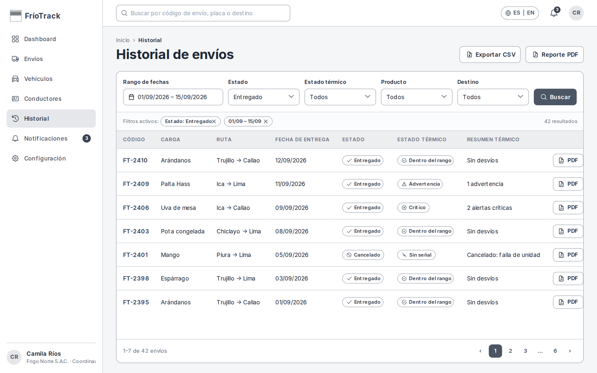<br>
  <i>Nota.</i> Elaboración propia.
</p>

**Figura 4.53**

*Wireframe · Notificaciones*

<p align="center">
  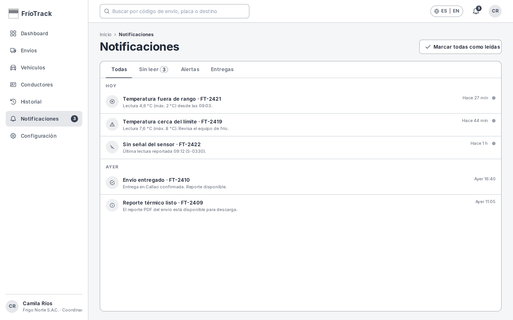<br>
  <i>Nota.</i> Elaboración propia.
</p>

**Figura 4.54**

*Wireframe · Configuración*

<p align="center">
  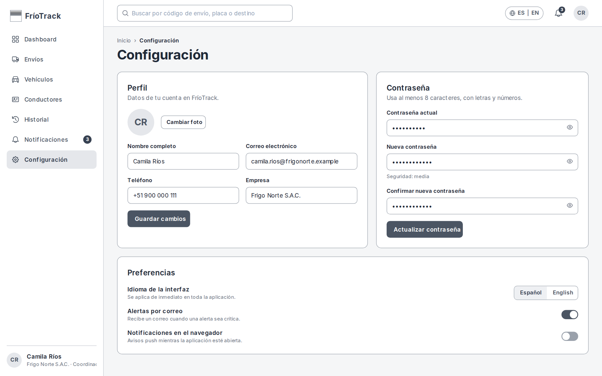<br>
  <i>Nota.</i> Elaboración propia.
</p>

#### Cliente de Carga

**Figura 4.55**

*Wireframe · Envíos por recibir*

<p align="center">
  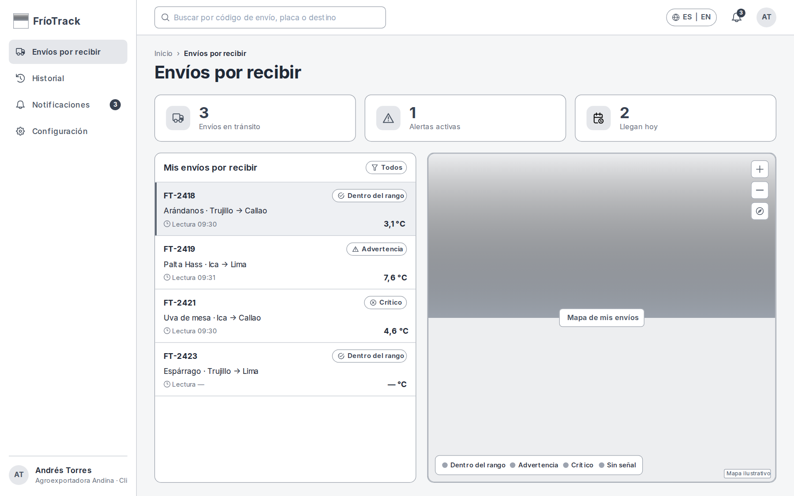<br>
  <i>Nota.</i> Elaboración propia.
</p>

**Figura 4.56**

*Wireframe · Detalle de un envío (vista de solo lectura)*

<p align="center">
  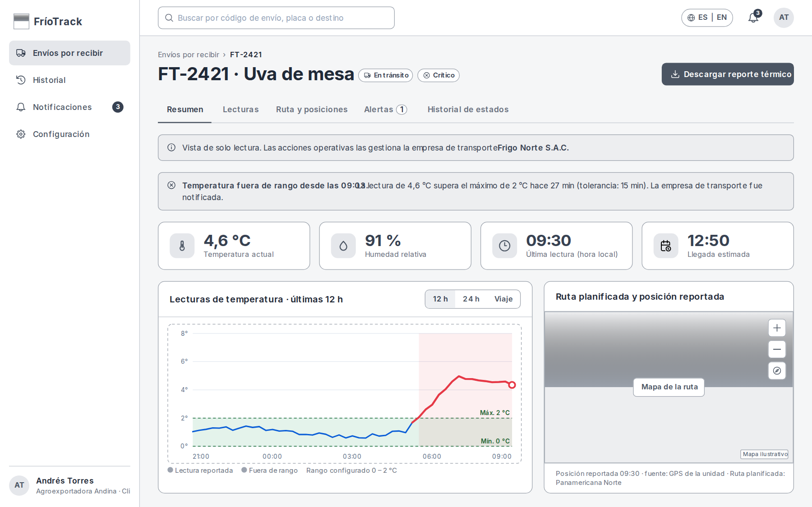<br>
  <i>Nota.</i> Elaboración propia.
</p>

**Figura 4.57**

*Wireframe · Historial del Cliente de Carga*

<p align="center">
  <br>
  <i>Nota.</i> Elaboración propia.
</p>

#### Versión móvil

**Figura 4.58**

*Wireframes móviles · Inicio de sesión, panel, detalle del envío y registro de acción correctiva*

<p align="center">
  
  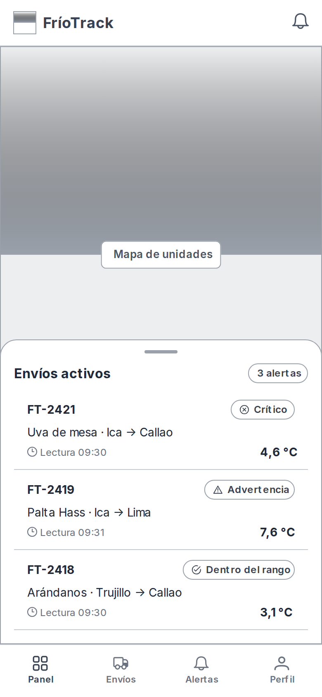
  
  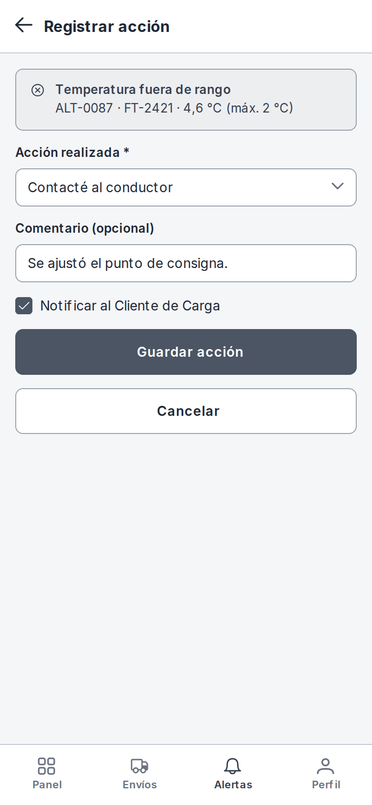<br>
  <i>Nota.</i> Elaboración propia.
</p>

### 4.4.2. Web Applications Wireflow Diagrams

Los wireflows combinan miniaturas de los wireframes con flechas rotuladas que indican la acción del usuario que provoca el cambio de pantalla. Permiten verificar que cada tarea principal puede completarse sin callejones sin salida y que cada pantalla sabe hacia dónde continúa. Se elaboraron cinco wireflows, uno por objetivo relevante de los perfiles: preparar y programar un envío, atender una alerta, verificar un envío como cliente, crear una cuenta o recuperar la contraseña, y operar desde el celular.

#### Wireflow 1 · Preparar y programar un envío (Coordinador Logístico)

El Coordinador parte del Dashboard, entra a Envíos, inicia un nuevo envío y avanza por los pasos del formulario hasta la revisión. Al confirmar, el envío queda en estado Programado, aparece en la lista y el Cliente de Carga recibe una notificación.

**Figura 4.59**

*Wireflow · Preparar y programar un envío*

<p align="center">
  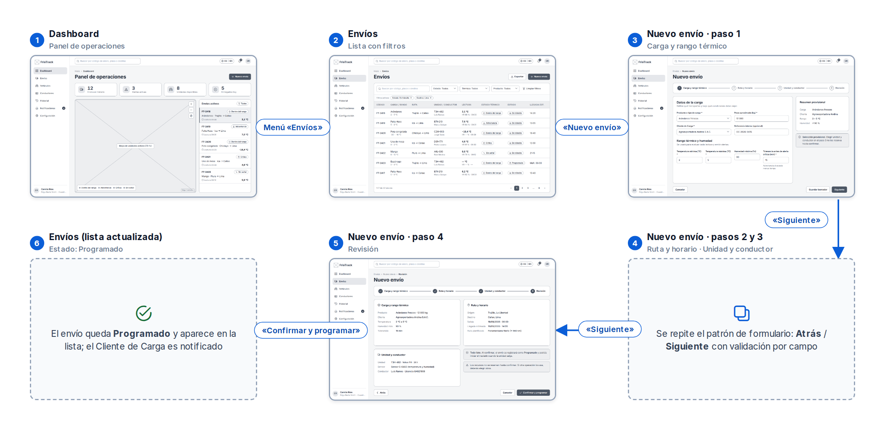<br>
  <i>Nota.</i> Elaboración propia.
</p>

#### Wireflow 2 · Atender una alerta (Coordinador Logístico)

Una alerta crítica se descubre desde el contador del Dashboard o desde la campana de notificaciones. Desde la notificación el usuario llega directamente a la pestaña Alertas del envío afectado, abre la ventana modal, registra la acción realizada y guarda. La alerta pasa a estado Reconocida, se conserva en el historial y, si el usuario lo indicó, el Cliente de Carga recibe el aviso.

**Figura 4.60**

*Wireflow · Atender una alerta*

<p align="center">
  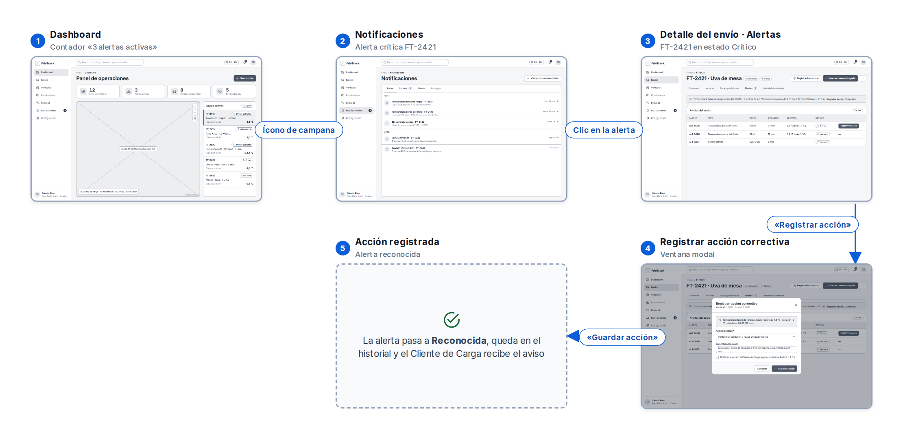<br>
  <i>Nota.</i> Elaboración propia.
</p>

#### Wireflow 3 · Verificar un envío y descargar el reporte (Cliente de Carga)

Tras iniciar sesión, el Cliente de Carga llega a Envíos por recibir, abre el detalle de un envío en modo de solo lectura y, desde Historial, descarga el reporte térmico en PDF de un envío entregado.

**Figura 4.61**

*Wireflow · Verificar un envío y descargar el reporte*

<p align="center">
  <br>
  <i>Nota.</i> Elaboración propia.
</p>

#### Wireflow 4 · Crear una cuenta y recuperar la contraseña

Desde la pantalla de inicio de sesión, un visitante puede registrarse eligiendo su perfil, tras lo cual es redirigido a la pantalla inicial correspondiente (Dashboard para el Coordinador Logístico, Envíos por recibir para el Cliente de Carga), o recuperar su contraseña mediante un enlace enviado a su correo.

**Figura 4.62**

*Wireflow · Crear una cuenta y recuperar la contraseña*

<p align="center">
  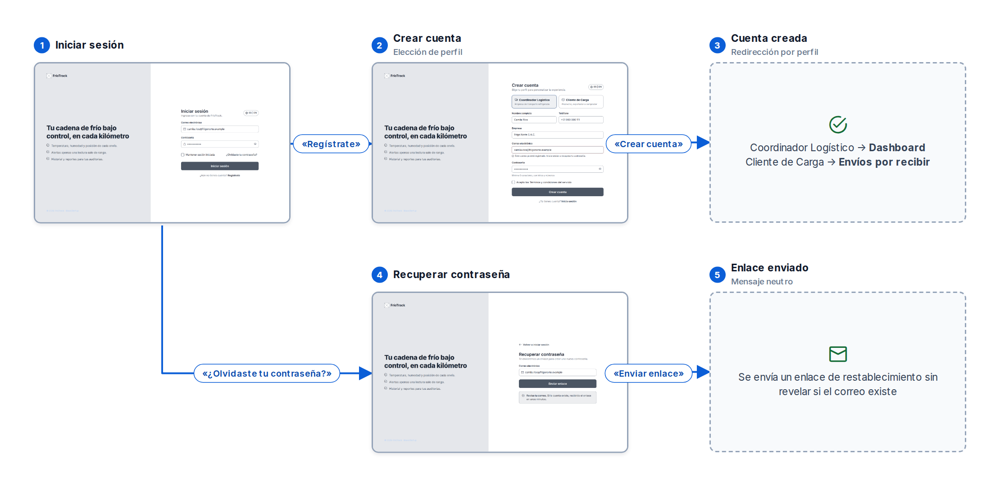<br>
  <i>Nota.</i> Elaboración propia.
</p>

#### Wireflow 5 · Atender una alerta desde el celular

El Coordinador que se encuentra en ruta recorre un flujo abreviado: inicia sesión, ve el panel con el mapa y la hoja deslizable de envíos, abre el detalle del envío crítico y registra la acción correctiva.

**Figura 4.63**

*Wireflow · Atender una alerta desde el celular*

<p align="center">
  <br>
  <i>Nota.</i> Elaboración propia.
</p>

### 4.4.3. Web Applications Mock-ups

Los mock-ups desarrollan las mismas pantallas con el detalle visual definido en la guía de estilo: color, tipografía, íconos, componentes, datos de ejemplo y estados. Se usaron datos ficticios verosímiles (unidades, placas, conductores y empresas inventados) para comprobar que los textos y las tablas sostienen contenido real sin desbordarse. Los criterios que guiaron la revisión visual fueron los siguientes:

**Tabla 4.18**

*Criterios de diseño aplicados en los mock-ups*


| Criterio | Aplicación en las pantallas |
| :--- | :--- |
| **El estado térmico se entiende sin leer** | Cada envío lleva un chip de color con ícono y texto (dentro del rango, advertencia, crítico, sin señal); los envíos críticos también se destacan con un marcador rojo en el mapa. |
| **Diferenciación entre perfiles** | El Coordinador dispone de acciones de gestión (nuevo envío, registrar acción, marcar como entregado); el Cliente de Carga ve un aviso de «Vista de solo lectura» y un único botón primario, «Descargar reporte térmico». |
| **Datos con su contexto temporal** | Las lecturas indican su hora («Lectura reportada 09:30») y las posiciones, su fuente; el gráfico marca con una banda el rango seguro configurado. |
| **Prevención de errores** | Las validaciones se muestran junto al campo; el aviso «Otro envío usa estos recursos» evita programar dos envíos con la misma unidad. |
| **Consistencia** | Las tablas, las tarjetas, los chips y los botones son los mismos componentes en todas las pantallas. |

*Nota.* Elaboración propia.

Los mock-ups se diseñan para implementarse con Vue 3 y PrimeVue (PrimeTek, s. f.) sobre una base de Material Design 3 (Google, s. f.); representan decisiones visuales y no la ejecución real de los componentes.

#### Acceso y cuenta

**Figura 4.64**

*Mock-up · Iniciar sesión*

<p align="center">
  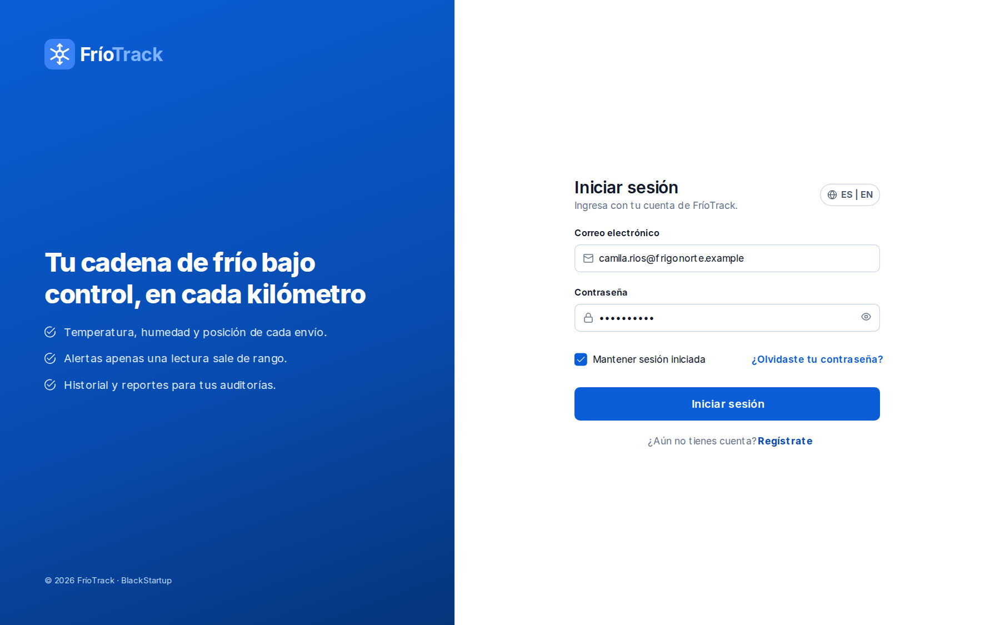<br>
  <i>Nota.</i> Elaboración propia.
</p>

**Figura 4.65**

*Mock-up · Crear cuenta*

<p align="center">
  <br>
  <i>Nota.</i> Elaboración propia.
</p>

**Figura 4.66**

*Mock-up · Recuperar contraseña*

<p align="center">
  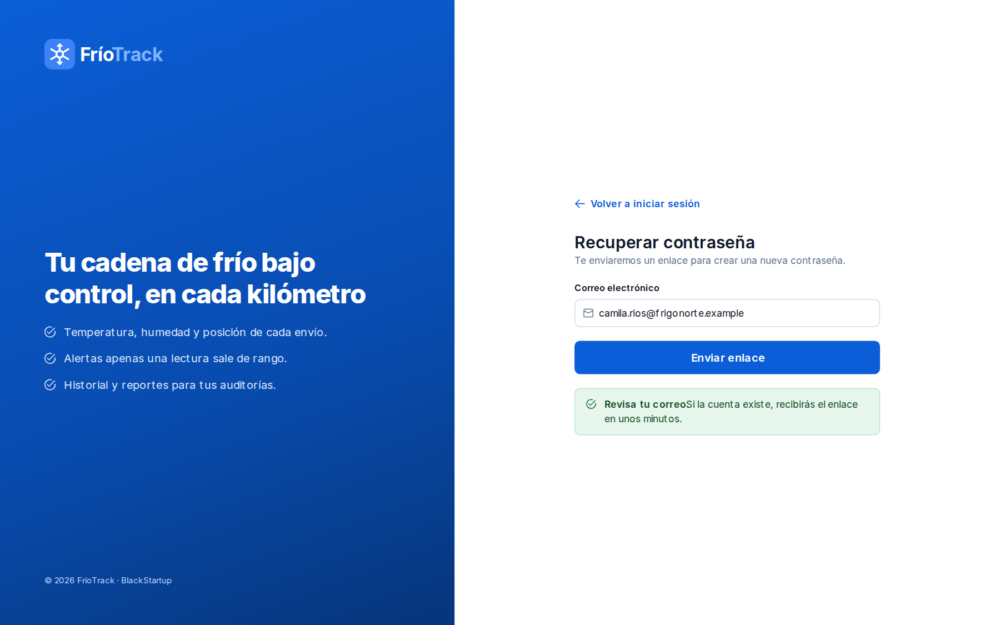<br>
  <i>Nota.</i> Elaboración propia.
</p>

#### Coordinador Logístico

**Figura 4.67**

*Mock-up · Dashboard del Coordinador Logístico*

<p align="center">
  <br>
  <i>Nota.</i> Elaboración propia.
</p>

**Figura 4.68**

*Mock-up · Lista de envíos*

<p align="center">
  <br>
  <i>Nota.</i> Elaboración propia.
</p>

**Figura 4.69**

*Mock-up · Nuevo envío, paso 1: carga y rango térmico*

<p align="center">
  <br>
  <i>Nota.</i> Elaboración propia.
</p>

**Figura 4.70**

*Mock-up · Nuevo envío, paso 4: revisión*

<p align="center">
  <br>
  <i>Nota.</i> Elaboración propia.
</p>

**Figura 4.71**

*Mock-up · Detalle de un envío en tránsito*

<p align="center">
  <br>
  <i>Nota.</i> Elaboración propia.
</p>

**Figura 4.72**

*Mock-up · Detalle de un envío, pestaña Alertas*

<p align="center">
  <br>
  <i>Nota.</i> Elaboración propia.
</p>

**Figura 4.73**

*Mock-up · Ventana modal «Registrar acción correctiva»*

<p align="center">
  <br>
  <i>Nota.</i> Elaboración propia.
</p>

**Figura 4.74**

*Mock-up · Vehículos*

<p align="center">
  <br>
  <i>Nota.</i> Elaboración propia.
</p>

**Figura 4.75**

*Mock-up · Conductores*

<p align="center">
  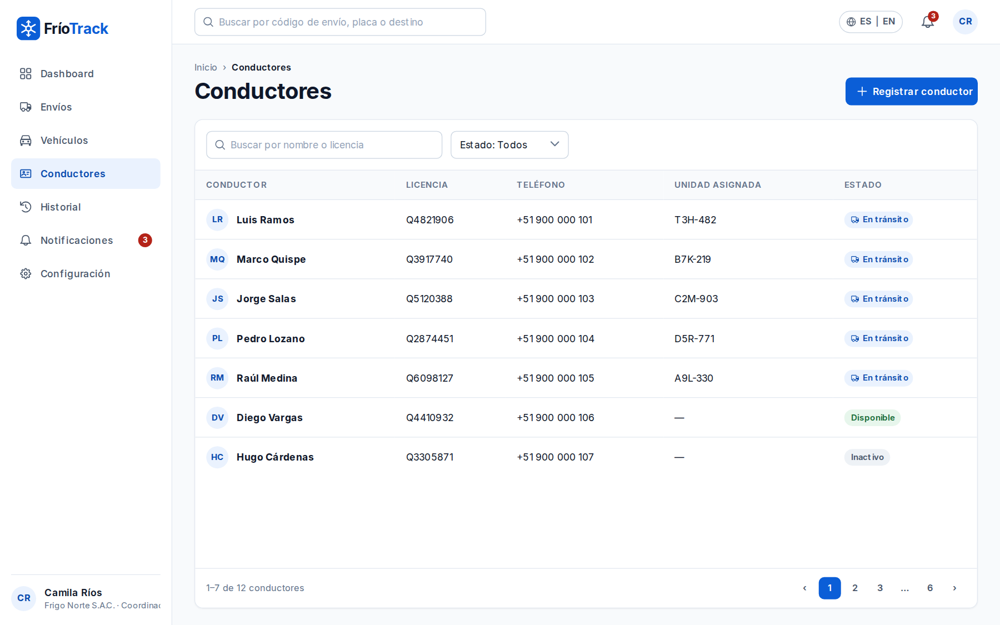<br>
  <i>Nota.</i> Elaboración propia.
</p>

**Figura 4.76**

*Mock-up · Historial de envíos*

<p align="center">
  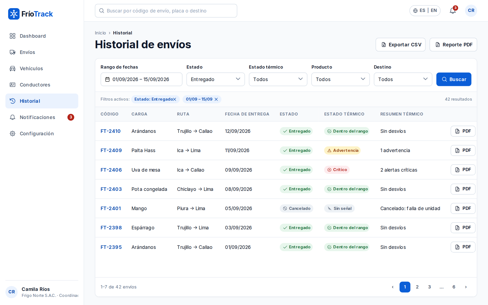<br>
  <i>Nota.</i> Elaboración propia.
</p>

**Figura 4.77**

*Mock-up · Notificaciones*

<p align="center">
  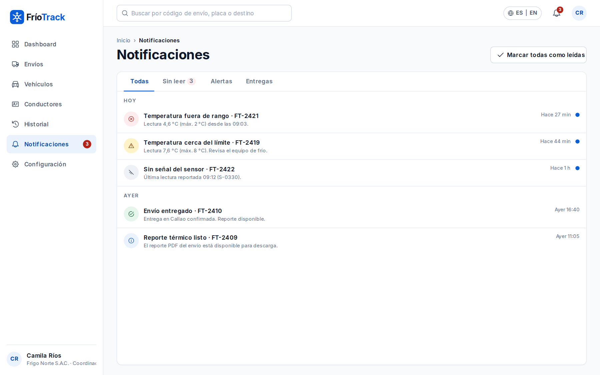<br>
  <i>Nota.</i> Elaboración propia.
</p>

**Figura 4.78**

*Mock-up · Configuración*

<p align="center">
  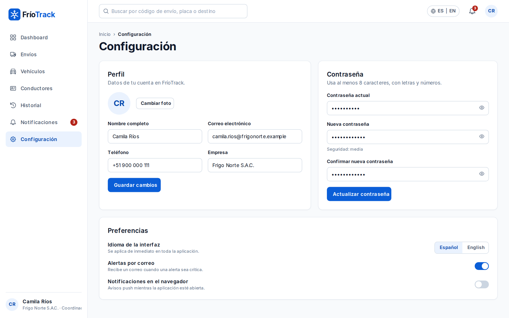<br>
  <i>Nota.</i> Elaboración propia.
</p>

#### Cliente de Carga

**Figura 4.79**

*Mock-up · Envíos por recibir*

<p align="center">
  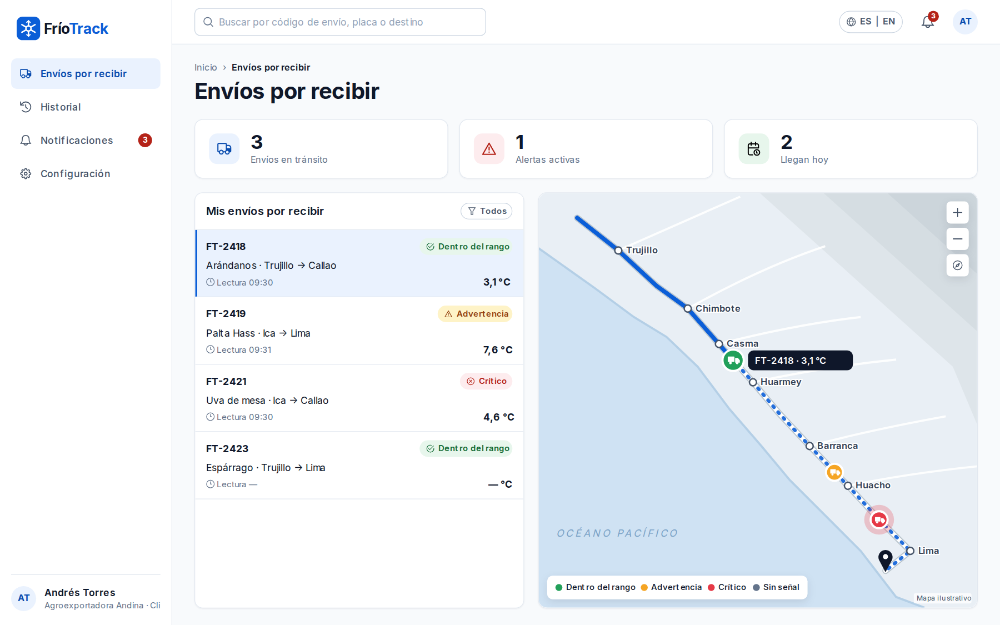<br>
  <i>Nota.</i> Elaboración propia.
</p>

**Figura 4.80**

*Mock-up · Detalle de un envío (vista de solo lectura)*

<p align="center">
  <br>
  <i>Nota.</i> Elaboración propia.
</p>

**Figura 4.81**

*Mock-up · Historial del Cliente de Carga*

<p align="center">
  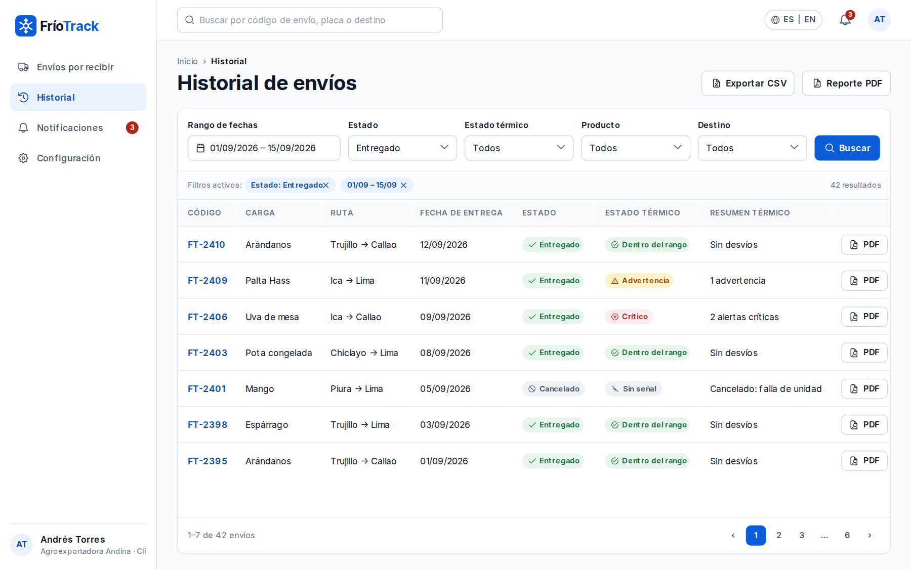<br>
  <i>Nota.</i> Elaboración propia.
</p>

#### Versión móvil

**Figura 4.82**

*Mock-ups móviles · Inicio de sesión, panel, detalle del envío y registro de acción correctiva*

<p align="center">
  
  
  
  <br>
  <i>Nota.</i> Elaboración propia.
</p>

### 4.4.4. Web Applications User Flow Diagrams

Los diagramas de flujo de usuario complementan los wireflows al incorporar las decisiones que determinan cómo continúa una interacción y las rutas alternas cuando algo falla. Cada diagrama muestra el camino esperado (o camino feliz) y los caminos de error, y permite comprobar que toda rama tiene una salida: corregir, reintentar, cancelar o volver. La leyenda de los tres diagramas es común: los rectángulos azules son pantallas, los rombos ámbar son decisiones, los rectángulos turquesa con línea discontinua son procesos que ejecuta el sistema, los rectángulos rojos son errores o caminos alternos, y las elipses son el inicio y el final del flujo.

#### Flujo 1 · Programar un envío

El flujo valida los datos en cada paso antes de avanzar: que el mínimo de temperatura sea menor que el máximo y que el peso sea positivo (paso 1), que la salida sea futura y que la ruta esté definida (paso 2), y que existan una unidad y un conductor disponibles (paso 3). En la revisión, el usuario puede confirmar o cancelar; si cancela, se le ofrece guardar un borrador. Al confirmar, el sistema valida de nuevo la disponibilidad y reserva los recursos. Si otro envío los ocupó mientras tanto, se muestra el aviso «Otro envío usa estos recursos» y el usuario vuelve al paso 3. Esta regla se apoya en el principio de que la selección provisional de recursos no los reserva: la reserva solo ocurre al confirmar.

**Figura 4.83**

*Diagrama de flujo de usuario · Programar un envío*

<p align="center">
  <br>
  <i>Nota.</i> Elaboración propia.
</p>

#### Flujo 2 · Atender una alerta

El flujo comienza con la llegada de una lectura del sensor. El sistema la compara con el rango configurado. Si está dentro del rango, el estado térmico se mantiene. Si está fuera de rango pero no excede la tolerancia en minutos, el envío pasa a Advertencia y se espera la siguiente lectura; si la excede, se crea una alerta crítica y se envía una notificación. Mientras el Coordinador no registre una acción, la alerta sigue activa y se le recuerda periódicamente. Al registrar la acción, el sistema exige seleccionar una de las acciones disponibles; luego, si la lectura vuelve al rango, la alerta se resuelve y el historial se actualiza; si no vuelve, se registra una incidencia y se notifica al Cliente de Carga.

**Figura 4.84**

*Diagrama de flujo de usuario · Atender una alerta*

<p align="center">
  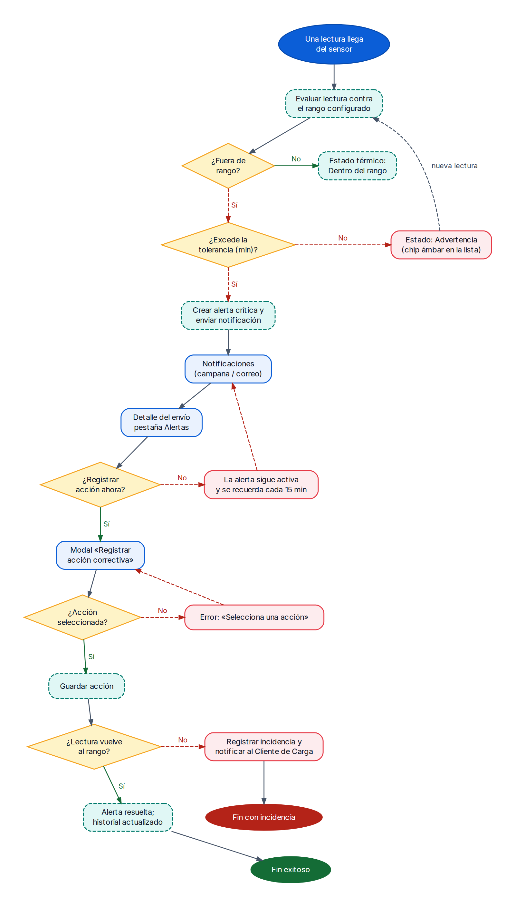<br>
  <i>Nota.</i> Elaboración propia.
</p>

#### Flujo 3 · Verificar un envío y descargar el reporte (Cliente de Carga)

Este flujo verifica primero que la cuenta corresponda al perfil de Cliente de Carga; en caso contrario, redirige al Dashboard del Coordinador. Si el cliente no tiene envíos asignados, ve un estado vacío con un mensaje explicativo. Al abrir el detalle de un envío, se comprueba si el sensor tiene señal: si no la tiene, se muestra el aviso «Sin señal desde HH:MM» junto con la última lectura conocida, pero el resto de la información sigue disponible. El botón «Descargar reporte» permanece deshabilitado hasta que el envío se entrega; una vez entregado, el sistema genera el PDF y, si la generación falla, muestra un mensaje de error con la opción de reintentar.

**Figura 4.85**

*Diagrama de flujo de usuario · Verificar un envío y descargar el reporte*

<p align="center">
  <br>
  <i>Nota.</i> Elaboración propia.
</p>

**Tabla 4.19**

*Reglas de negocio reflejadas en los flujos de usuario*


| Regla | Efecto en la interfaz |
| :--- | :--- |
| Los recursos no se reservan hasta confirmar el envío. | La selección de unidad y conductor es provisional; el aviso de la revisión lo advierte. |
| Un envío nuevo nace como borrador y pasa a Programado al confirmarse. | El envío aparece en la lista con el chip «Programado» y se notifica al Cliente de Carga. |
| Una desviación menor que la tolerancia genera advertencia; una que la excede, alerta crítica. | Cambia el chip del envío y, en el caso crítico, se crea una notificación. |
| El Cliente de Carga solo consulta. | Las pantallas del cliente no muestran acciones de gestión y llevan el aviso «Vista de solo lectura». |
| El reporte térmico solo está disponible cuando el envío se entrega. | El botón «Descargar reporte» se habilita al concluir el envío. |

*Nota.* Elaboración propia.

## 4.5. Web Applications Prototyping

> **Alcance de los artefactos:** el HTML histórico no sustituye el prototipo Figma solicitado. Los mock-ups móviles siguen siendo estáticos y no hay evidencia de enlaces de prototipo Figma. La aplicación Vue TB1 incorpora navegación responsive y cuatro pasos de programación; es una implementación demostrativa distinta del prototipo. El video de navegación y su captura/URL Microsoft Stream están pendientes.

El prototipo de FríoTrack reúne los mock-ups de la Web Application en una experiencia navegable con la que es posible recorrer los flujos principales antes de escribir código de producción. Su propósito es doble: validar con el equipo y con usuarios que las tareas se pueden completar con la estructura propuesta, y ofrecer una referencia concreta para la implementación. Siguiendo el ciclo iterativo de diseño y evaluación que plantea la norma ISO 9241-210 (International Organization for Standardization [ISO], 2019), el prototipo es el insumo para la evaluación que se realizará en la siguiente etapa.

El prototipo se entrega como un único archivo HTML autocontenido (sin dependencias externas), que incluye las tipografías, los íconos y las 20 pantallas de escritorio conectadas entre sí: las 18 del inventario de la sección 4.4 y las versiones de Notificaciones y Configuración del Cliente de Carga. Se abre en cualquier navegador moderno. Una barra superior permite volver a la pantalla anterior, regresar al inicio de sesión y saltar directamente al Dashboard del Coordinador Logístico o a la pantalla Envíos por recibir del Cliente de Carga. Los elementos interactivos se resaltan al pasar el cursor.

La Tabla 4.20 resume las interacciones que el prototipo permite. Los menús laterales de ambos perfiles navegan a todas las secciones; las demás interacciones se listan por pantalla.

**Tabla 4.20**

*Interacciones disponibles en el prototipo*


| Pantalla | Elemento interactivo | Resultado |
| :--- | :--- | :--- |
| Iniciar sesión | Botón «Iniciar sesión» | Abre el Dashboard del Coordinador Logístico. |
| Iniciar sesión | Enlace «Regístrate» | Abre Crear cuenta. |
| Iniciar sesión | Enlace «¿Olvidaste tu contraseña?» | Abre Recuperar contraseña. |
| Crear cuenta | Botón «Crear cuenta» y enlace «Inicia sesión» | Regresan a Iniciar sesión. En el sistema real, crear la cuenta redirige al Dashboard (Coordinador Logístico) o a Envíos por recibir (Cliente de Carga). |
| Recuperar contraseña | Enlace «Volver a iniciar sesión» | Regresa a Iniciar sesión. |
| Dashboard | Botón «Nuevo envío» | Abre el paso 1 del registro de un envío. |
| Dashboard | Tarjeta de un envío de la lista | Abre el detalle del envío. |
| Envíos | Botón «Nuevo envío» y cada fila de la tabla | Abren el paso 1 del registro y el detalle del envío, respectivamente. |
| Nuevo envío · paso 1 | Botones «Siguiente» y «Cancelar» | El HTML histórico omite pasos 2 y 3; esta limitación se conserva como antecedente. En la aplicación Vue TB1 se recorren los cuatro pasos. |
| Nuevo envío · paso 4 | Botones «Atrás», «Confirmar y programar» y «Cancelar» | Regresan al paso 1 o vuelven a la lista de envíos. |
| Detalle del envío | Pestaña «Alertas» y botón «Registrar incidencia» | Abren la pestaña Alertas o la ventana modal de acción correctiva. |
| Detalle · Alertas | Botón «Registrar acción» y pestaña «Resumen» | Abren la ventana modal o regresan al resumen. |
| Registrar acción correctiva | Botones «Guardar acción» y «Cancelar» | Regresan a la pestaña Alertas. |
| Notificaciones | Cada notificación | Abre el detalle del envío; la alerta crítica abre directamente la pestaña Alertas. |
| Envíos por recibir (Cliente) | Tarjeta de un envío | Abre el detalle en modo de solo lectura. |
| Detalle (Cliente) | Menú lateral | Navega a Envíos por recibir, Historial, Notificaciones y Configuración del Cliente. |

*Nota.* Elaboración propia.

El recorrido que se muestra en la Figura 4.86 sigue el camino principal del Coordinador Logístico (iniciar sesión, abrir un envío crítico, registrar la acción correctiva, programar un nuevo envío) y termina en la vista del Cliente de Carga.

**Figura 4.86**

*Recorrido del prototipo interactivo de FríoTrack (animación)*

<p align="center">
  <br>
  <i>Nota.</i> La animación recorre doce pantallas en el orden: inicio de sesión, Dashboard, detalle del envío FT-2421, pestaña Alertas, registro de la acción correctiva, retorno a Alertas, lista de envíos, nuevo envío (pasos 1 y 4), lista de envíos, Envíos por recibir del Cliente de Carga y detalle del envío. Elaboración propia.
</p>

**Alcance del prototipo.** El prototipo simula la experiencia de uso. No implementa autenticación real, persistencia de datos, envío de correos, recepción de lecturas de sensores ni conexión con servicios de mapas: los datos son ficticios y los mapas y gráficos son ilustraciones. Las secciones Vehículos, Conductores, Historial y Configuración se pueden visitar, pero sus formularios no ejecutan acciones. Las versiones móviles se presentan como mock-ups estáticos en la sección 4.4.3.

**Plan de evaluación.** Con el prototipo se evaluarán tres tareas, una por cada flujo de usuario de la sección 4.4.4. La Tabla 4.21 define la métrica de éxito de cada una. Los resultados se documentarán en la etapa de validación del proyecto, una vez ejecutadas las sesiones con usuarios.

**Tabla 4.21**

*Tareas y métricas para la evaluación del prototipo*


| Tarea | Perfil | Métrica de éxito |
| :--- | :--- | :--- |
| Programar un envío con una carga a 2–5 °C. | Coordinador Logístico | Completa los cuatro pasos sin ayuda y sin errores de validación repetidos. |
| Registrar la acción correctiva de una alerta crítica. | Coordinador Logístico | Llega desde la notificación al formulario y guarda la acción en menos de un minuto. |
| Identificar si un envío está dentro del rango y ubicar el reporte térmico. | Cliente de Carga | Lee correctamente el estado térmico y localiza el botón de descarga en el detalle o en Historial. |

*Nota.* Elaboración propia.

**Enlaces del prototipo.**

| Recurso | Enlace |
| :--- | :--- |
| Prototipo interactivo en HTML (archivo del repositorio) | [`assets/prototype/friotrack-prototype.html`](assets/prototype/friotrack-prototype.html). Para verlo, descargue el archivo y ábralo en un navegador. |
| Archivo de Figma del Bloque 4 (Product Design) | [figma.com/design/eJ6Ceq0H0FP0xWseNnKFFv](https://www.figma.com/design/eJ6Ceq0H0FP0xWseNnKFFv). Contiene las páginas Portada, 4.1 Style Guidelines, 4.2 IA y User Flows, 4.3 Landing Page y 4.5 Web App (wireframes y mock-ups). Las capturas de cada página están en [`assets/figma/capturas/`](assets/figma/README.md) y los archivos SVG de origen en [`assets/figma/svg/`](assets/figma/README.md). |
| Landing Page publicada (Azure) | [FríoTrack Landing Page](https://friotracktb1bce6db1b.z22.web.core.windows.net/landing/) |
| Repositorio de la Landing Page | [github.com/upc-pre-202620-1asi0730-8088-FrioTrack/friotrack-landing](https://github.com/upc-pre-202620-1asi0730-8088-FrioTrackk/friotrack-landing) |
| Video demostrativo del prototipo | Pendiente de completar por el equipo. |

## 4.6. Domain-Driven Software Architecture

Esta sección describe el diseño de la solución de software de FríoTrack desde el enfoque de Domain-Driven Design (DDD), propuesto por Evans (2003) y desarrollado en su vertiente estratégica y táctica por Vernon (2013). El enfoque parte de un lenguaje compartido entre el equipo y el negocio (el lenguaje ubicuo), divide el dominio en contextos delimitados (*Bounded Contexts*) con responsabilidades claras y, dentro de cada uno, modela los agregados que protegen las reglas del negocio. El modelo se descubrió con EventStorming en su nivel de diseño (Brandolini, 2021), y la arquitectura resultante se documenta con el modelo C4 (Brown, s. f.), que la describe en tres niveles de detalle: contexto, contenedores y componentes.

El punto de partida del modelado fueron los problemas del Capítulo I (la falta de lecturas continuas, de alertas oportunas y de evidencia térmica comprobable), que se sustentan en que la gestión del tiempo y de la temperatura a lo largo de la cadena de frío determina la calidad y la inocuidad del alimento (Mercier et al., 2017), y las pantallas y flujos de la sección 4.4. De esas fuentes se obtuvo el lenguaje ubicuo, cuyos términos principales se resumen en la Tabla 4.22. Estos términos se usan con el mismo significado en las pantallas, en los eventos del modelo, en las clases y en las tablas de la base de datos.

**Tabla 4.22**

*Lenguaje ubicuo de FríoTrack*


| Término | Significado en FríoTrack |
| :--- | :--- |
| **Envío (*Shipment*)** | Traslado terrestre de una carga perecible entre un origen y un destino, con un rango térmico configurado. Es la unidad central del negocio. |
| **Rango térmico** | Intervalo de temperatura mínima y máxima, y humedad máxima, dentro del cual la carga debe viajar. |
| **Tolerancia** | Minutos que una lectura puede permanecer fuera del rango antes de que la desviación se considere crítica. |
| **Lectura (*Reading*)** | Medición de temperatura y humedad enviada por el sensor de la unidad, con su fecha y hora. |
| **Posición reportada** | Ubicación GPS enviada por el sensor; se distingue de la ruta planificada. |
| **Monitoreo** | Seguimiento de un envío mientras está en tránsito, desde el inicio del traslado hasta su entrega. |
| **Alerta** | Aviso generado cuando una lectura sale del rango (advertencia o crítica) o cuando el sensor pierde señal. |
| **Acción correctiva** | Respuesta que el Coordinador Logístico registra ante una alerta. |
| **Incidencia** | Evento del traslado que el Coordinador Logístico registra y que puede afectar la carga. |
| **Reporte térmico** | Documento PDF con las lecturas, alertas y acciones de un envío, que sirve como evidencia. |
| **Reserva de recursos** | Bloqueo de una unidad y de un conductor para un envío durante su horario. |

*Nota.* Elaboración propia.

### 4.6.1. Design-Level EventStorming

#### Notación

El EventStorming de nivel de diseño ordena, de izquierda a derecha y en una línea de tiempo, los eventos de dominio que ocurren en el sistema y, alrededor de ellos, los comandos que los provocan, los agregados que los emiten y las políticas que reaccionan. Se agregaron dos elementos de apoyo: las reglas de negocio que protegen a cada agregado y las vistas (*read models*) que consumen las pantallas. La Tabla 4.23 muestra la notación usada en los diagramas de esta sección.

**Tabla 4.23**

*Notación de los diagramas de EventStorming*


| Elemento | Color | Significado |
| :--- | :---: | :--- |
| **Actor** | Amarillo claro | Persona o rol que ejecuta un comando. |
| **Comando** | Azul | Intención de un actor o de una política de cambiar el estado del sistema. |
| **Agregado** | Amarillo | Entidad raíz que valida las reglas y emite los eventos. |
| **Evento de dominio** | Naranja | Hecho relevante que ya ocurrió, en pasado. |
| **Política** | Lila | Regla «cuando ocurre X, entonces hacer Y» que conecta un evento con un comando. |
| **Regla de negocio** | Blanco con borde lila discontinuo | Restricción que el agregado debe garantizar. |
| **Sistema externo** | Rosado | Sistema fuera del control de FríoTrack. |
| **Vista (*read model*)** | Verde | Información que una pantalla presenta al usuario. |
| **Evento o comando externo** | Tono claro con borde discontinuo | Elemento que pertenece a otro contexto delimitado. |

*Nota.* Elaboración propia, con base en la notación de EventStorming (Brandolini, 2021).

#### Bounded Contexts

El dominio se dividió en cinco contextos delimitados. La separación sigue las cuatro preguntas que orientaron el análisis: qué parte del negocio genera valor diferencial (subdominio *core*), qué partes lo apoyan pero no lo diferencian (*supporting*), cuáles son genéricas y podrían resolverse con soluciones estándar (*generic*), y dónde cambia el significado de un término. Por ejemplo, «envío» significa una programación con rango térmico en Shipment Management, una reserva de horario en Fleet & Resource Management y una serie de lecturas en Monitoring & Telemetry.

**Tabla 4.24**

*Bounded Contexts de FríoTrack*


| Bounded Context | Tipo de subdominio | Responsabilidad | Agregados principales | Pantallas relacionadas |
| :--- | :---: | :--- | :--- | :--- |
| **IAM** (Identity & Access Management) | Genérico | Registrar cuentas, autenticar, bloquear tras intentos fallidos, recuperar contraseñas y gestionar el perfil y el idioma. | `UserAccount`, `AuthSession`, `UserProfile` | Iniciar sesión, Crear cuenta, Recuperar contraseña, Configuración |
| **Fleet & Resource Management** | De apoyo | Administrar vehículos, sensores y conductores, y reservar o liberar recursos para los envíos. | `Vehicle`, `Driver`, `FleetAllocation` | Vehículos, Conductores, paso 3 del registro de un envío |
| **Shipment Management** | *Core* | Definir, programar, iniciar, entregar y cancelar envíos con su rango térmico y su ruta. | `Shipment` | Dashboard, Envíos, Nuevo envío, Detalle del envío |
| **Monitoring & Telemetry** | *Core* | Recibir lecturas y posiciones del sensor, evaluarlas contra el rango, detectar la pérdida de señal y exponer las series. | `ShipmentMonitoring` | Detalle del envío (Resumen, Lecturas, Ruta y posiciones), mapas y gráficos |
| **Alert & Reporting** | De apoyo | Generar alertas, notificar, registrar acciones correctivas e incidencias y producir el reporte térmico. | `Alert`, `Notification`, `Incident`, `ThermalReport` | Notificaciones, pestaña Alertas, acción correctiva, Historial, reportes |

*Nota.* Elaboración propia.

Shipment Management y Monitoring & Telemetry son los contextos *core* porque en ellos reside el valor diferencial de FríoTrack: programar con un rango térmico explícito y vigilar continuamente su cumplimiento. IAM es genérico y podría resolverse con una solución estándar de identidad, aunque se implementa en la propia API para simplificar el alcance inicial.

#### Relaciones entre contextos y matriz de interdependencias

En el diseño propuesto de la API, los contextos se relacionan mediante eventos de dominio internos de un monolito modular: un contexto publica un evento y otro reacciona con un comando propio, sin acceder a los datos internos del primero. En el mapa de contextos, Shipment Management es el proveedor (*upstream*) de Fleet & Resource Management y de Monitoring & Telemetry en una relación de cliente y proveedor (*Customer/Supplier*), y Monitoring & Telemetry lo es de Alert & Reporting. No se propone un broker ni microservicios independientes para TB1. IAM opera como servicio abierto (*Open Host Service*) que entrega la identidad y el perfil del usuario a los demás contextos mediante un token. Los sensores, por ser un sistema externo, se aíslan con una capa anticorrupción que traduce sus mensajes al comando `RecordReading` (Evans, 2003).

La Tabla 4.25 lista las interacciones y se corresponde con los números que aparecen en el diagrama general. Las interacciones 3 y 6 ocurren dentro de un mismo contexto y se incluyen para mantener continua la cadena desde la lectura hasta la notificación.

**Tabla 4.25**

*Matriz de interdependencias entre contextos*


| N.º | Origen (evento) | Destino (comando) | Descripción |
| :---: | :--- | :--- | :--- |
| 1 | `ShipmentScheduled` (Shipment Management) | `ReserveResources` (Fleet & Resource Management) | Al programar un envío se reservan la unidad y el conductor. Si no están disponibles, se emite `ResourcesUnavailable` y el envío vuelve a borrador. |
| 2 | `TransitStarted` (Shipment Management) | `StartMonitoring` (Monitoring & Telemetry) | Al iniciar el traslado se abre el monitoreo con el rango térmico y la tolerancia del envío. |
| 3 | `ReadingRecorded` (Monitoring & Telemetry) | `EvaluateReading` (Monitoring & Telemetry) | Cada lectura se evalúa contra el rango y la tolerancia; el resultado es `ReadingOutOfRange` o `ReadingWithinRange`. |
| 4 | `ReadingOutOfRange` (Monitoring & Telemetry) | `RaiseAlert` (Alert & Reporting) | Una lectura fuera de rango solicita la creación de una alerta, advertencia o crítica según la tolerancia. |
| 5 | `SignalLost` (Monitoring & Telemetry) | `RaiseAlert` (Alert & Reporting) | La pérdida de señal del sensor solicita una alerta de tipo «Sin señal». |
| 6 | `AlertRaised` (Alert & Reporting) | `SendNotification` (Alert & Reporting) | Toda alerta genera una notificación para el Coordinador Logístico y para el Cliente de Carga. |
| 7 | `ReadingWithinRange` (Monitoring & Telemetry) | `ResolveAlert` (Alert & Reporting) | Si existe una alerta activa y la lectura se normaliza, la alerta se cierra. |
| 8 | `ShipmentDelivered` (Shipment Management) | `ReleaseResources` (Fleet & Resource Management) | Al entregar el envío se liberan la unidad y el conductor. |
| 9 | `ShipmentDelivered` (Shipment Management) | `StopMonitoring` (Monitoring & Telemetry) | Al entregar el envío se detiene el monitoreo. La cancelación se admite antes de iniciar el tránsito. |
| 10 | `ShipmentDelivered` (Shipment Management) | `GenerateThermalReport` (Alert & Reporting) | La entrega habilita la generación del reporte térmico, que el usuario solicita desde «Descargar reporte». |
| 11 | `ShipmentCancelled` (Shipment Management) | `ReleaseResources` (Fleet & Resource Management) | Al cancelar el envío se liberan los recursos que tenía reservados. |

*Nota.* Elaboración propia.

#### Diagrama general

El diagrama general presenta los eventos de dominio de los cinco contextos organizados en calles (*swimlanes*), una por contexto, y las once integraciones de la Tabla 4.25 como flechas numeradas.

**Figura 4.87**

*Diagrama general de EventStorming de nivel de diseño*

<p align="center">
  <br>
  <i>Nota.</i> Elaboración propia.
</p>

> **Enlace al tablero de EventStorming (Miro):** pendiente de completar por el equipo.

#### BC1 · IAM (Identity & Access Management)

El diseño objetivo del contexto IAM cubre el ciclo de vida de la cuenta. La API de TB1 exige un correo único, contraseña de al menos doce caracteres y consentimiento para el registro público de Cliente de Carga. El correo de confirmación y la recuperación pertenecen al diseño posterior. Cada inicio de sesión exitoso redirige al usuario según su perfil: al Dashboard, si es Coordinador Logístico, o a Envíos por recibir, si es Cliente de Carga. En la API actual, login y registro están limitados a quince solicitudes por minuto e IP; el bloqueo por cuenta es una política prevista. La recuperación de contraseña envía un enlace sin revelar si el correo existe, con el fin de no facilitar la enumeración de cuentas.

**Figura 4.88**

*EventStorming del contexto IAM*

<p align="center">
  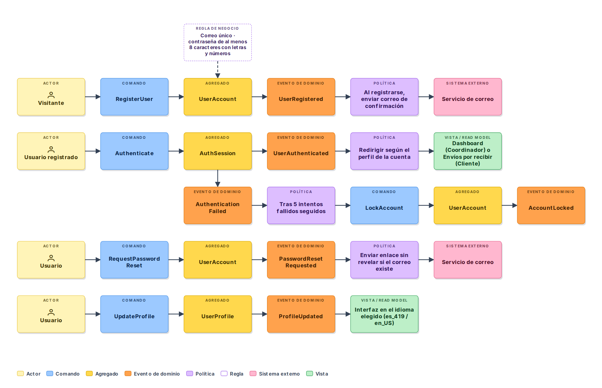<br>
  <i>Nota.</i> Elaboración propia.
</p>

#### BC2 · Fleet & Resource Management

Este contexto gestiona los recursos físicos de la empresa de transporte. Sus reglas más importantes son la unicidad de la placa y de la licencia, y la ausencia de traslape de horarios: una unidad o un conductor no pueden reservarse para dos envíos a la vez. Una unidad enviada a mantenimiento deja de aparecer como disponible. La reserva y la liberación no las decide el usuario directamente, sino que las provocan por política los eventos del contexto Shipment Management.

**Figura 4.89**

*EventStorming del contexto Fleet & Resource Management*

<p align="center">
  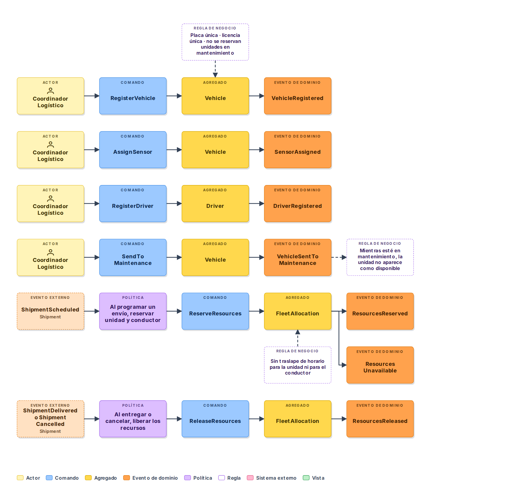<br>
  <i>Nota.</i> Elaboración propia.
</p>

#### BC3 · Shipment Management

Este es el contexto central del negocio. El diseño previsto permite al Coordinador Logístico definir un borrador con su rango térmico y luego programarlo; el borrador persistido queda fuera de la implementación TB1. Al programar, la política del contexto solicita la reserva de recursos: si se reservan, se avisa al Cliente de Carga; si no están disponibles, no se confirma la programación. Esta secuencia corresponde al flujo 1 de la sección 4.4.4. Antes del tránsito puede cancelarse el envío programado y liberar la reserva. Al iniciar el traslado se abre el monitoreo; la entrega lo detiene y libera los recursos. No se permite cancelar un envío en tránsito ni entregado.

**Figura 4.90**

*EventStorming del contexto Shipment Management*

<p align="center">
  <br>
  <i>Nota.</i> Elaboración propia.
</p>

#### BC4 · Monitoring & Telemetry

El contexto recibe las lecturas y las posiciones de los sensores y las evalúa. Al iniciar el monitoreo copia el rango térmico y la tolerancia del envío, de modo que una modificación posterior del envío no altere retroactivamente la evaluación. Cada lectura se registra y se evalúa: si está fuera de rango se solicita una alerta al contexto Alert & Reporting; si está dentro y existe una alerta activa, se solicita su resolución. Una política adicional detecta la pérdida de señal cuando no llegan lecturas durante el tiempo máximo permitido y solicita una alerta «Sin señal», que en la interfaz se muestra con el banner «Sin señal desde HH:MM» y la última lectura conocida.

**Figura 4.91**

*EventStorming del contexto Monitoring & Telemetry*

<p align="center">
  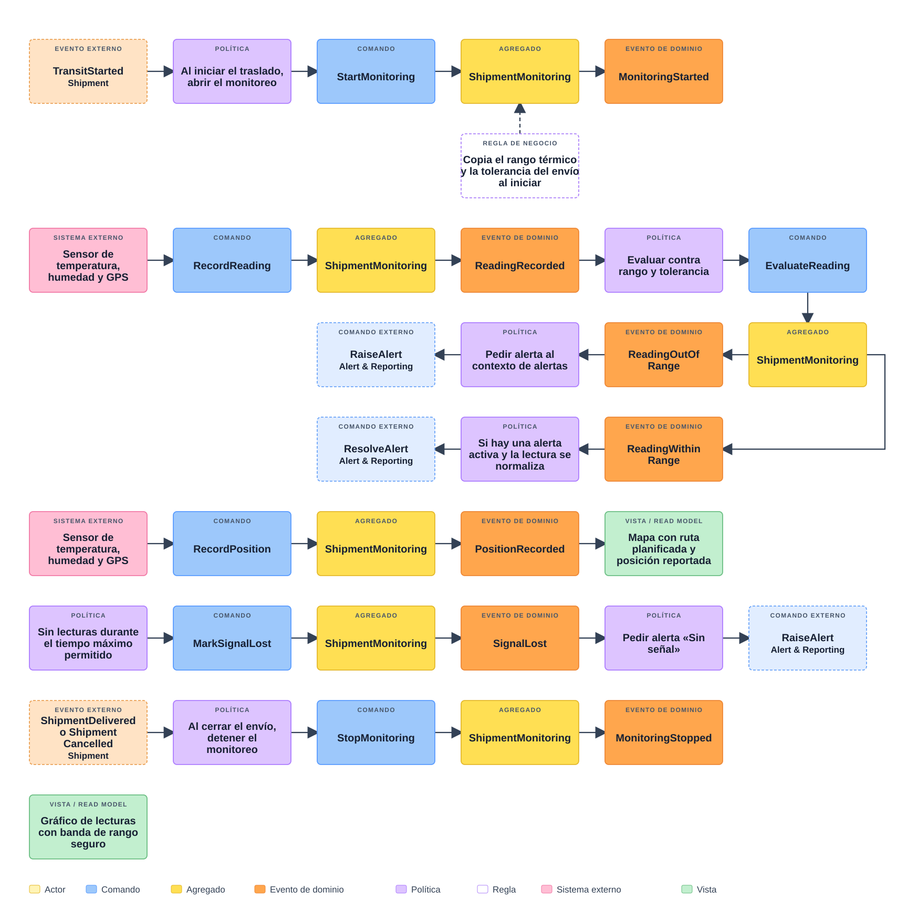<br>
  <i>Nota.</i> Elaboración propia.
</p>

#### BC5 · Alert & Reporting

Este contexto reacciona a los eventos de monitoreo. Al recibir la solicitud de una alerta, la política del contexto la clasifica como advertencia o como crítica según la tolerancia, la registra y genera una notificación para el Coordinador Logístico y el Cliente de Carga (con envío de correo en el caso de alertas críticas). El Coordinador registra la acción correctiva desde la ventana modal descrita en la sección 4.4; si marcó la casilla «Notificar al Cliente de Carga», se envía además una notificación al cliente. La alerta se cierra cuando la lectura vuelve al rango. El contexto también registra incidencias, genera el reporte térmico en PDF y controla la lectura de las notificaciones.

**Figura 4.92**

*EventStorming del contexto Alert & Reporting*

<p align="center">
  <br>
  <i>Nota.</i> Elaboración propia.
</p>

### 4.6.2. Software Architecture Context Diagram

El diagrama de contexto (nivel 1 del modelo C4) muestra FríoTrack como una sola caja y a su alrededor las personas que lo usan y los sistemas externos con los que se comunica (Brown, s. f.). Su utilidad es acordar el alcance del sistema con lectores no técnicos.

**Figura 4.93**

*Diagrama de contexto del sistema FríoTrack (modelo C4, nivel 1)*

<p align="center">
  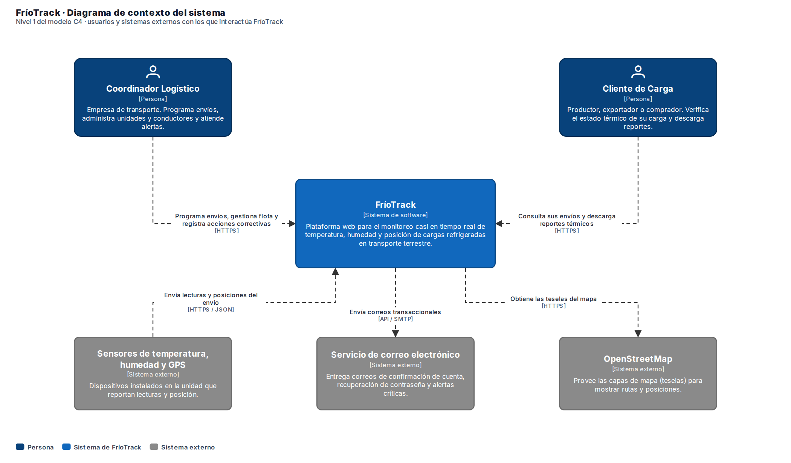<br>
  <i>Nota.</i> Elaboración propia, con base en el modelo C4.
</p>

**Tabla 4.26**

*Elementos del diagrama de contexto*


| Elemento | Tipo | Descripción y relación con FríoTrack |
| :--- | :--- | :--- |
| **Coordinador Logístico** | Persona | Empresa de transporte. Programa envíos, administra unidades y conductores y atiende alertas. Usa el sistema mediante HTTPS. |
| **Cliente de Carga** | Persona | Productor, exportador o comprador. Consulta el estado térmico de sus envíos y descarga reportes. Usa el sistema mediante HTTPS. |
| **FríoTrack** | Sistema | Plataforma web para el monitoreo casi en tiempo real de temperatura, humedad y posición de cargas refrigeradas. |
| **Sensores de temperatura, humedad y GPS** | Sistema externo | Dispositivos instalados en cada unidad. Envían lecturas y posiciones a FríoTrack mediante HTTPS con formato JSON. |
| **Servicio de correo electrónico** | Sistema externo | Entrega los correos de confirmación de cuenta, de recuperación de contraseña y de alertas críticas. |
| **OpenStreetMap** | Sistema externo | Provee las teselas de los mapas donde se muestran rutas y posiciones (OpenStreetMap Foundation, s. f.). |

*Nota.* Elaboración propia.

### 4.6.3. Software Architecture Container Diagrams

El diagrama de contenedores (nivel 2 del modelo C4) descompone FríoTrack en sus unidades ejecutables y muestra las decisiones tecnológicas. Un contenedor, en este modelo, es una aplicación o un almacén de datos que debe estar en ejecución para que el sistema funcione, y no un contenedor de Docker.

**Figura 4.94**

*Diagrama de contenedores de FríoTrack (modelo C4, nivel 2)*

<p align="center">
  <br>
  <i>Nota.</i> Elaboración propia, con base en el modelo C4.
</p>

**Tabla 4.27**

*Contenedores de FríoTrack y decisiones tecnológicas*


| Contenedor | Tecnología | Responsabilidad | Justificación |
| :--- | :--- | :--- | :--- |
| **Landing Page** | HTML, CSS y JavaScript, sitio estático | Presentar la propuesta de valor y dirigir al registro o al inicio de sesión. | Contenido público que no requiere lógica de servidor y que se sirve de forma estática y rápida. |
| **Aplicación web (SPA)** | Vue 3, Vite, PrimeVue, Leaflet | Interfaz del Coordinador Logístico y del Cliente de Carga: dashboard, envíos, alertas, historial y reportes. | Vue 3 y Vite permiten una interfaz reactiva; PrimeVue (PrimeTek, s. f.) aporta los componentes descritos en la sección 4.1.2; Leaflet (Agafonkin, s. f.) dibuja los mapas con las teselas de OpenStreetMap. |
| **API de apoyo** | ASP.NET Core, C#, .NET 10 | Validar credenciales, sesiones, permisos y comandos; filtrar la información por cliente. | Servidor publicado en App Service; token opaco de sesión y persistencia JSON. |
| **Almacén implementado** | Archivo JSON privado | Conservar cuentas, sesiones y operaciones en una sola instancia. | Archivo fuera del hosting público; reemplazo relacional previsto para el backend objetivo. |
| **Base de datos objetivo** | PostgreSQL (diseño) | Almacenar usuarios, flota, envíos, lecturas, alertas, notificaciones y reportes. | Base relacional con integridad referencial, tipos para fecha y hora con zona horaria y soporte de campos JSON (The PostgreSQL Global Development Group, s. f.). |
| **OpenStreetMap** | Sistema externo | Proveer las teselas del mapa. | Alternativa abierta que no exige licencia comercial de mapas. |
| **Sensores** | Sistema externo | Reportar lecturas y posiciones. | Cada unidad lleva un sensor asignado en el contexto Fleet & Resource Management. |
| **Servicio de correo** | Sistema externo | Entregar correos transaccionales. | Evita operar un servidor de correo propio. |

*Nota.* Elaboración propia.

La aplicación Vue consume la API de apoyo mediante HTTPS y JSON. El servidor valida credenciales, emite tokens opacos, filtra el workspace por cliente y procesa comandos autorizados. La API persiste en un archivo JSON privado. El diseño de backend final añade EF Core, PostgreSQL, OpenAPI, sensores y correo; esos componentes se diferencian de la implementación de TB1.

### 4.6.4. Software Architecture Component Diagrams

Se separan los componentes del cliente y del backend objetivo por sus responsabilidades. El frontend actual utiliza el adaptador HTTP de workspace y sesión. Las fuentes editables de esta sección están en `assets/architecture/`; el diseño por capas del backend final se mantiene como evolución de la API de apoyo desplegada.

#### 4.6.4.1. Componentes del frontend


| Contexto/componente | Tecnología | Responsabilidad | Relación |
|---|---|---|---|
| IAM: Access/Profile views | Vue y PrimeVue | Login con credenciales, registro de cliente y preferencias | API verifica identidad y asigna rol; sesión en sessionStorage |
| Fleet: Resource views | Vue, formularios PrimeVue | Crear/editar vehículos y conductores, asociar sensores de prueba | Valida unicidad y disponibilidad en operations.js |
| Shipment: List/Detail/Wizard views | Vue y PrimeVue | Programar en cuatro pasos, cambiar estados permitidos y buscar | El adaptador HTTP envía comandos; API valida y persiste |
| Monitoring: Reading/Map components | Vue y Leaflet | Lecturas y ubicaciones de ejemplo, rango térmico y señal | Lecturas demo; teselas OpenStreetMap vía HTTPS |
| Alert & Reporting: Alert/History views | Vue | Acciones correctivas, avisos internos e historial de prueba | API verifica permisos; exportación identifica datos de prueba |
| Workspace repository | JavaScript, fetch y sessionStorage | Estado reactivo, sesión y comandos HTTP | Conecta con API ASP.NET Core; la autorización reside en servidor |
| Shared UI / i18n / navigation | Vue, PrimeVue y JavaScript | Layout, foco, rutas hash e inglés/español | Utilizado por todas las vistas |

La interfaz limita los controles según el perfil y la API verifica la autorización en cada solicitud. El cliente recibe únicamente sus envíos y recursos relacionados. El aislamiento por organización y las transacciones relacionales forman parte del backend objetivo; no se atribuyen al almacén JSON actual.

#### 4.6.4.2. Componentes del backend


Cada columna corresponde a un contexto: IAM, Fleet, Shipment, Monitoring y Alert & Reporting. En cada uno, **Interfaces** expone controladores REST y DTO; **Application** coordina command/query handlers, validación de solicitud y transacciones; **Domain** contiene agregados, objetos de valor, reglas y puertos; **Infrastructure** implementa esos puertos con EF Core y adaptadores. Interfaces depende de Application, Application de Domain, e Infrastructure implementa interfaces definidas hacia el interior. El dominio no depende de EF Core, controladores ni correo externo.

| Componente | Tecnología propuesta | Responsabilidad |
|---|---|---|
| REST controllers / DTO | ASP.NET Core y C# | Validar forma de solicitud, identidad y mapear respuestas HTTP |
| Command/query handlers | C# | Coordinar casos de uso por contexto y una unidad de trabajo |
| Aggregates / domain services / ports | C# | Proteger rangos, reservas y transiciones; emitir eventos internos |
| Repository / UnitOfWork adapters | EF Core y PostgreSQL | Guardar agregados; unicidad, FK y transacciones |
| In-process event dispatcher | C# | Publicar eventos después de aceptar el caso de uso; reacciones de aplicación |
| Sensor adapter | C# | Traducir datos de sensores al comando RecordReading |
| Mail / Report adapters | C# | Aislar correo externo y generación de documento térmico |

`ShipmentScheduled` solicita reserva; `TransitStarted` activa monitoreo; `ReadingOutOfRange` y `SignalLost` solicitan alertas; entrega/cancelación liberan recursos. Estas son integraciones **propuestas**, no un bus implementado. La reserva que condiciona la programación debe ser validada y confirmada dentro del caso de uso; un evento aceptado no justifica sobreasignar recursos.

#### 4.6.4.3. Otros contenedores

La landing tiene contenido/estilo (`index.html`, CSS), internacionalización (`i18n.js` y diccionarios), navegación/planes/contacto (`app.js`) y simulador identificado (`hero-sim.js`). El almacén PostgreSQL es un contenedor de datos, cuyo detalle se presenta en 4.8; no se lo representa como una aplicación con controladores. Las teselas, sensores y correo son sistemas externos, no contenedores que el equipo implementa.

## 4.7. Software Object-Oriented Design

### 4.7.1. Class Diagrams

**Estado:** los diagramas de backend y base de datos describen el diseño objetivo. El cliente utiliza un módulo JavaScript de sesión y workspace; su modelo lógico actual se muestra a continuación. Las fuentes PlantUML y Mermaid permiten revisar relaciones y responsabilidades sin confundirlas con clases JavaScript implementadas.

#### Modelo del cliente TB1

El UML representa un modelo lógico de objetos y módulos JavaScript. El módulo `workspace-repository.js` mantiene referencias reactivas `data` y `profile` y expone login, register, logout, execute y restoreSession. Envía solicitudes HTTPS a la API; los objetos de envíos y lecturas recibidos alimentan las vistas. Las reglas de dominio del cliente se conservan en `operations.js` y la validación del servidor en `api/Operations.cs`.

**Modelo del cliente TB1 · aplicación y acceso**

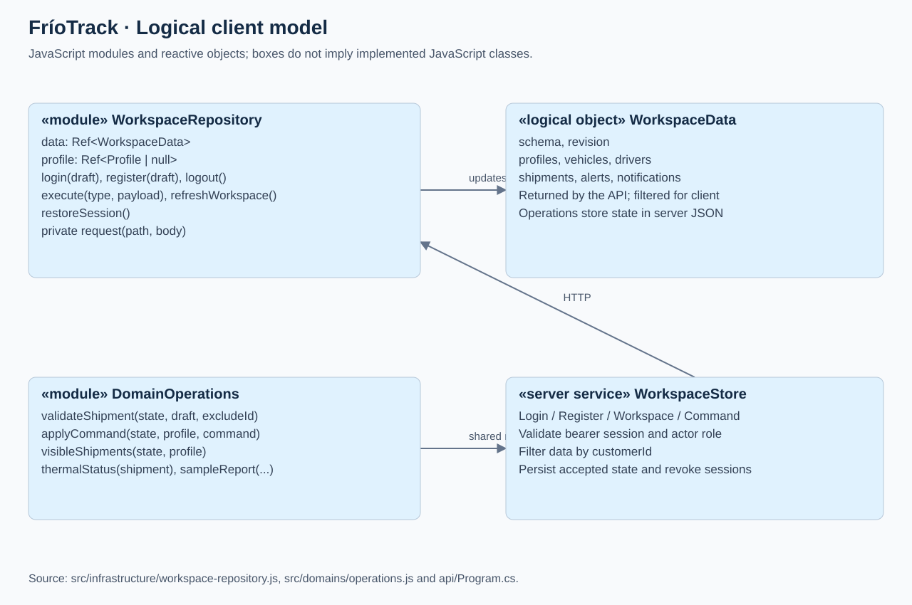

**Modelo del cliente TB1 · envíos, recursos y monitoreo**


El envío referencia una unidad, conductor y cliente por sus IDs; conserva ruta, peso, fechas, versión y los límites mínimo/máximo de temperatura y humedad. Incluye lecturas con coordenadas, historial y alertas asociadas. La capacidad de la unidad, los recursos disponibles y el solapamiento temporal condicionan la programación. Las asociaciones con multiplicidades documentan ese contrato; `ThermalRange` agrupa lógicamente campos numéricos que hoy están en el objeto de envío.

La acción correctiva reconoce una alerta; su estado sigue abierto hasta que una nueva lectura de ejemplo cumple ambos rangos. Los avisos opcionales se dirigen al cliente asignado. Las enumeraciones reflejan valores de diseño y estados derivados, sin inventar autenticación. Los SVG se generaron localmente y se revisaron visualmente; **no son capturas de PlantUML ni de una herramienta compartida**. La fuente PlantUML queda disponible para importación y revisión del equipo.

El diseño del backend propone agregados para los cinco contextos de 4.6. La fuente [backend-classes-tb1.puml](assets/architecture/backend-classes-tb1.puml) y el [catálogo de entidades](assets/architecture/backend-model-tb1.json) documentan relaciones y restricciones del modelo objetivo. Las figuras son vistas SVG de ese modelo; la API de apoyo desplegada no implementa todavía toda esta estructura ni PostgreSQL.

En UML, `−` indica un atributo privado y `+` una operación pública. El rombo de `Shipment` a `ThermalRange` indica composición; las asociaciones por ID y sus multiplicidades representan vínculos del diseño. Los colores agrupan contextos. Para mantener legibilidad, se dividen los modelos en cuatro paneles: recursos, envío, monitoreo y alertas. Las figuras muestran asociaciones principales; la fuente editable y la Tabla 4.32 contienen las 27 relaciones persistentes, incluidas las que atraviesan paneles.

Se proponen las siguientes decisiones:

- `Organization` identifica la empresa de transporte. Las cuentas, unidades, conductores y envíos referencian esa empresa; el servidor futuro deberá verificar empresa, rol y permiso para cada operación. La cadena `organization` de los perfiles de la API de apoyo no equivale a esta normalización ni acredita aislamiento entre empresas.
- Las asociaciones entre agregados se expresan mediante IDs. `FleetAllocation` reserva unidad y conductor para el intervalo del envío, y `ShipmentHistoryEvent` conserva acciones, responsable y fecha. Programar envío y reserva deberá ser una operación atómica que rechace solapamientos y exceso de capacidad.
- `ThermalRange` contiene **mínimo y máximo de temperatura en °C, mínimo y máximo de humedad relativa en %, y tolerancia en minutos**. `ShipmentMonitoring` recibe una copia al iniciar el monitoreo. Las lecturas históricas se evalúan con esa copia; el diseño no permite reescribir retroactivamente sus límites (US08).
- El contrato previsto conserva `DRAFT → SCHEDULED → IN_TRANSIT → DELIVERED` y la cancelación de borrador o programado de US34. La implementación TB1 admite cancelación únicamente de un envío programado y rechaza cancelación durante tránsito o después de entrega; no persiste borradores. En el diseño, un borrador no reserva recursos; cancelar antes del tránsito libera las reservas existentes y entregar detiene el monitoreo y libera los recursos.
- JWT corresponde al contrato técnico propuesto TS05; en TB1 se utilizan tokens opacos de sesión, no JWT. La recuperación con token de uso único, la tolerancia temporal, la severidad y la detección automática de silencio son diseño previsto; las capturas del frontend no acreditan esos servicios.

#### Diagrama de clases 1 · IAM, Fleet & Resource Management y Shipment Management

IAM contiene `Organization`, `UserAccount` y `PasswordResetToken`; los roles previstos son `LOGISTICS_COORDINATOR` y `CARGO_CLIENT`. Fleet & Resource Management contiene unidades, conductores, sensores y reservas. Shipment Management organiza el envío, sus cuatro límites ambientales y el historial. Un Cliente de Carga se vincula mediante `clientId`; esa relación condiciona la consulta y las notificaciones del envío.

**Figura 4.96**

*Modelo de clases previsto: recursos y operación de envío, en dos paneles*

**Panel de recursos e identidad**


**Panel del envío, reserva y trazabilidad**


*Nota.* Vistas SVG del modelo de clases previsto. El [PNG de AV1](assets/images/chapter-04/class-diagram-1.png) se preserva como antecedente y contiene el modelo anterior, sin mínimo de humedad.

**Tabla 4.29**

*Clases previstas de IAM, Fleet & Resource Management y Shipment Management*

| Clase | Contexto | Tipo | Responsabilidad prevista |
| :--- | :--- | :--- | :--- |
| `Organization` | IAM | Entidad | Identificar la empresa de transporte asociada con usuarios, recursos y envíos. |
| `UserAccount` | IAM | Agregado raíz | Mantener identidad, rol, idioma, resumen de contraseña, estado de cuenta e intentos fallidos; participar en autenticación y actualización del perfil. |
| `PasswordResetToken` | IAM | Entidad | Conservar el resumen del token, vencimiento y fecha de uso; impedir reutilización. |
| `UserRole` | IAM | Enumeración | `LOGISTICS_COORDINATOR` y `CARGO_CLIENT`; los permisos se verifican en cada caso de uso. |
| `Vehicle` | Fleet & Resource | Agregado raíz | Conservar placa, capacidad y estado; comprobar disponibilidad para una reserva. |
| `Sensor` | Fleet & Resource | Entidad | Conservar identidad del dispositivo y asignación opcional a una unidad. |
| `Driver` | Fleet & Resource | Agregado raíz | Conservar identidad, licencia y estado; comprobar disponibilidad. |
| `FleetAllocation` | Fleet & Resource | Agregado raíz | Reservar unidad y conductor por intervalo; conservar y liberar la reserva. |
| `Shipment` | Shipment | Agregado raíz | Conservar empresa, coordinador, cliente, carga, peso, ruta, fechas, versión y rangos; validar programación y transiciones. |
| `ThermalRange` | Shipment | Objeto de valor | Agrupar mínimos y máximos de temperatura y humedad y tolerancia; comprobar ambos rangos de manera inclusiva. |
| `ShipmentHistoryEvent` | Shipment | Entidad | Conservar acción, responsable, fecha, nota y estados anterior/posterior cuando corresponda. |
| `ShipmentStatus` | Shipment | Enumeración | `DRAFT`, `SCHEDULED`, `IN_TRANSIT`, `DELIVERED`, `CANCELLED`. |

*Nota.* Responsabilidades de diseño; no acreditan implementación ni resultados de ejecución del backend.

#### Diagrama de clases 2 · Monitoring & Telemetry y Alert & Reporting

`ShipmentMonitoring` mantiene la copia del rango, lecturas, posiciones y condición de señal del envío. `SensorReading` evalúa temperatura y humedad contra ambos intervalos. `Alert` distingue temperatura, humedad y pérdida de señal; una lectura que origina una alerta puede no existir en una pérdida de comunicación. `CorrectiveAction` conserva la respuesta del coordinador; `Notification`, `Incident` y `ThermalReport` preservan avisos, eventos operativos y evidencia del envío. Estos objetos se separan en dos paneles para facilitar su lectura.

**Figura 4.97**

*Modelo de clases previsto: monitoreo y atención, en dos paneles*

**Panel de monitoreo y telemetría**

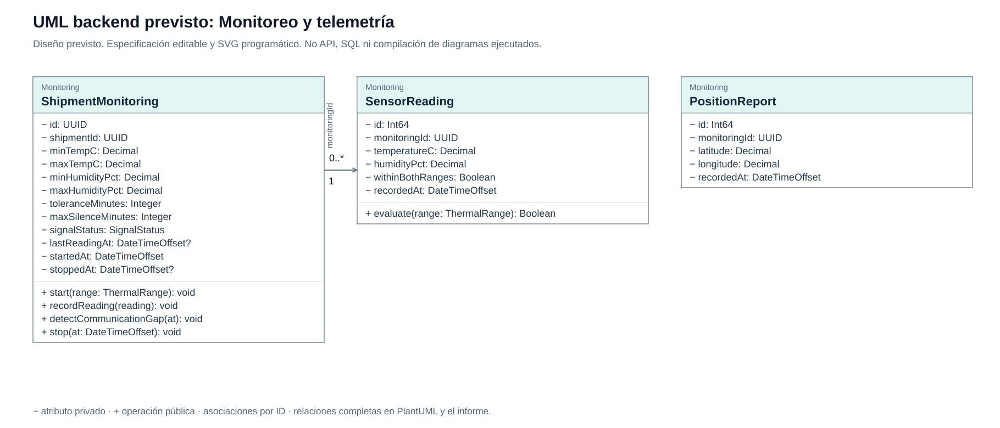

**Panel de alertas, acciones y evidencia**


*Nota.* Vistas SVG del modelo de clases previsto. El [PNG de AV1](assets/images/chapter-04/class-diagram-2.png) permanece como antecedente; sus tipos adicionales de alerta no se incorporan al alcance vigente sin una historia que los sustente.

**Tabla 4.30**

*Clases previstas de Monitoring & Telemetry y Alert & Reporting*

| Clase | Contexto | Tipo | Responsabilidad prevista |
| :--- | :--- | :--- | :--- |
| `ShipmentMonitoring` | Monitoring & Telemetry | Agregado raíz | Conservar cuatro límites y tolerancia de inicio; registrar lecturas y posiciones; detectar silencio configurable y detenerse al concluir el envío. |
| `SensorReading` | Monitoring & Telemetry | Entidad | Conservar temperatura, humedad y fecha; indicar si ambos valores satisfacen los rangos del monitoreo. |
| `PositionReport` | Monitoring & Telemetry | Entidad | Conservar latitud, longitud y fecha de reporte válidas. |
| `SignalStatus` | Monitoring & Telemetry | Enumeración | `ONLINE`, `NO_SIGNAL`; el umbral temporal debe configurarse y validarse. |
| `Alert` | Alert & Reporting | Agregado raíz | Conservar tipo, severidad, estado y fechas; reconocer una acción y resolver solo con evidencia posterior de recuperación. |
| `CorrectiveAction` | Alert & Reporting | Entidad | Conservar alerta, comentario, responsable, fecha y elección de notificar al cliente asignado. |
| `Notification` | Alert & Reporting | Agregado raíz | Conservar destinatario, envío, origen opcional y fecha de lectura. |
| `Incident` | Alert & Reporting | Agregado raíz | Conservar una incidencia operativa, responsable y fecha del traslado. |
| `ThermalReport` | Alert & Reporting | Agregado raíz | Conservar referencia de un archivo y resumen generado del envío; no certificar condiciones que carecen de mediciones. |
| `AlertType` | Alert & Reporting | Enumeración | `TEMPERATURE`, `HUMIDITY`, `NO_SIGNAL`. |
| `AlertStatus` | Alert & Reporting | Enumeración | `ACTIVE`, `ACKNOWLEDGED`, `RESOLVED`. |
| `AlertSeverity` | Alert & Reporting | Enumeración | `WARNING`, `CRITICAL`; clasificación de severidad prevista en US04; su política temporal requiere integración. |

*Nota.* La fuente PlantUML incluye las enumeraciones y sus dependencias; los paneles muestran las entidades y agregados persistentes.

Una acción válida cambia la alerta de `ACTIVE` a `ACKNOWLEDGED` y puede generar un aviso únicamente para el cliente asignado (US35). **Registrar la acción no demuestra recuperación.** La resolución requiere una lectura posterior dentro de ambos rangos; el historial conserva la alerta y su atención.

## 4.8. Database Design

### 4.8.1. Database Diagrams

Se propone un esquema relacional de **17 tablas** para PostgreSQL. La fuente [database-tb1.mmd](assets/architecture/database-tb1.mmd) y el [catálogo](assets/architecture/backend-model-tb1.json) documentan columnas, claves y 27 relaciones. Las vistas por contexto corresponden al diseño objetivo; la aplicación TB1 utiliza el almacén JSON privado descrito en 5.2.2.6. La entidad Organization establece un diseño de aislamiento por empresa aún no implementado.

**Figura 4.98**

*Diseño relacional previsto de FríoTrack, en cuatro paneles*

**Panel de organización, cuentas y recursos**


**Panel de envío, reserva e historial**

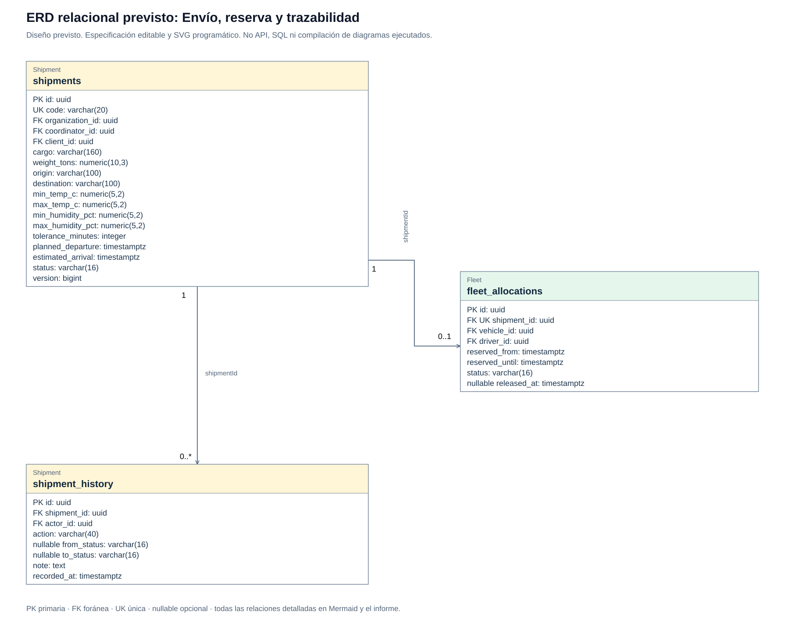

**Panel de monitoreo y telemetría**


**Panel de alertas, atención y evidencia**


*Nota.* `PK` identifica una clave primaria; `FK`, una referencia; `UK`, una restricción de unicidad; `nullable`, un campo opcional. Las flechas identifican asociaciones principales y sus multiplicidades; la fuente Mermaid y la Tabla 4.32 contienen todas las relaciones. El [ERD PNG de AV1](assets/images/chapter-04/erd-friotrack.png) se conserva sin alteración como antecedente del modelo anterior.

**Tabla 4.31**

*Tablas propuestas por contexto delimitado*

| Contexto | Tabla | Descripción prevista |
| :--- | :--- | :--- |
| IAM | `organizations` | Empresa de transporte que agrupa cuentas, recursos y envíos. |
| IAM | `users` | Cuentas con empresa, rol, idioma, contraseña resumida, estado e intentos fallidos. |
| IAM | `password_reset_tokens` | Tokens resumidos de recuperación, vencimiento y uso único. |
| Fleet & Resource | `vehicles` | Unidades de la empresa, placa, capacidad y estado. |
| Fleet & Resource | `drivers` | Conductores de la empresa, licencia y estado. |
| Fleet & Resource | `sensors` | Dispositivos identificados con asignación opcional y única a una unidad. |
| Fleet & Resource | `fleet_allocations` | Reserva de unidad y conductor por envío, intervalo, estado y liberación. |
| Shipment | `shipments` | Empresa, coordinador, cliente, carga, peso, ruta, fechas, versión, estado y cuatro límites ambientales con tolerancia. |
| Shipment | `shipment_history` | Acciones del envío, responsable, nota, fecha y cambios de estado cuando corresponda. |
| Monitoring & Telemetry | `shipment_monitorings` | Copia de los cuatro límites y tolerancia, máximo silencio configurable, estado de señal y fechas de monitoreo. |
| Monitoring & Telemetry | `sensor_readings` | Temperatura, humedad, fecha y resultado de ambos rangos. |
| Monitoring & Telemetry | `position_reports` | Latitud, longitud y fecha de reporte. |
| Alert & Reporting | `alerts` | Envío, tipo, severidad, estado, lectura de origen opcional y fechas de evolución. |
| Alert & Reporting | `corrective_actions` | Alerta atendida, responsable, comentario, fecha y elección de notificar al cliente. |
| Alert & Reporting | `notifications` | Destinatario, envío, alerta opcional, tipo y fechas de creación/lectura. |
| Alert & Reporting | `incidents` | Evento operativo del envío, responsable, descripción y fecha. |
| Alert & Reporting | `thermal_reports` | Referencia al informe, responsable, fecha y resumen de evidencia en JSON. |

*Nota.* No existen registros reales ni migraciones ejecutadas que se acrediten mediante este diseño.

**Decisiones de diseño.** Se proponen las siguientes restricciones y patrones:

- Usar UUID en las tablas de negocio y `bigint` en lecturas y posiciones; usar `timestamptz` para comparar instantes y `numeric` para los valores y límites ambientales.
- Incluir `min_temp_c`, `max_temp_c`, `min_humidity_pct` y `max_humidity_pct` tanto en `shipments` como en `shipment_monitorings`. Los límites de inicio y la tolerancia forman una copia que conserva la interpretación de las mediciones históricas (US08).
- Validar `min_temp_c < max_temp_c`, `0 ≤ min_humidity_pct < max_humidity_pct ≤ 100` y tolerancia no negativa. El frontend actual acepta temperatura entre −50 y 50 °C; estos son límites operativos del prototipo, no una recomendación universal de conservación. La futura validación deberá conservar los rangos admitidos por el contrato aprobado.
- Validar peso positivo que no supere capacidad; salida anterior a llegada; origen diferente del destino; recursos habilitados y cliente autorizado. La reserva y programación deberán confirmar ambas asignaciones de forma atómica y rechazar intervalos solapados de unidad o conductor.
- Aplicar unicidad a placa, licencia, serial, correo y código de envío; prever una asignación de sensor por unidad, una reserva por envío y un monitoreo por envío. La asociación opcional de sensor y los estados de borrador/inicio explican las cardinalidades `0..1`; una reserva liberada permanece para trazabilidad.
- Limitar mediante `CHECK` los estados y roles previstos; comprobar coordenadas `−90..90` para latitud y `−180..180` para longitud. La severidad temporal y el máximo silencio configurable necesitan validación al integrar telemetría real.
- Prever índices por empresa y estado del envío, por monitoreo/fecha de lectura, por envío/estado de alerta y por destinatario/fecha de lectura del aviso. Guardar el resumen del informe como `jsonb` conserva su contexto de generación; la copia de límites es una decisión deliberada de trazabilidad.
- La API actual verifica sesión, rol y asociación del cliente al envío. El backend relacional deberá añadir pertenencia por empresa; una FK por sí sola no garantiza aislamiento por organización.

Las siguientes relaciones documentan el esquema completo. Las cardinalidades se leen **padre → hija**; una hija con FK no nullable referencia exactamente un padre, y la tabla indica cuántas hijas puede tener ese padre. Las relaciones opcionales especifican ambos extremos.

**Tabla 4.32**

*Relaciones propuestas entre tablas*

| Tabla hija | Columna FK | Tabla padre | Cardinalidad padre → hija | Significado |
| :--- | :--- | :--- | :--- | :--- |
| `users` | `organization_id` | `organizations` | `1 → 0..*` | Empresa de la cuenta. |
| `vehicles` | `organization_id` | `organizations` | `1 → 0..*` | Empresa propietaria de la unidad. |
| `drivers` | `organization_id` | `organizations` | `1 → 0..*` | Empresa que administra al conductor. |
| `shipments` | `organization_id` | `organizations` | `1 → 0..*` | Empresa que gestiona el envío. |
| `password_reset_tokens` | `user_id` | `users` | `1 → 0..*` | Cuenta a la que pertenece el token. |
| `sensors` | `vehicle_id` | `vehicles` | `0..1 → 0..1` | Sensor opcional y único por unidad; sensor aún sin asignar permitido. |
| `fleet_allocations` | `shipment_id` | `shipments` | `1 → 0..1` | Reserva opcional en borrador, requerida al programar. |
| `fleet_allocations` | `vehicle_id` | `vehicles` | `1 → 0..*` | Unidad reservada; se rechazan solapamientos activos. |
| `fleet_allocations` | `driver_id` | `drivers` | `1 → 0..*` | Conductor reservado; se rechazan solapamientos activos. |
| `shipments` | `coordinator_id` | `users` | `1 → 0..*` | Coordinador responsable de la programación. |
| `shipments` | `client_id` | `users` | `1 → 0..*` | Cliente asignado con acceso de consulta. |
| `shipment_history` | `shipment_id` | `shipments` | `1 → 0..*` | Envío al que pertenece la acción histórica. |
| `shipment_history` | `actor_id` | `users` | `1 → 0..*` | Responsable de la acción. |
| `shipment_monitorings` | `shipment_id` | `shipments` | `1 → 0..1` | Monitoreo opcional antes del inicio, único por envío. |
| `sensor_readings` | `monitoring_id` | `shipment_monitorings` | `1 → 0..*` | Monitoreo que conserva y evalúa la lectura. |
| `position_reports` | `monitoring_id` | `shipment_monitorings` | `1 → 0..*` | Monitoreo al que pertenece la posición. |
| `alerts` | `shipment_id` | `shipments` | `1 → 0..*` | Envío afectado. |
| `alerts` | `trigger_reading_id` | `sensor_readings` | `0..1 → 0..*` | Lectura opcional de origen; una pérdida de señal puede no tenerla. |
| `corrective_actions` | `alert_id` | `alerts` | `1 → 0..*` | Alerta cuya atención se documenta. |
| `corrective_actions` | `registered_by` | `users` | `1 → 0..*` | Coordinador que registra la acción. |
| `notifications` | `user_id` | `users` | `1 → 0..*` | Destinatario autorizado del aviso. |
| `notifications` | `shipment_id` | `shipments` | `1 → 0..*` | Envío al que se refiere el aviso. |
| `notifications` | `alert_id` | `alerts` | `0..1 → 0..*` | Alerta de origen opcional. |
| `incidents` | `shipment_id` | `shipments` | `1 → 0..*` | Envío afectado por la incidencia. |
| `incidents` | `registered_by` | `users` | `1 → 0..*` | Responsable del registro. |
| `thermal_reports` | `shipment_id` | `shipments` | `1 → 0..*` | Envío cuya evidencia se resume. |
| `thermal_reports` | `generated_by` | `users` | `1 → 0..*` | Usuario que solicita/genera el informe autorizado. |

*Nota.* Multiplicidades del diseño, no restricciones verificadas en una base de datos ejecutada.

El diseño prevé consultas de envíos autorizados por empresa y cliente, última lectura con su fecha, periodos de mediciones sin interpolar vacíos, alertas abiertas y reconocidas, avisos no leídos e historial con evidencia. Su ejecución y seguridad deben demostrarse en la implementación posterior; este capítulo acredita la especificación local del modelo.

# Capítulo V: Product Implementation, Validation & Deployment

## 5.1. Software Configuration Management

### 5.1.1. Software Development Environment Configuration

FríoTrack integra una Landing Page, una aplicación Vue para el Coordinador Logístico y el Cliente de Carga, y una API de apoyo en ASP.NET Core. La entrega TB1 publica la landing actualizada y la primera aplicación frontend en Azure. El acceso utiliza cuentas con correo y contraseña; las lecturas y los registros iniciales de transporte son datos de prueba.

| Discipline | Tools / technologies | Application in FríoTrack | Evidence |
| --- | --- | --- | --- |
| Project Management | Trello y GitHub | Product Backlog, tareas y seguimiento del informe. | Tablero y captura en 3.3; historial de commits del repositorio actual. |
| Requirements Management | Markdown y Gherkin | Historias, criterios de aceptación y trazabilidad del Sprint 2. | Catálogo de 3.1 y backlog de 5.2.2.3. |
| Product UX/UI Design | Figma y prototipo HTML | Guía visual, wireframes, mock-ups y flujos por perfil. | Artefactos y enlace de diseño de 4.5. |
| Landing Development | HTML5, CSS3 y JavaScript | Presentación de la propuesta, corredores, planes y acceso a la aplicación. | Landing publicada en Azure Storage. |
| Frontend Development | Vue 3, JavaScript, PrimeVue 4, Vite y Leaflet | Programación, recursos, monitoreo, alertas, historial y consulta del cliente. | Código integrado en `friotrack-frontend/main`. |
| Backend Development | C# y ASP.NET Core, .NET 10 | Autenticación, autorización, consulta y comandos de la aplicación. | API publicada en Azure App Service; código en `friotrack-frontend/api`. |
| Software Testing | Node test runner y pruebas HTTP | Reglas de dominio, autenticación, aislamiento por cliente y validaciones. | 15 pruebas frontend y 26 comprobaciones API locales; 12 comprobaciones HTTPS del servicio publicado. |
| Software Documentation | Markdown, Mermaid y PlantUML | Informe, configuración, contratos y diseños editables. | Informe y fuentes en este repositorio; contratos del servicio en 5.2.2.6. |
| Software Deployment | Azure Storage y Azure App Service | Hosting estático y ejecución del servicio de apoyo. | Configuración y verificaciones en 5.2.2.7. |

El backend objetivo del producto contempla EF Core, PostgreSQL y OpenAPI. La API de apoyo de esta iteración persiste en un archivo JSON privado de una sola instancia; esas tecnologías del diseño final no se presentan como implementadas.

### 5.1.2. Source Code Management

La organización del equipo es [upc-pre-202620-1asi0730-8088-FrioTrackk](https://github.com/upc-pre-202620-1asi0730-8088-FrioTrackk). Los enlaces siguientes corresponden a los productos de FríoTrack.

| Repository | Branch / location | Content |
| --- | --- | --- |
| [report-friotrack](https://github.com/upc-pre-202620-1asi0730-8088-FrioTrackk/report-friotrack) | `develop` → `main` | Informe acumulativo, imágenes, anexos y evidencias. |
| [friotrack-landing](https://github.com/upc-pre-202620-1asi0730-8088-FrioTrackk/friotrack-landing) | Repositorio independiente de la landing | HTML, estilos, internacionalización y contenido público. La publicación Azure se identifica mediante sus hashes de archivos. |
| [friotrack-frontend](https://github.com/upc-pre-202620-1asi0730-8088-FrioTrackk/friotrack-frontend) | `main`; servicio en [`api/`](https://github.com/upc-pre-202620-1asi0730-8088-FrioTrackk/friotrack-frontend/tree/main/api) | Aplicación Vue, API de apoyo, pruebas y scripts de despliegue. |

La consolidación del informe se realiza sobre la rama existente `develop` y se integra en `main` para publicar `v2.0.0`. Se conserva el historial previo. Los mensajes nuevos siguen Conventional Commits y describen el cambio en inglés. El versionado del informe es independiente de la versión del paquete frontend y de la versión devuelta por `/api/health`.

La integración del frontend está registrada en los [PR #4](https://github.com/upc-pre-202620-1asi0730-8088-FrioTrackk/friotrack-frontend/pull/4) y [PR #5](https://github.com/upc-pre-202620-1asi0730-8088-FrioTrackk/friotrack-frontend/pull/5). Su revisión publicada es [`dc49d7e`](https://github.com/upc-pre-202620-1asi0730-8088-FrioTrackk/friotrack-frontend/commit/dc49d7e28e13c8d0f78fa913dd5353ea162012c6).

### 5.1.3. Source Code Style Guide & Conventions

| Technology / artifact | Convention | Purpose |
| --- | --- | --- |
| HTML y CSS | Estructura semántica, etiquetas de formulario, textos alternativos y variables de marca. | Presentación consistente y controles comprensibles. |
| JavaScript y Vue | camelCase en funciones y variables; PascalCase en componentes; módulos explícitos. | Separar vistas, reglas y acceso HTTP. |
| PrimeVue e i18n | Mensajes y etiquetas localizados; inglés inicial y español latinoamericano. | Mantener los dos idiomas en navegación y validaciones. |
| Acceso HTTP | `src/infrastructure/workspace-repository.js`. | Centralizar login, registro, sesión, consulta y comandos. |
| Reglas de negocio | `src/domains/operations.js` y `api/Operations.cs`. | Validar fechas, rangos, recursos, transiciones y permisos. |
| C# | PascalCase público, camelCase en parámetros y tipos explícitos. | Mantener consistencia del servicio. |
| Gherkin | Given/When/Then o Dado/Cuando/Entonces, con resultados observables. | Vincular requisitos con aceptación. |
| Markdown y Git | Encabezados numerados, enlaces comprobables y commits descriptivos. | Facilitar lectura, revisión y trazabilidad. |

Las contraseñas, claves de Azure y tokens de acceso se excluyen del control de versiones. Las variables `VITE_*` contienen únicamente configuración pública.

### 5.1.4. Software Deployment Configuration

La aplicación se compila con `npm ci` y `npm run build`. Los archivos de `dist/` se publican en el contenedor `$web` de Azure Storage. La landing ocupa `/landing/` y la aplicación la raíz del sitio. La navegación Vue utiliza rutas hash, por lo que el refresco de una vista conserva el punto de entrada sin reescrituras de rutas del servidor.

La configuración de producción define `VITE_API_URL` y `VITE_LANDING_URL`. La API se compila mediante `dotnet publish`, se empaqueta en ZIP y se publica en Azure App Service. CORS permite el origen del frontend; las credenciales iniciales se configuran en el servidor. Los datos persistidos se guardan en `HOME/data`, fuera de los archivos públicos del sitio.

| Setting | Value |
| --- | --- |
| Resource group | `rg-friotrack-tb1` |
| Region | West US |
| Static hosting | StorageV2, Standard LRS; `friotracktb1bce6db1b` |
| API hosting | Windows App Service, .NET 10; `friotrack-api-bce6db1b` |
| App Service plan | `plan-friotrack-free`, Free F1; Always On desactivado |
| Transport | HTTPS; TLS mínimo 1.2 en App Service |
| Persistence | Archivo JSON privado; una sola instancia |

El plan F1 puede requerir un arranque después de periodos de inactividad. La landing mantiene el formulario de contacto sin receptor comercial configurado; su validación no se presenta como una solicitud recibida.

## 5.2. Landing Page, Services & Applications Implementation

### 5.2.1. Sprint 1

#### 5.2.1.1. Sprint Planning 1

El Sprint 1 desarrolló la Landing Page de AV1. Su objetivo fue presentar el problema de la cadena de frío, los segmentos objetivo, los corredores propuestos y el acceso a FríoTrack.

| Field | Recorded detail |
| --- | --- |
| Sprint # | Sprint 1 |
| Date / Time | 08/09/2026, 19:00, según el registro AV1. |
| Location | Reunión virtual registrada en AV1. |
| Prepared By | Equipo BlackStartup. |
| Attendees | La relación de asistentes no se adjunta en el registro disponible. |
| Sprint 1 Goal | Present the cold-chain transport proposal, target users and proposed corridors through a bilingual landing page. |
| Sprint 1 Velocity | No consta medición de velocidad en el registro disponible. |
| Sum of Story Points | 9 SP: US23, US24, US25 y US27 del catálogo vigente. |

#### 5.2.1.2. Aspect Leaders and Collaborators

| Team Member | GitHub Username | Contribution recorded for AV1 |
| --- | --- | --- |
| Atauje Barreto, Alexander Sebastián | Alexander1Alexander2 | Startup Profile, Solution Profile, estructura del informe y secciones de la landing. |
| Bardales Rodriguez, Benjamin Elias | Benja72312 | Arquitectura, diseño y mayor parte de la implementación de la landing. |
| Daga Chávez, Joaquín Leonardo | Eshnikeee | Historias y criterios de aceptación. |
| Saavedra Flores, Rodrigo Andree | rodrigoxd67 | Capítulo V y apoyo al despliegue de la landing. |
| Vera Solsol, Nayely Macarena | Macaxprogram29 | Impact Mapping, Product Backlog y Trello. |

#### 5.2.1.3. Sprint Backlog 1

Los identificadores se relacionan con el catálogo actual de 3.1. Se conservan los resultados de AV1 y se distingue el formulario de contacto de las secciones publicadas.

| Story Id | Story Title | Task Id | Task Title | Task Description | Estimation (Hours) | Assigned To | Status |
| --- | --- | --- | --- | --- | --- | --- | --- |
| US23 | Propuesta de valor en Landing | S1-T01 | Implementar presentación | Comunicar problema, propuesta y segmentos. | No registrada | Benjamin / Alexander | Publicado |
| US24 | Corredores logísticos en Landing | S1-T02 | Presentar corredores | Mostrar las rutas propuestas de La Libertad, Ica, Piura y Lambayeque. | No registrada | Benjamin | Publicado |
| US25 | Formulario de contacto comercial | S1-T03 | Implementar formulario | Validar datos de contacto; integrar receptor comercial. | No registrada | Benjamin | Parcial: falta receptor |
| US27 | Preguntas frecuentes (FAQ) | S1-T04 | Incorporar FAQ | Mostrar preguntas y respuestas de la propuesta. | No registrada | Benjamin | Publicado |

#### 5.2.1.4. Development Evidence for Sprint Review

El repositorio de la landing conserva los commits del desarrollo AV1. Las fechas siguientes corresponden al calendario de Lima.

| Repository | Branch | CommitId | CommitMessage | CommitMessageBody | Committed on Date |
| --- | --- | --- | --- | --- | --- |
| friotrack-landing | main | [02b76e5](https://github.com/upc-pre-202620-1asi0730-8088-FrioTrackk/friotrack-landing/commit/02b76e5e97803fbbcc176bdec8492da8d4fa585e) | Merge pull request #6 from upc-pre-202620-1asi0730-8088-FrioTrack/develop | release: publicar la landing rediseñada en main | 19/09/2026 |
| friotrack-landing | main | [c63b6b0](https://github.com/upc-pre-202620-1asi0730-8088-FrioTrackk/friotrack-landing/commit/c63b6b0b8613cb2b161aa352bd25e47e7e3c9aca) | Merge pull request #3 from upc-pre-202620-1asi0730-8088-FrioTrack/feature/terms-and-conditions | feat: bilingual terms and conditions page | 19/09/2026 |
| friotrack-landing | main | [c64f54f](https://github.com/upc-pre-202620-1asi0730-8088-FrioTrackk/friotrack-landing/commit/c64f54f4b18ddd96ee4c6ebe514835d20baa07b9) | Merge pull request #2 from upc-pre-202620-1asi0730-8088-FrioTrack/feature/landing-page | feat: landing page markup, scripts and team assets | 19/09/2026 |

#### 5.2.1.5. Execution Evidence for Sprint Review

Las capturas siguientes corresponden a la landing AV1. La ejecución de la versión actual y el acceso a la aplicación se presentan en Sprint 2.

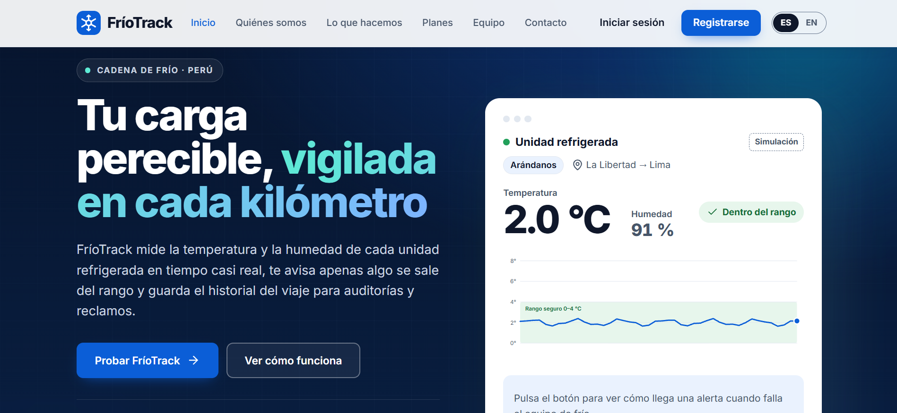

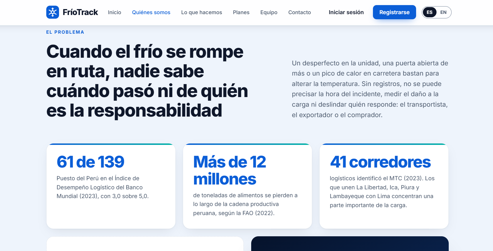

#### 5.2.1.6. Services Documentation Evidence for Sprint Review

La landing de Sprint 1 fue un sitio estático. No implementó Web Services internos. El formulario de contacto requiere un receptor para completar US25.

#### 5.2.1.7. Software Deployment Evidence for Sprint Review

La publicación AV1 utilizó GitHub Pages. Se conservan sus capturas de configuración y publicación como antecedentes. La URL vigente de la landing TB1 es [FríoTrack en Azure](https://friotracktb1bce6db1b.z22.web.core.windows.net/landing/).

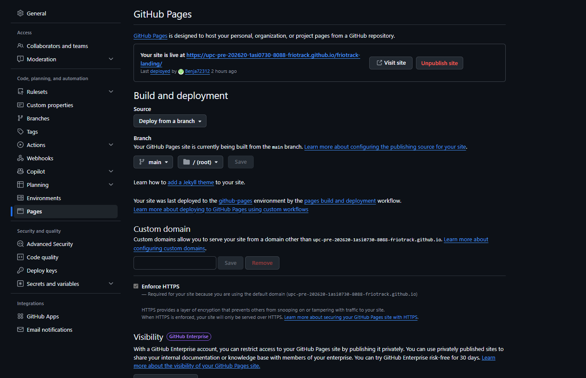


#### 5.2.1.8. Team Collaboration Insights during Sprint

La participación de AV1 se conserva en el registro de versiones y en la tabla de responsabilidades. Esta captura pertenece a esa entrega; la actividad del nuevo repositorio se presenta por separado en Sprint 2.

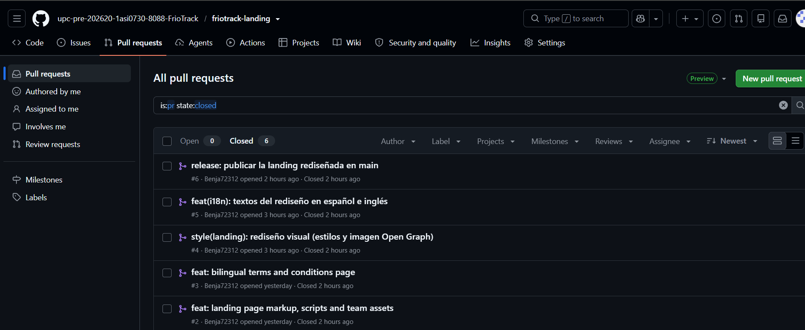

### 5.2.2. Sprint 2

#### 5.2.2.1. Sprint Planning 2

El Sprint 2 entrega la primera aplicación web de FríoTrack y actualiza la landing. El Coordinador Logístico dispone de programación, recursos, monitoreo y acciones correctivas; el Cliente de Carga consulta los envíos asociados a su cuenta. La revisión técnica comprende el acceso con credenciales, la autorización del servidor y la publicación en Azure.

| Field | FríoTrack Sprint Planning 2 |
| --- | --- |
| Sprint # | Sprint 2 — TB1 |
| Date / Time / Location | El acta de la reunión de planificación no está adjunta. El periodo de integración técnica registrado es 07–08/10/2026, America/Lima. |
| Prepared By | Equipo BlackStartup; Team Leader: Atauje Barreto, Alexander Sebastián. |
| Attendees | No consta una relación de asistentes en los archivos del informe. |
| Sprint 1 Review Summary | Landing implementada; el formulario comercial aún requiere receptor. Se actualizaron los accesos hacia la aplicación pública. |
| Sprint 1 Retrospective Summary | Para esta iteración se consolidan requisitos, fuentes, pruebas y evidencias en los repositorios del equipo. No se adjunta acta de retrospectiva. |
| Sprint 2 Goal | Deliver the first FríoTrack web application on Azure. Logistics coordinators can manage refrigerated shipments and corrective actions; cargo clients can securely consult their assigned shipments through an authenticated bilingual interface. |
| Sprint 2 Velocity | No se registra velocidad aceptada por el equipo. |
| Sum of Story Points | 75 SP de 20 historias relacionadas con la implementación; no equivalen a puntos aceptados ni a velocidad. |

Los criterios de revisión técnica son: rechazar credenciales incorrectas, restaurar una sesión válida, impedir acciones de coordinación desde una cuenta cliente, filtrar los envíos por cliente, conservar los parámetros de idioma y perfil desde la landing y comprobar los archivos publicados. Las verificaciones disponibles se detallan en 5.2.2.5.

#### 5.2.2.2. Aspect Leaders and Collaborators

La distribución se basa en las responsabilidades registradas y en los aportes verificables. L identifica al líder del aspecto y C al colaborador. La integración técnica de acceso y despliegue está registrada bajo la cuenta `rodrigoxd67`.

| Team Member | GitHub Username | Requirements / research | Product design | Report consolidation | Access / API / deployment |
| --- | --- | --- | --- | --- | --- |
| Atauje Barreto, Alexander Sebastián | Alexander1Alexander2 | C — Capítulo I | — | L — estructura e integración | — |
| Bardales Rodriguez, Benjamin Elias | Benja72312 | — | L — diseño y landing registrados en AV1 | — | — |
| Daga Chávez, Joaquín Leonardo | Eshnikeee | L — Capítulo II y entrevistas | — | C | — |
| Saavedra Flores, Rodrigo Andree | rodrigoxd67 | — | C — incorporación del Capítulo IV | C — Student Outcome y Capítulo V | L |
| Vera Solsol, Nayely Macarena | Macaxprogram29 | L — Capítulo III y backlog | — | C | — |

La actividad de publicación del nuevo repositorio se diferencia de la autoría histórica del diseño. El detalle de commits por integrante figura en 5.2.2.8.

#### 5.2.2.3. Sprint Backlog 2

El backlog utiliza los IDs del Capítulo III. **Verificado** indica que la función indicada cuenta con comprobación técnica; **Parcial** indica que existe una implementación con criterios del producto aún abiertos; **Pendiente** identifica trabajo sin evidencia de cierre. Estos estados no sustituyen el acta de aceptación del equipo. Las horas no registradas se muestran como tal.

| Story Id | Story Title | Task Id | Task Title | Task Description | Estimation (Hours) | Assigned To | Status |
| --- | --- | --- | --- | --- | --- | --- | --- |
| US19 | Inicio de sesión en el sistema | S2-T01 | Integrar credenciales | Validar correo y contraseña en API, error genérico y redirección por rol. | No registrada | Rodrigo | Verificado |
| US20 | Cierre de sesión seguro | S2-T02 | Revocar sesión | Invalidar token en servidor y limpiar la sesión del navegador. | No registrada | Rodrigo | Verificado |
| US32 | Registro de Cliente de Carga | S2-T03 | Crear cuenta cliente | Validar datos, contraseña y consentimiento; impedir autoasignación de coordinador. | No registrada | Rodrigo | Verificado por pruebas API |
| US33 | Programación de envío refrigerado | S2-T04 | Programar en cuatro pasos | Validar carga, fechas, cliente, recursos y rangos; persistir al confirmar. | No registrada | Rodrigo — integración API | Parcial: sin borrador persistido |
| US14, US15 | Registro / edición de unidad | S2-T05 | Gestionar unidades | Validar capacidad, placa y sensor únicos; proteger recursos asignados. | No registrada | Rodrigo — integración API | Implementado; revisión funcional del equipo abierta |
| US16, US17 | Conductores / asignación | S2-T06 | Gestionar recursos | Validar licencia única, disponibilidad y solapamiento al programar. | No registrada | Rodrigo — integración API | Parcial: vigencia de licencia no verificada |
| US34 | Gestión de estados del envío | S2-T07 | Gestionar ciclo del envío | Inicio, entrega y cancelación de programados; historial y liberación de recursos. | No registrada | Rodrigo — integración API | Parcial: sin estado DRAFT persistido |
| US01, US02, US05 | Panel / mapa / detalle | S2-T08 | Presentar monitoreo | Mostrar lecturas, ubicación ilustrativa, gráfica y tabla. | No registrada | Rodrigo — integración API | Parcial: datos de prueba; sin sensores ni vibración |
| US03 | Búsqueda y filtros de envíos | S2-T09 | Localizar envíos | Filtrar la información autorizada y mostrar resultados vacíos. | No registrada | Rodrigo — integración API | Implementado; filtros completos por revisar |
| US08 | Configuración de umbrales térmicos | S2-T10 | Validar rangos | Exigir mínimo menor que máximo y humedad entre 0 y 100. | No registrada | Rodrigo — integración API | Verificado para rangos del envío |
| US09, US35 | Historial de alertas / acción correctiva | S2-T11 | Atender alerta | Guardar acción, autor y fecha; reconocer sin cerrar automáticamente. | No registrada | Rodrigo — integración API | Parcial: filtros del catálogo por revisar |
| US10, US11 | Historial / exportación | S2-T12 | Consultar y exportar | Presentar historial y CSV identificado como datos de prueba. | No registrada | Rodrigo — integración API | Parcial: exportación en cliente |
| US36 | Consulta de envíos del Cliente de Carga | S2-T13 | Aislar información por cliente | Filtrar en servidor envíos, alertas y recursos; impedir comandos de coordinación. | No registrada | Rodrigo | Verificado |
| US30 | Gestión de multi-idioma (i18n) | S2-T14 | Integrar EN / ES | Idioma inicial inglés; conservar idioma explícito desde la landing. | No registrada | Rodrigo — integración publicada | Verificado en recorridos registrados |
| US31 | Planes y acceso desde la Landing | S2-T15 | Conectar entradas públicas | Dirigir cada segmento al login de la aplicación Azure. | No registrada | Rodrigo | Verificado |
| Soporte | Despliegue y pruebas | S2-T16 | Publicar aplicación y API | Compilar, desplegar y comprobar HTTPS, permisos y archivos. | No registrada | Rodrigo | Verificado |
| Soporte | Actualización del informe | S2-T17 | Consolidar documentación | Integrar capítulos, índice, commits, conclusiones y anexos. | No registrada | Alexander / Joaquín / Nayely / Rodrigo | Integrado en informe |
| US25 | Formulario de contacto comercial | S2-T18 | Conectar receptor | Comprobar recepción efectiva y errores de transporte. | No registrada | Sin asignación registrada | Pendiente |
| Soporte | Evidencias de equipo | S2-T19 | Completar actas y exposición | Adjuntar planning, review, retrospectiva, exposición y evaluación individual. | No registrada | Equipo / Team Leader | Pendiente de adjuntos |

Las historias relacionadas suman 75 SP una sola vez: US01, US02, US03, US05, US08, US09, US10, US11, US14, US15, US16, US17, US19, US20, US30, US32, US33, US34, US35 y US36. US31 corresponde a la actualización de la landing y se registra aparte con 2 SP. Las tareas de soporte no agregan puntos de historia.

El [Product Backlog en Trello](https://trello.com/b/6qrvOukt/blackstartup-fr%C3%ADotrack) y su captura se conservan en 3.3. La tabla del sprint y el [CSV correspondiente](assets/annexes/sprint2-backlog.csv) permiten contrastar la implementación con los criterios; la captura existente no acredita todos los estados actuales del Sprint 2.

#### 5.2.2.4. Development Evidence for Sprint Review

Los registros siguientes pertenecen al repositorio actual del informe y al frontend integrado. Reproducen los mensajes y fechas de Git. Los cuerpos vacíos se indican con «—». La [tabla completa de commits](assets/annexes/commits-sprint2.csv) y el [registro JSON](assets/evidence/current-commits.json) conservan la metadata consultada.

| Repository | Branch | CommitId | CommitMessage | CommitMessageBody | Committed on Date |
| --- | --- | --- | --- | --- | --- |
| report-friotrack | `develop` | [06144a7](https://github.com/upc-pre-202620-1asi0730-8088-FrioTrackk/report-friotrack/commit/06144a7647cec13030e819eeb7288f482bc5bd91) | docs(tb1): consolidate report with authenticated Azure deployment | Update the report index, version history, Student Outcome and Sprint 2 evidence using the current repositories and verified commit metadata. Align the backlog identifiers with implemented workflows, restore referenced design assets and document the deployed supporting API, conclusions and delivery annexes. | 2026-10-08T23:17:51-05:00 |
| report-friotrack | `develop` | [369cc99](https://github.com/upc-pre-202620-1asi0730-8088-FrioTrackk/report-friotrack/commit/369cc991c51dd2424aded38766728918bf27de71) | docs(chapter-02): update interview video link | — | 2026-10-08T18:18:11-05:00 |
| report-friotrack | `develop` | [c216ca0](https://github.com/upc-pre-202620-1asi0730-8088-FrioTrackk/report-friotrack/commit/c216ca06517fca1c2496cf31b83e54c73eefe686) | docs(chapter-02): update interviews and photographic evidence | — | 2026-10-08T17:51:58-05:00 |
| report-friotrack | `develop` | [5875269](https://github.com/upc-pre-202620-1asi0730-8088-FrioTrackk/report-friotrack/commit/58752691c08a90ce27e2d2cf3c8ca0cb5b10565c) | docs(chapter-05): edit report | — | 2026-10-08T16:47:09-05:00 |
| report-friotrack | `develop` | [d525d9e](https://github.com/upc-pre-202620-1asi0730-8088-FrioTrackk/report-friotrack/commit/d525d9e34c6469488dca96042e610adbd6739b6d) | docs(chapter-04): add 4.8 database design | — | 2026-10-08T15:16:56-05:00 |
| report-friotrack | `develop` | [7530bcc](https://github.com/upc-pre-202620-1asi0730-8088-FrioTrackk/report-friotrack/commit/7530bcc800b711dbd4de43d79cc0603dbff04500) | docs(chapter-03): add section 3.3 product backlog | — | 2026-10-08T13:42:48-05:00 |
| report-friotrack | `develop` | [37a975a](https://github.com/upc-pre-202620-1asi0730-8088-FrioTrackk/report-friotrack/commit/37a975a52afd0adc57e948f183140868695cd2c2) | docs(chapter1): update chapter 1 content | Revise and adjust content of chapter 1 introduction. | 2026-10-08T12:01:43-05:00 |
| report-friotrack | `develop` | [c28876c](https://github.com/upc-pre-202620-1asi0730-8088-FrioTrackk/report-friotrack/commit/c28876cacc022a107a229ca6f64c1f5c1360903a) | docs(student-outcome): add SO5 teamwork contributions | — | 2026-10-08T00:05:36-05:00 |
| friotrack-frontend | `main` | [9a2ad38](https://github.com/upc-pre-202620-1asi0730-8088-FrioTrackk/friotrack-frontend/commit/9a2ad386cae79aba5fb77b9c1daf9a607bf8cec8) | feat(auth): connect role-based access to ASP.NET Core API | — | 2026-10-08T22:12:21-05:00 |
| friotrack-frontend | `main` | [5bce6b1](https://github.com/upc-pre-202620-1asi0730-8088-FrioTrackk/friotrack-frontend/commit/5bce6b1deced47d098e6237c20bb452dae93d0ac) | docs(azure): record deployment configuration and validation | — | 2026-10-08T22:13:05-05:00 |


La versión frontend fue integrada primero en `develop` y después en `main`. La documentación del informe se consolida directamente en `develop`; el historial permite identificar la aportación de cada cuenta sin mezclar los conteos de repositorios diferentes.

#### 5.2.2.5. Execution Evidence for Sprint Review

La versión publicada inicia sesión con correo y contraseña. El rol procede de la cuenta validada por el servidor. El parámetro `role` del enlace únicamente orienta el texto del acceso: no concede permisos.

| Scenario | Observed result | Evidence / scope |
| --- | --- | --- |
| Contraseña incorrecta | Acceso rechazado con mensaje en español. | Navegador sobre Azure y pruebas HTTP. |
| Coordinador Logístico | Acceso al panel con cuatro envíos iniciales y acciones de gestión. | Captura del servicio publicado. |
| Cliente de Carga | Tres envíos asignados; menú de gestión de flota ausente. | Captura del servicio publicado y filtrado del servidor. |
| Consulta sin sesión | HTTP 401. | Suite HTTPS publicada. |
| Comando de coordinador desde cliente | HTTP 403. | Suite API y autorización en servidor. |
| Restauración y cierre de sesión | Refresco conserva sesión válida; logout revoca el token y vuelve al login. | Navegador y suite HTTPS. |
| Registro público | Crea exclusivamente Cliente de Carga; rechaza escalamiento de rol. | Suite API local. |
| Programación y recursos | Fechas, rangos, capacidad y reservas se validan; el servidor guarda la operación confirmada. | Pruebas de dominio e integración. |
| Acción y recuperación térmica | La acción reconoce la alerta; una lectura posterior dentro de rango permite cerrar la térmica. | Pruebas y recorrido local de operaciones. |
| Idiomas y acceso desde landing | El enlace del Cliente de Carga conserva español; acceso en inglés disponible. | Navegador, diccionarios y rutas. |
| Telemetría y mapa | Lecturas y coordenadas de prueba; teselas OpenStreetMap con atribución. | No hay sensores físicos ni GPS conectados. |

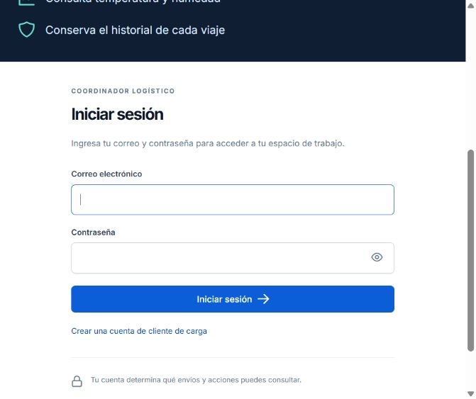

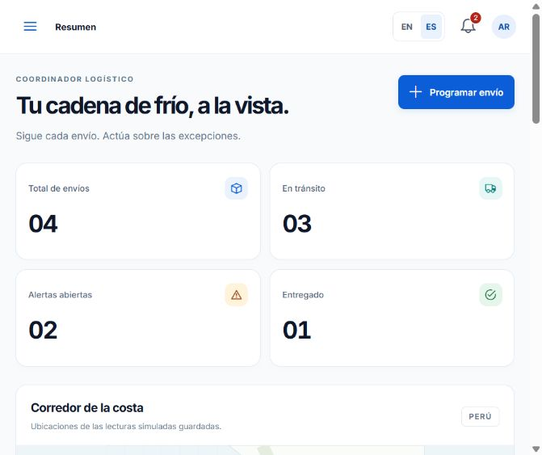


Se conservan las capturas locales del 07/10/2026 para mostrar la programación y las acciones de monitoreo. Corresponden a la iteración previa de la interfaz; las cuatro imágenes anteriores muestran el acceso actual.


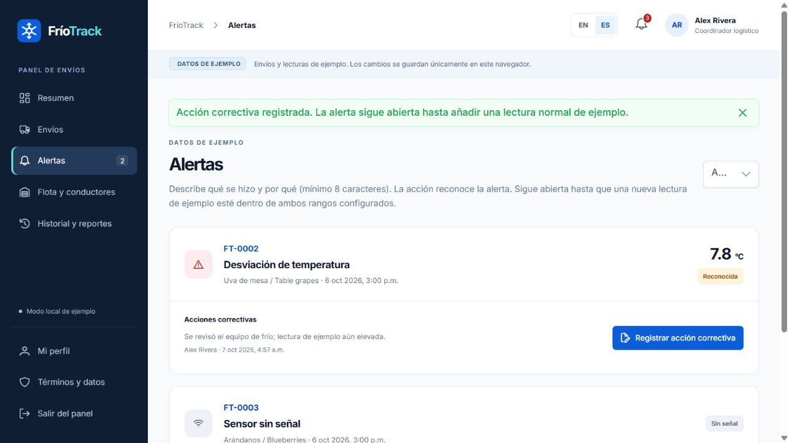

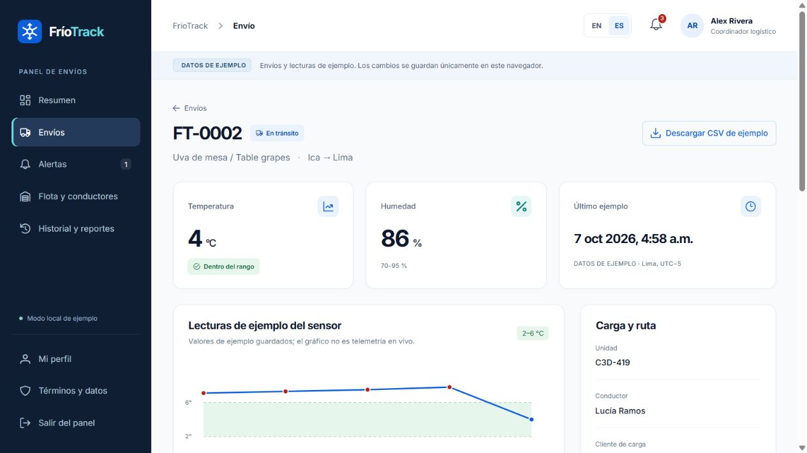

La validación de las fuentes actuales registra **15 pruebas de dominio frontend**, **26 comprobaciones API locales**, compilación Vue/Vite con **222 módulos** y publicación compilada de .NET 10. El servicio Azure registra **12 comprobaciones HTTPS**. Los conteos local y cloud pertenecen a suites distintas y no se suman como pruebas únicas de cobertura.

Los recibos están en [validación del repositorio](assets/evidence/repository-verification.json), [API publicada](assets/evidence/azure-api-verification.json) y [recorridos de navegador](assets/evidence/azure-browser-verification.json). Las capturas cloud muestran el viewport efectivo del navegador utilizado; no certifican todos los tamaños ni el cumplimiento integral de WCAG.

Se incluye el [video de apoyo del recorrido local](assets/annexes/frioTrack-productnavigation-sprint2-apoyo.mp4), de 4:46, sin narración ni cámaras. Muestra programación, validaciones, lecturas, acciones, cliente e idiomas de la iteración local anterior. La exposición del equipo y el video narrado del Sprint Review requieren sus archivos y enlaces de entrega.

#### 5.2.2.6. Services Documentation Evidence for Sprint Review

La aplicación consume la API de apoyo en `https://friotrack-api-bce6db1b.azurewebsites.net/api`. Su implementación y sus pruebas están en el [repositorio frontend](https://github.com/upc-pre-202620-1asi0730-8088-FrioTrackk/friotrack-frontend/tree/main/api). Este servicio autentica cuentas, filtra información y procesa comandos; no utiliza json-server ni requiere un repositorio mock adicional.

| Action | HTTP method / syntax | Parameters / body | Response |
| --- | --- | --- | --- |
| Health | `GET /api/health` | Sin parámetros ni autenticación. | `200`: `status`, `service`, `version`. |
| Login | `POST /api/auth/login` | JSON `email`, `password`. | `200`: `token`, `expiresAt`, `profile`, `state`; `401`: credenciales inválidas; `429`: límite de intentos. |
| Client registration | `POST /api/auth/register` | JSON `name`, `email`, `organization`, `password`, `consent`; rol permitido `cargo-client`. | `200`: sesión de nueva cuenta; `400`: datos inválidos; `403`: rol no permitido. |
| Authorized workspace | `GET /api/workspace` | Cabecera `Authorization: Bearer <token>`. | `200`: `profile` y `state` filtrado; `401`: sesión ausente, vencida o revocada. |
| Application command | `POST /api/commands` | Bearer; JSON `type`, `payload`. Ejemplos: `createShipment`, `recordAction`, `updateProfile`. | `200`: `profile`, `state`, `result`; `400`: validación; `401`: sesión inválida; `403`: operación no permitida; `404`: envío no disponible. |
| Logout | `POST /api/auth/logout` | Bearer; cuerpo vacío `{}`. | `204`: token revocado; `401`: sesión inválida. |

Example health response:

```json
{"status":"ok","service":"FrioTrack","version":"2.0"}
```

Example login request (replace the placeholder with the privately supplied password):

```http
POST /api/auth/login
Content-Type: application/json

{"email":"coordinador@friotrack.app","password":"<private-password>"}
```

An invalid login returns HTTP 401 with `{"code":"invalidCredentials"}`. A successful login returns an opaque random token with an eight-hour expiry. The browser stores it in `sessionStorage`; logout revokes its hash in the server. The token is not a JWT. Passwords use individually salted PBKDF2-SHA256 hashes with 210,000 iterations. Public registration cannot grant coordinator privileges.

The deployed service uses a private single-instance JSON store. Physical telemetry ingestion, relational transactions, organization tenancy, verified email, password recovery and external notifications remain outside this implementation. OpenAPI/Swagger for the final backend remains TS07; this endpoint table is manual contract documentation and does not claim a deployed Swagger interface. Documentation changes are recorded in frontend commit [`5bce6b1`](https://github.com/upc-pre-202620-1asi0730-8088-FrioTrackk/friotrack-frontend/commit/5bce6b1deced47d098e6237c20bb452dae93d0ac).

#### 5.2.2.7. Software Deployment Evidence for Sprint Review

La nueva landing y la primera aplicación frontend se publicaron en Azure. La publicación estática registrada finalizó el **08/10/2026 a las 21:35, America/Lima** (`2026-10-09T02:35:30.171Z`). La verificación compara archivos publicados con sus SHA-256 locales.

| Product | Public URL | Deployment / evidence |
| --- | --- | --- |
| Landing Page | [Abrir FríoTrack](https://friotracktb1bce6db1b.z22.web.core.windows.net/landing/) | Azure Storage, directorio `/landing/`; CTA hacia login por perfil e idioma. |
| Frontend Web Application | [Abrir aplicación](https://friotracktb1bce6db1b.z22.web.core.windows.net/) | Azure Storage, raíz `$web`; bundle `index-CF3heRjH.js`. |
| Coordinador Logístico | [Iniciar sesión](https://friotracktb1bce6db1b.z22.web.core.windows.net/#/login?role=coordinator&lang=es) | Credenciales verificadas por la API; rol de coordinación. |
| Cliente de Carga | [Iniciar sesión](https://friotracktb1bce6db1b.z22.web.core.windows.net/#/login?role=cargo-client&lang=es) | Credenciales verificadas por la API; consulta de envíos asignados. |
| Supporting API | [Comprobar estado](https://friotrack-api-bce6db1b.azurewebsites.net/api/health) | Azure App Service, .NET 10 y Free F1. |

El [registro estático](assets/evidence/azure-deployment.json), el [registro API](assets/evidence/azure-api-deployment.json) y la [comparación de archivos](assets/evidence/azure-file-verification.json) documentan los recursos, la fecha y los resultados. **34 archivos** de la publicación conjunta frontend/landing coincidieron con sus hashes locales; una ruta inexistente respondió HTTP 404. La validación posterior del repositorio frontend confirmó los **20 archivos** correspondientes a su propio build. El recibo conjunto no atribuye a `friotrack-landing/main` los cambios de entrada que todavía no están sincronizados allí.

Las capturas 5.6–5.9 muestran la ejecución sobre las URLs públicas. La [guía de despliegue](https://github.com/upc-pre-202620-1asi0730-8088-FrioTrackk/friotrack-frontend/blob/main/docs/azure-deployment.md) contiene los comandos de compilación, publicación y verificación. El sitio publica términos en el footer de ambas interfaces. Los correos iniciales son `coordinador@friotrack.app` y `cliente@friotrack.app`; sus contraseñas se entregan por separado y no se incorporan al informe público.

#### 5.2.2.8. Team Collaboration Insights during Sprint

El nuevo informe registra aportes por capítulo y por cuenta GitHub. El periodo considerado es el **07–08/10/2026**, sobre el historial de `develop` previo a la consolidación `v2.0.0`. Se excluyen merges; no se suman commits del frontend a los del informe.

| Team Member | GitHub Username | Report commits (excluding merges) | Evidence |
| --- | --- | --- | --- |
| Atauje Barreto, Alexander Sebastián | Alexander1Alexander2 | 10 | Capítulo I, navegación e integración del Capítulo V. [5875269](https://github.com/upc-pre-202620-1asi0730-8088-FrioTrackk/report-friotrack/commit/58752691c08a90ce27e2d2cf3c8ca0cb5b10565c). |
| Bardales Rodriguez, Benjamin Elias | Benja72312 | 0 | Diseño y landing de AV1; sin commits en este conjunto del nuevo informe. Registro AV1 de responsabilidades. |
| Daga Chávez, Joaquín Leonardo | Eshnikeee | 8 | Capítulo II, entrevistas, fotografías y enlaces de video. [369cc99](https://github.com/upc-pre-202620-1asi0730-8088-FrioTrackk/report-friotrack/commit/369cc991c51dd2424aded38766728918bf27de71). |
| Saavedra Flores, Rodrigo Andree | rodrigoxd67 | 11 | Portada, Student Outcome e incorporación del Capítulo IV; integración de acceso/API en frontend. [d525d9e](https://github.com/upc-pre-202620-1asi0730-8088-FrioTrackk/report-friotrack/commit/d525d9e34c6469488dca96042e610adbd6739b6d). |
| Vera Solsol, Nayely Macarena | Macaxprogram29 | 4 | User Stories, Impact Mapping, Product Backlog e índice del Capítulo III. [3cc5e02](https://github.com/upc-pre-202620-1asi0730-8088-FrioTrackk/report-friotrack/commit/3cc5e023893f00728f4a7d80ea836a7c0451247e). |


Bardales Rodriguez, Benjamin Elias conserva la contribución de diseño y landing registrada en AV1; no se le atribuyen commits que no figuren en este conjunto del nuevo informe. Las incorporaciones efectuadas por otra cuenta se identifican como tales. La calidad de la participación se valora junto con las tareas, resultados y evaluación del Team Leader; los conteos no constituyen una calificación individual.


# Conclusiones y Recomendaciones

## Conclusiones

FríoTrack aborda la visibilidad del transporte refrigerado mediante programación de envíos, administración de recursos, consulta térmica y atención de alertas. El informe relaciona estos procesos con los perfiles de Coordinador Logístico y Cliente de Carga. Las entrevistas de distribuidores y comerciantes aportan contexto sobre conservación y pérdidas; los resultados de inventario y vencimientos no se convierten en funcionalidades implementadas de transporte.

La entrega incorpora la primera aplicación Vue/PrimeVue publicada en Azure y una landing actualizada que conduce al acceso correspondiente. El inicio de sesión valida correo y contraseña en ASP.NET Core. La consulta y los comandos se autorizan en el servidor, y la cuenta cliente recibe únicamente sus envíos y recursos relacionados. El cierre de sesión revoca el token.

La validación registrada comprende 15 pruebas de dominio frontend, 26 comprobaciones locales de la API y 12 comprobaciones HTTPS del servicio publicado, además de compilación y comparación de archivos mediante SHA-256. Las capturas muestran el acceso y las vistas autenticadas sobre las URLs públicas. Estas comprobaciones permiten reproducir la revisión técnica; no miden adopción comercial, satisfacción ni reducción real de pérdidas.

La arquitectura diferencia los contenedores actualmente desplegados del diseño posterior con EF Core y PostgreSQL. El servicio de apoyo utiliza un archivo JSON privado de una sola instancia. Las lecturas y coordenadas iniciales son datos de prueba; la recepción de sensores físicos, recuperación de contraseña, correo externo y Swagger del backend final continúan en el roadmap.

El nuevo repositorio consolida el trabajo por capítulo y registra los commits de las cuentas participantes. Los anexos reúnen los enlaces del producto, evidencias técnicas y materiales de apoyo, y especifican los documentos académicos que todavía requieren adjuntarse por el equipo.

## Recomendaciones

Completar la validación con usuarios de transporte refrigerado y clientes de carga, distinguiendo sus necesidades de las entrevistas orientadas a almacenes y bodegas. Actualizar las personas, mapas e instrumentos según esos hallazgos y conservar los registros originales de las entrevistas.

Para la siguiente iteración, evolucionar la API hacia persistencia relacional con EF Core, transacciones para reservas, aislamiento por empresa y contratos OpenAPI. Integrar dispositivos solo después de validar su identidad, sus marcas de tiempo y la recepción de lecturas. Mantener visible la procedencia de datos de prueba mientras no exista telemetría real.

Cerrar el receptor del formulario comercial, sincronizar en el repositorio independiente de landing la configuración publicada y repetir los recorridos de aceptación en ambos idiomas. Ampliar la revisión de accesibilidad y tamaños de pantalla a los controles y estados que aún no tienen evidencia completa.

Adjuntar las actas del sprint, el video narrado del Sprint Review, la exposición del equipo, el Keynote y la evaluación individual del Team Leader. Los enlaces privados deben permitir el acceso del docente y corresponder a los archivos reales de la entrega.

# Bibliografía


* Agafonkin, V. (s. f.). *Leaflet: An open-source JavaScript library for interactive maps*. [https://leafletjs.com](https://leafletjs.com)
* Andersson, R. (s. f.). *Inter* [Tipografía]. [https://rsms.me/inter/](https://rsms.me/inter/)
* Banco Mundial. (2023). *Logistics Performance Index 2023: Mind the gap*. [LPI report 2023](https://lpi.worldbank.org/sites/default/files/2023-04/LPI_2023_report_with_layout.pdf)
* Brandolini, A. (2021). *Introducing EventStorming*. Leanpub. [https://leanpub.com/introducing_eventstorming](https://leanpub.com/introducing_eventstorming)
* Brown, S. (s. f.). *The C4 model for visualising software architecture*. Leanpub. [https://leanpub.com/visualising-software-architecture](https://leanpub.com/visualising-software-architecture)
* Buxton, B. (2007). *Sketching user experiences: Getting the design right and the right design*. Morgan Kaufmann.
* Chen, P. P.-S. (1976). The entity-relationship model—Toward a unified view of data. *ACM Transactions on Database Systems, 1*(1), 9–36. [https://doi.org/10.1145/320434.320440](https://doi.org/10.1145/320434.320440)
* Elmasri, R., y Navathe, S. B. (2016). *Fundamentals of database systems* (7.ª ed.). Pearson.
* Evans, E. (2003). *Domain-driven design: Tackling complexity in the heart of software*. Addison-Wesley.
* Fowler, M. (2002). *Patterns of enterprise application architecture*. Addison-Wesley.
* Fowler, M. (2004). *UML distilled: A brief guide to the standard object modeling language* (3.ª ed.). Addison-Wesley.
* Garrett, J. J. (2011). *The elements of user experience: User-centered design for the web and beyond* (2.ª ed.). New Riders.
* Google. (s. f.). *Material Design 3*. [https://m3.material.io/](https://m3.material.io/)
* Google Search Central. (s. f.). *Robots meta tags specifications*. [https://developers.google.com/search/docs/crawling-indexing/robots-meta-tag](https://developers.google.com/search/docs/crawling-indexing/robots-meta-tag)
* Instituto Nacional de Estadística e Informática. (2024, 15 de febrero). *Producción nacional disminuyó 0,55 % en el año 2023*. [Comunicado INEI](https://www.gob.pe/institucion/inei/noticias/906643-produccion-nacional-disminuyo-0-55-en-el-ano-2023).
* International Organization for Standardization. (2019). *Ergonomics of human-system interaction — Part 210: Human-centred design for interactive systems* (ISO 9241-210:2019). [https://www.iso.org/standard/77520.html](https://www.iso.org/standard/77520.html)
* Jones, M., Bradley, J., y Sakimura, N. (2015). *JSON Web Token (JWT)* (RFC 7519). Internet Engineering Task Force. [https://www.rfc-editor.org/info/rfc7519](https://www.rfc-editor.org/info/rfc7519)
* Krug, S. (2014). *Don't make me think, revisited: A common sense approach to web usability* (3.ª ed.). New Riders.
* Marcotte, E. (2010, 25 de mayo). Responsive web design. *A List Apart*. [https://alistapart.com/article/responsive-web-design/](https://alistapart.com/article/responsive-web-design/)
* Mercier, S., Villeneuve, S., Mondor, M., y Uysal, I. (2017). Time–temperature management along the food cold chain: A review of recent developments. *Comprehensive Reviews in Food Science and Food Safety, 16*(4), 647–667. [https://doi.org/10.1111/1541-4337.12269](https://doi.org/10.1111/1541-4337.12269)
* Ministerio de Transportes y Comunicaciones. (2023). *Plan Nacional de Servicios e Infraestructura Logística de Transporte al 2032* (Resolución Ministerial N.° 362-2023-MTC/01). [Plan aprobado por MTC](https://www.gob.pe/institucion/mtc/normas-legales/4081616-362-2023-mtc-01)
* Nielsen, J. (1994). *10 usability heuristics for user interface design*. Nielsen Norman Group. [https://www.nngroup.com/articles/ten-usability-heuristics/](https://www.nngroup.com/articles/ten-usability-heuristics/)
* Norman, D. A. (2013). *The design of everyday things* (ed. rev. y ampliada). Basic Books.
* OpenStreetMap Foundation. (s. f.). *OpenStreetMap*. [https://www.openstreetmap.org](https://www.openstreetmap.org)
* Organización de las Naciones Unidas para la Alimentación y la Agricultura. (2026). *FAO y MIDAGRI fortalecen acciones para reducir la pérdida y desperdicio de alimentos en el Perú*. [Noticia FAO Perú](https://www.fao.org/peru/noticias/detail/fao-y-midagri-fortalecen-acciones-para-reducir-la-p%C3%A9rdida-y-desperdicio-de-alimentos-en-el-per%C3%BA/es).
* The PostgreSQL Global Development Group. (s. f.). *PostgreSQL documentation*. [https://www.postgresql.org/docs/](https://www.postgresql.org/docs/)
* PrimeTek. (s. f.). *PrimeVue*. [https://primevue.org](https://primevue.org)
* Rosenfeld, L., Morville, P., y Arango, J. (2015). *Information architecture: For the web and beyond* (4.ª ed.). O'Reilly Media.
* Vernon, V. (2013). *Implementing domain-driven design*. Addison-Wesley.
* World Wide Web Consortium. (2023). *Accessible Rich Internet Applications (WAI-ARIA) 1.2*. [https://www.w3.org/TR/wai-aria-1.2/](https://www.w3.org/TR/wai-aria-1.2/)
* World Wide Web Consortium. (2024). *Web Content Accessibility Guidelines (WCAG) 2.2*. [https://www.w3.org/TR/WCAG22/](https://www.w3.org/TR/WCAG22/)
* Wroblewski, L. (2011). *Mobile first*. A Book Apart.


* Tive. (s. f.). *Real-time trackers*. [Producto oficial](https://www.tive.com/products/real-time-trackers). Consultado el 06/10/2026.
* Tive. (s. f.). *Cold chain monitoring*. [Solución oficial](https://www.tive.com/solutions/cold-chain-monitoring). Consultado el 06/10/2026.
* Sensitech. (s. f.). *SensiWatch Platform*. [Plataforma oficial](https://www.sensitech.com/en/products/sensiwatch-platform/). Consultado el 06/10/2026.
* Sensitech. (s. f.). *Food Supply Chain Visibility Solutions*. [Sector alimentos](https://www.sensitech.com/en/industries/food/). Consultado el 06/10/2026.
* Controlant. (s. f.). *The Controlant Platform*. [Plataforma oficial](https://www.controlant.com/platform). Consultado el 06/10/2026.
* Controlant. (s. f.). *System overview*. [Documentación oficial](https://support.controlant.com/en/20956-39992-system-overview.html). Consultado el 06/10/2026.
* Portigal, S. (2013). *Interviewing users: How to uncover compelling insights*. Rosenfeld Media.
* Goodman, E., Kuniavsky, M., y Moed, A. (2012). *Observing the user experience: A practitioner's guide to user research* (2.ª ed.). Morgan Kaufmann.
* Microsoft. (s. f.). *C# coding conventions*. [Documentación oficial](https://learn.microsoft.com/en-us/dotnet/csharp/fundamentals/coding-style/coding-conventions).
* Vue.js. (s. f.). *Style Guide*. [Documentación oficial](https://vuejs.org/style-guide/).
* Semantic Versioning. (s. f.). *Semantic Versioning 2.0.0*. [Especificación](https://semver.org/).
* Conventional Commits. (s. f.). *Conventional Commits 1.0.0*. [Especificación](https://www.conventionalcommits.org/en/v1.0.0/).

* Microsoft. (s. f.). *Static website hosting in Azure Storage*. [Documentación oficial](https://learn.microsoft.com/en-us/azure/storage/blobs/storage-blob-static-website).
* Microsoft. (s. f.). *Deploy an ASP.NET web app to Azure*. [Documentación oficial](https://learn.microsoft.com/en-us/azure/app-service/quickstart-dotnetcore).

# Anexos

## Anexo A. Participant Performance Report

El Team Leader, Atauje Barreto, Alexander Sebastián, debe incorporar la evaluación individual en Word y PDF conforme al formato del enunciado y su escala 20/16/13/07/00. No se adjunta un informe evaluado y firmado en este repositorio. El registro de commits de 5.2.2.8 aporta trazabilidad, pero no sustituye la valoración del líder.

## Anexo B. Repositorios del proyecto

| Product | Repository / source | Content |
| --- | --- | --- |
| Project Report | [report-friotrack](https://github.com/upc-pre-202620-1asi0730-8088-FrioTrackk/report-friotrack) | Informe, recursos y anexos; consolidación en `develop` e integración en `main`. |
| Landing Page | [friotrack-landing](https://github.com/upc-pre-202620-1asi0730-8088-FrioTrackk/friotrack-landing) | Fuente independiente de la landing. |
| Frontend Web Application | [friotrack-frontend](https://github.com/upc-pre-202620-1asi0730-8088-FrioTrackk/friotrack-frontend) | Vue/PrimeVue, pruebas y configuración Azure. |
| Supporting API | [Código ASP.NET Core](https://github.com/upc-pre-202620-1asi0730-8088-FrioTrackk/friotrack-frontend/tree/main/api) | Autenticación, autorización, persistencia y comandos. |

La API de apoyo se mantiene junto al frontend. No se incorpora una dependencia de un repositorio mock ni un enlace a un proyecto ajeno.

## Anexo C. Acceso a los productos publicados

| Resource | URL |
| --- | --- |
| Landing Page | [FríoTrack](https://friotracktb1bce6db1b.z22.web.core.windows.net/landing/) |
| Web Application | [Aplicación FríoTrack](https://friotracktb1bce6db1b.z22.web.core.windows.net/) |
| Coordinador Logístico | [Acceso en español](https://friotracktb1bce6db1b.z22.web.core.windows.net/#/login?role=coordinator&lang=es) |
| Cliente de Carga | [Acceso en español](https://friotracktb1bce6db1b.z22.web.core.windows.net/#/login?role=cargo-client&lang=es) |
| API Health | [Estado del servicio](https://friotrack-api-bce6db1b.azurewebsites.net/api/health) |
| Términos de la aplicación | [Terms and Conditions](https://friotracktb1bce6db1b.z22.web.core.windows.net/#/terms) |

Los correos de las cuentas iniciales son `coordinador@friotrack.app` y `cliente@friotrack.app`. Las contraseñas se proporcionan de forma privada. La publicación no utiliza selección de perfil sin autenticación.

## Anexo D. Tablero, diseño e investigación

- [Product Backlog en Trello](https://trello.com/b/6qrvOukt/blackstartup-fr%C3%ADotrack): la captura incorporada en 3.3 conserva el tablero documentado.
- [Diseño en Figma](https://www.figma.com/design/eJ6Ceq0H0FP0xWseNnKFFv): recurso citado en 4.5; su acceso depende de los permisos del archivo.
- [Prototipo HTML](assets/prototype/friotrack-prototype.html): descargar y abrir en navegador; corresponde al diseño visual y se distingue de la aplicación implementada.
- Registro, fotografías y enlaces de las entrevistas: sección 2.2.2. Se conservan los cinco registros incorporados por el equipo.
- [Fuentes editables de arquitectura](assets/architecture/containers.mmd), [modelo de clases](assets/architecture/backend-classes-tb1.puml) y [modelo de datos](assets/architecture/database-tb1.mmd).

## Anexo E. Videos

| Material | Location / state |
| --- | --- |
| Entrevistas | Enlaces y fotografías en 2.2.2. |
| Prototipo | Animación de 4.5 y prototipo HTML; el video narrado no está adjunto. |
| Navegación Sprint 2 | [Video local de apoyo, 4:46](assets/annexes/frioTrack-productnavigation-sprint2-apoyo.mp4), sin audio ni cámaras; muestra la iteración local anterior. |
| Exposición TB1 | Archivo y enlace de entrega no adjuntos. El video de apoyo no sustituye la exposición de los integrantes. |

## Anexo F. Entregables TB1

La matriz utiliza las secciones TB1 del enunciado, página 32, y distingue los archivos presentes de los materiales que debe adjuntar el equipo.

| Deliverable | Evidence available | Completion item |
| --- | --- | --- |
| Final Project Doc Report | Informe acumulativo, índice, registro, Student Outcome, cinco capítulos, conclusiones, bibliografía y anexos. | Revisión final del equipo y exportación en el formato de entrega solicitado. |
| Landing actualizada | Publicación Azure y acceso a aplicación. | Sincronizar la configuración publicada en el repositorio independiente. |
| Primera Frontend Web Application | Vue/PrimeVue en Azure; login y permisos del servidor. | Review del equipo contra todos los criterios seleccionados. |
| Sprint 2: ocho subsecciones | Planning, responsables, backlog, desarrollo, ejecución, servicios, despliegue y colaboración en 5.2.2. | Adjuntar actas de planning, review y retrospectiva. |
| Keynote TB1 | No adjunto en el repositorio. | Presentación final del equipo. |
| Individual Member Performance Report | Identificación del Team Leader y evidencia de contribuciones. | Word/PDF evaluados por el líder. |
| Videos y archivos complementarios | Entrevistas, prototipo HTML, imágenes, recibos y video de apoyo. | Exposición y video narrado con enlaces y permisos del docente. |

## Anexo G. Registros de verificación

| Record | Purpose |
| --- | --- |
| [Current commits](assets/evidence/current-commits.json) | Metadatos del nuevo informe y del frontend integrado. |
| [Repository verification](assets/evidence/repository-verification.json) | Pruebas, compilación y correspondencia del build frontend. |
| [Static deployment](assets/evidence/azure-deployment.json) | Publicación conjunta de frontend y landing. |
| [API deployment](assets/evidence/azure-api-deployment.json) | App Service, plan y configuración del servicio. |
| [Published files](assets/evidence/azure-file-verification.json) | Comparación SHA-256 de los archivos públicos. |
| [API HTTPS checks](assets/evidence/azure-api-verification.json) | Autenticación y autorización del servicio publicado. |
| [Browser checks](assets/evidence/azure-browser-verification.json) | Login, aislamiento de cuenta, refresco y logout. |

Los registros de la revisión local anterior se conservan en el [archivo de evidencias del 07/10/2026](assets/evidence/archive/2026-10-07/README.md). Sus estados de publicación pertenecen a esa fecha y no describen el despliegue actual.
